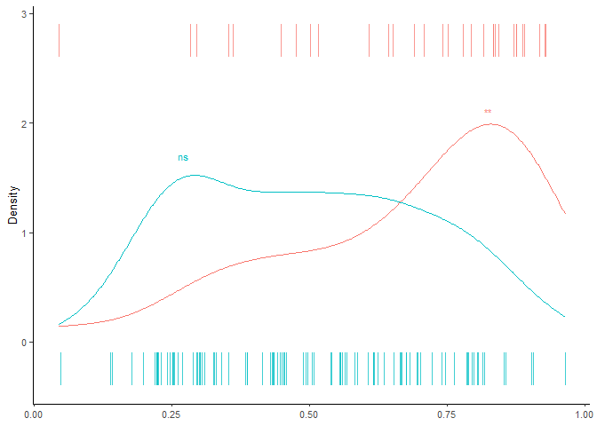
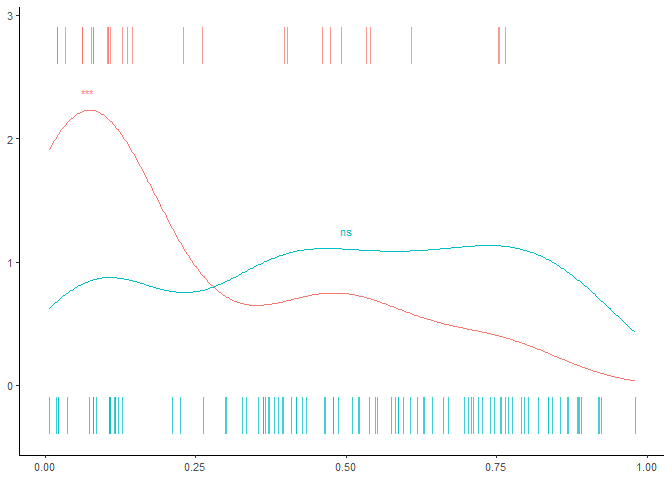

Enrichment Plots
================
Chandler Sutherland

Copyright (c) Chandler Sutherland Email:
<chandlersutherland@berkeley.edu>

Purpose: generate hv and non-hvNLR enrichment plots of expression,
methylation, and TE distance.

Intermediate processing steps are shown here, but figures can be
recreated using just the numerical source data provided in Source
`Data/Figure 2/2D-F`. Significance for these figures determined using
singscore and various permutation tests in the `permutations.Rmd`
script.

Code used to create plots was adapted from singscore visualization of
ranked density reported in Foroutan M, Bhuva D, Lyu R, Horan K, Cursons
J, Davis M (2018). “Single sample scoring of molecular phenotypes.” BMC
bioinformatics, 19(1), 404. doi: 10.1186/s12859-018-2435-4.

``` r
library(tidyverse)
```

    ## ── Attaching core tidyverse packages ──────────────────────── tidyverse 2.0.0 ──
    ## ✔ dplyr     1.1.3     ✔ readr     2.1.4
    ## ✔ forcats   1.0.0     ✔ stringr   1.5.0
    ## ✔ ggplot2   3.4.3     ✔ tibble    3.2.1
    ## ✔ lubridate 1.9.2     ✔ tidyr     1.3.0
    ## ✔ purrr     1.0.2     
    ## ── Conflicts ────────────────────────────────────────── tidyverse_conflicts() ──
    ## ✖ dplyr::filter() masks stats::filter()
    ## ✖ dplyr::lag()    masks stats::lag()
    ## ℹ Use the conflicted package (<http://conflicted.r-lib.org/>) to force all conflicts to become errors

``` r
library(ggplot2)
library(openxlsx)
library(ggsignif)
library(ggpubr)
library(patchwork)
```

``` r
#Change to your path to the zenodo download to repeat 
zenodo_path <- "C:\\Users\\chand\\Box Sync\\Krasileva_Lab\\Research\\chandler\\Krasileva Lab\\E14\\Zenodo V2\\"
#load in all gene data 
table <- readxl::read_xlsx(path=paste(zenodo_path, "all_gene_table.xlsx", sep=''))
```

Write a function that takes in a column name, then outputs a ranked list

``` r
ranking <- function(table, x){
  filt <- table[,c('Gene', 'HV', x)] 
  filt <- filt[complete.cases(filt), ] #remove missing values 
  filt <- filt[order(filt[[x]]),]
  rownames(filt) <- NULL #reset rownames to correctly rank
  hv <- filt %>% filter(HV == 'hv') %>% pull('Gene')
  nonhv <- filt %>% filter(HV == 'non-hv') %>% pull('Gene')
  
  #assign the rank and calculate normalized rank 
  filt$rank <- row.names(filt) %>% as.numeric()
  filt$norm_rank <- filt$rank/nrow(filt)
  
  #find the hv and nonhv rank 
  hv_rank <- filt %>% subset(Gene %in% hv) %>% mutate(set='hv')
  nhv_rank <- filt %>% subset(Gene %in% nonhv) %>% mutate(set='non-hv')
  
  #bind and return ranks
  rank <- rbind(hv_rank, nhv_rank)
  rank <- rank[c('norm_rank', 'set')]
  
  rank
}
```

Apply to expression, methylation, and TE distance. Write source code

``` r
exp_rank <- ranking(table, 'log2_TPM')
meth_rank <- ranking(table, "meth_percentage")
te_rank <- ranking(table, 'te_dist')

write.csv(exp_rank, file="./Source Data/Figure 2/2D/exp_rank.csv")
write.csv(meth_rank, file="./Source Data/Figure 2/2E/meth_rank.csv")
write.csv(te_rank, file="./Source Data/Figure 2/2F/te_rank.csv")

#To reproduce these plots, un-comment the following lines and start code from there  
#exp_rank <- read.csv("./Source Data/Figure 2/2D/exp_rank.csv")
#meth_rank <- read.csv("./Source Data/Figure 2/2E/meth_rank.csv")
#te_rank <- read.csv("./Source Data/Figure 2/2F/te_rank.csv")
```

## Fig 2D: Expression Enrichment plot

``` r
#create density lines 
p2 <- ggplot(exp_rank, aes(x = norm_rank, col = set)) +
    stat_density(aes(y = ..density..), geom = 'line', position = 'identity', linewidth=0.3)

#Define Axes
ymap = c(2.6, -0.1)

#add rug plot 
exp_enrich_p <- p2 + geom_segment(data= exp_rank %>% filter(set=='hv'), aes(
      x= norm_rank,
        y = ymap[1],
        xend = norm_rank,
        yend = ymap[1]+0.3), alpha = 0.75, linewidth=0.3) +
    scale_colour_manual(values=c('#F8766D', '#00BFC4')) +
    labs(colour = c('hvNLR', 'nonhvNLR')) +
geom_segment(data= exp_rank %>% filter(set=='non-hv'), aes(
      x= norm_rank,
        y = ymap[2],
        xend = norm_rank,
        yend = ymap[2] -0.3), alpha = 0.75, linewidth=0.3) +
    scale_colour_manual(values=c('#F8766D', '#00BFC4')) +
    labs(colour = c('hvNLR', 'nonhvNLR'), 
         y='Density') +
  theme_classic()+
  theme(legend.position='none', text=element_text(size=10), axis.title.x=element_blank()) +
  annotate("text", x = 0.825, y = 2.1, label = "**", color='#F8766D', size=3) #Greatest sample p value for singscore enrichment is 0.002
```

    ## Scale for colour is already present.
    ## Adding another scale for colour, which will replace the existing scale.

``` r
exp_enrich_p
```

<!-- --> \## Fig 2E:
Methylation enrichment plot

``` r
#create density lines 
p1 <- ggplot(meth_rank, aes(x = norm_rank, col = set)) +
    stat_density(aes(y = ..density..), geom = 'line', position = 'identity', linewidth=0.3)

#Define axes 
ymap = c(2.6, -0.1)

#Add rug plot, format 
meth_enrich_p <- p1 + 
  geom_segment(data= meth_rank %>% filter(set=='hv'), aes(
      x= norm_rank,
        y = ymap[1],
        xend = norm_rank,
        yend = ymap[1]+0.3), alpha = 0.75, linewidth=0.3) +
    scale_colour_manual(values=c('#F8766D', '#00BFC4')) +
    labs(colour = c('hvNLR', 'nonhvNLR')) +
geom_segment(data= meth_rank %>% filter(set=='non-hv'), aes(
      x= norm_rank,
        y = ymap[2],
        xend = norm_rank,
        yend = ymap[2] -0.3), alpha = 0.75, linewidth=0.3) +
    scale_colour_manual(values=c('#F8766D', '#00BFC4')) +
    labs(colour = c('hvNLR', 'nonhvNLR')) +
  theme_classic()+
  theme(legend.position='none', text=element_text(size=10), 
        axis.title=element_blank())+
  annotate("text", x = 0.22, y = 1.6, label = "*", color='#F8766D', size=3) #greatest p value for hvNLR methylation weighted by GC content is .02, hvnlr is .55 (see permutations.Rmd for calculation)
```

    ## Scale for colour is already present.
    ## Adding another scale for colour, which will replace the existing scale.

``` r
meth_enrich_p
```

<!-- -->

## Fig 2F: TE Distance enrichment

``` r
#create density plot 
p3 <- ggplot(te_rank, aes(x = norm_rank, col = set)) +
    stat_density(aes(y = ..density..), geom = 'line', position = 'identity', linewidth=0.3)

#define axes 
ymap = c(2.6, -0.1)

#add rugplot 
te_enrich_p <- p3 + geom_segment(data= te_rank %>% filter(set=='hv'), aes(
      x= norm_rank,
        y = ymap[1],
        xend = norm_rank,
        yend = ymap[1]+0.3), alpha = 0.75, linewidth=0.3) +
    scale_colour_manual(values=c('#F8766D', '#00BFC4')) +
    labs(colour = c('hvNLR', 'nonhvNLR')) +
geom_segment(data= te_rank %>% filter(set=='non-hv'), aes(
      x= norm_rank,
        y = ymap[2],
        xend = norm_rank,
        yend = ymap[2] -0.3), alpha = 0.75, linewidth=0.3) +
    scale_colour_manual(values=c('#F8766D', '#00BFC4')) +
    labs(colour = c('hvNLR', 'nonhvNLR')) +
  theme_classic() +
  theme(legend.position='none', text=element_text(size=10), axis.title=element_blank())+
  annotate("text", x = 0.07, y = 2.37, label = "***", color='#F8766D', size=3) #p value is 0 for hv, see permutations.Rmd
```

    ## Scale for colour is already present.
    ## Adding another scale for colour, which will replace the existing scale.

``` r
te_enrich_p
```

<!-- -->

``` r
#combine plots and save 

lower_panel <- exp_enrich_p + meth_enrich_p + te_enrich_p + plot_layout(ncol=3)
ggsave(filename='C:\\Users\\chand\\Box Sync\\Krasileva_Lab\\Research\\chandler\\Krasileva Lab\\Outputs\\NLR Features Paper\\EMBO Submission\\Figure Panels\\fig_2d_f.svg', plot=lower_panel, dpi=1000, width=182, height=50, unit='mm')
```
