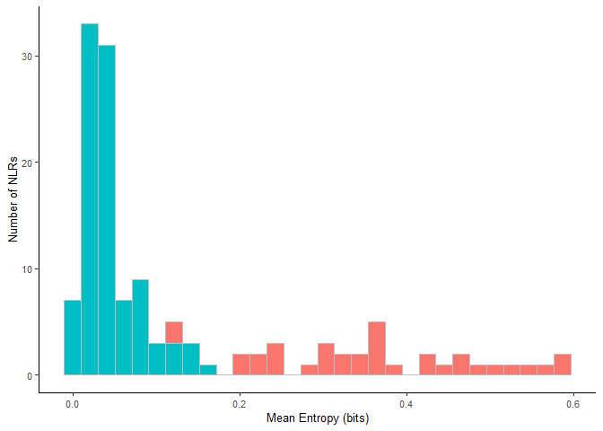
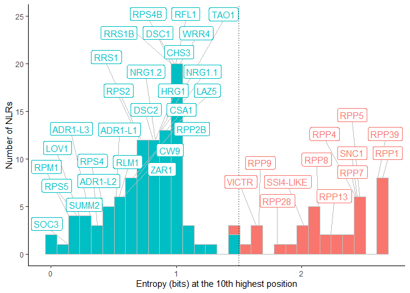

entropy_plot
================
Chandler Sutherland
2023-09-11

Copyright (c) Chandler Sutherland Email:
<chandlersutherland@berkeley.edu>

Purpose: generate a named entropy plot to demonstrate hv and non-hvNLRs

Intermediate processing steps are shown here, with all input files
available for download from Zenodo. Figures can be recreated using just
the numerical source data provided in `Source Data/Figure 1` and
`/EV Figure 1`.

``` r
library(tidyverse)
```

    ## ── Attaching core tidyverse packages ──────────────────────── tidyverse 2.0.0 ──
    ## ✔ dplyr     1.1.3     ✔ readr     2.1.4
    ## ✔ forcats   1.0.0     ✔ stringr   1.5.0
    ## ✔ ggplot2   3.4.3     ✔ tibble    3.2.1
    ## ✔ lubridate 1.9.2     ✔ tidyr     1.3.0
    ## ✔ purrr     1.0.2     
    ## ── Conflicts ────────────────────────────────────────── tidyverse_conflicts() ──
    ## ✖ dplyr::filter() masks stats::filter()
    ## ✖ dplyr::lag()    masks stats::lag()
    ## ℹ Use the conflicted package (<http://conflicted.r-lib.org/>) to force all conflicts to become errors

``` r
library(ggplot2)
library(stringr)
library(ggrepel)
```

``` r
#Change to your path to the zenodo download to repeat 
zenodo_path <- "C:\\Users\\chand\\Box Sync\\Krasileva_Lab\\Research\\chandler\\Krasileva Lab\\E14\\Zenodo V2\\"

#load in Daniil's entropy by position table 
Atha_Ent <- read_delim(paste(zenodo_path, "Athaliana_NLR_Entropy.tsv", sep=""))
```

    ## Rows: 8082075 Columns: 4
    ## ── Column specification ────────────────────────────────────────────────────────
    ## Delimiter: "\t"
    ## chr (2): Name, Clade
    ## dbl (2): Ent, Pos
    ## 
    ## ℹ Use `spec()` to retrieve the full column specification for this data.
    ## ℹ Specify the column types or set `show_col_types = FALSE` to quiet this message.

``` r
#load in the gene table, which provides HV information by clade 
Gene_table <- read_delim(paste(zenodo_path, "Atha_NLRome_GeneTable.txt", sep=""),delim = "\t")
```

    ## Rows: 7679 Columns: 10
    ## ── Column specification ────────────────────────────────────────────────────────
    ## Delimiter: "\t"
    ## chr (8): Gene, Clade_0, Clade_1, Clade_2, Clade_3, Clade, Ecotype, File
    ## dbl (2): Allele, HV
    ## 
    ## ℹ Use `spec()` to retrieve the full column specification for this data.
    ## ℹ Specify the column types or set `show_col_types = FALSE` to quiet this message.

``` r
#filter to just Col-0 
Col_Ent <- Atha_Ent %>% filter(str_detect(Name, 'ATHALIANA')) %>% separate(Name, c(NA, 'Gene'))
Col_table <- Gene_table %>% 
  filter(Ecotype=='ATHALIANA') %>% 
  separate(Gene, c(NA, 'Gene')) %>% 
  subset(select=c('Gene', 'Clade', 'HV')) %>% 
  distinct()

#read in common names 
names <- read_csv("C:\\Users\\chand\\Box Sync\\Krasileva_Lab\\Research\\chandler\\Krasileva Lab\\E14\\Zenodo V2\\Atha_NLR_common_names.csv") 
```

    ## New names:
    ## Rows: 132 Columns: 3
    ## ── Column specification
    ## ──────────────────────────────────────────────────────── Delimiter: "," chr
    ## (2): Gene, name dbl (1): ...1
    ## ℹ Use `spec()` to retrieve the full column specification for this data. ℹ
    ## Specify the column types or set `show_col_types = FALSE` to quiet this message.
    ## • `` -> `...1`

``` r
#tack common names onto the subset gene table 
Col_meta <- Col_table %>% merge(names)

#add back on to the entropy table 
named_ent <- left_join(Col_Ent, Col_meta, by=c('Gene', 'Clade')) %>% drop_na(HV)
```

## Fig 1: mean entropy per NLR

Added labels in illustrator

``` r
#create a df with the mean entropy
fig1_source <- named_ent %>% 
  group_by(Gene, HV, name) %>% 
  summarise(mean_ent = mean(Ent))
```

    ## `summarise()` has grouped output by 'Gene', 'HV'. You can override using the
    ## `.groups` argument.

``` r
#save source data 
write.csv(fig1_source, file="./Source Data/Figure 1/Col0_mean_entropy.csv")
#read in source data 
#fig1_source <- read.csv("./Source Data/Figure 1/Col0_mean_entropy.csv")

#create a histogram
mean_entropy <- ggplot() + 
  geom_histogram(fig1_source, mapping=aes(x=mean_ent, fill=as.factor(-HV)), col=I('grey'))+
  xlab("Mean Entropy (bits)")+
  ylab("Number of NLRs")+
  theme_classic() +
  theme(text = element_text(size=10), 
        legend.position='none')+
  scale_fill_discrete(name ="", labels = c("hvNLR", "non-hvNLR"))

mean_entropy
```

    ## `stat_bin()` using `bins = 30`. Pick better value with `binwidth`.

<!-- -->

``` r
ggsave(filename='C:\\Users\\chand\\Box Sync\\Krasileva_Lab\\Research\\chandler\\Krasileva Lab\\Outputs\\NLR Features Paper\\EMBO Submission\\Figure Panels\\fig_1a.svg', plot=mean_entropy, dpi=1000, width=87, height=55, units='mm')
```

    ## `stat_bin()` using `bins = 30`. Pick better value with `binwidth`.

## EV fig 1: count vs entropy at the tenth highest entropy position

Use geom_repel to add labels since they are more spread out

``` r
#create a df with the tenth highest entropy position 
col_r10 <- named_ent %>% group_by(Gene) %>% slice_max(Ent,n=10) %>% slice_min(Ent,n=1,with_ties = FALSE) %>% 
  ungroup

#create a labelled histogram 
hist <- ggplot() + 
  geom_histogram(col_r10, mapping=aes(x=Ent, fill=as.factor(-HV)), col=I('grey'), bins=30)

#create a column, bins2, that allows for plotting of label and create label_df 
real_bin <- ggplot_build(hist)$data[[1]] %>% subset(select=c(y, xmin, xmax))
breaks <- real_bin$xmin %>% unique()
plot_df <- col_r10 %>% mutate(bins2=as.factor(as.numeric(cut(Ent, breaks=breaks))))%>% arrange(Ent)

#save source data 
ev_fig1_source <- plot_df %>% subset(select=c('Gene', 'HV', 'name', 'Ent', 'bins2'))
write.csv(ev_fig1_source, file='./Source Data/Figure 1/Col0_mean_entropy.csv')
#ev_fig1_source <- read.csv(file='./Source Data/Figure 1/Col0_mean_entropy.csv')

#create label_df
counts <- ev_fig1_source %>% group_by(bins2) %>% count
label_df <- ev_fig1_source %>% filter(!is.na(name)) %>% left_join(counts, by='bins2')

#plot 
r10 <- ggplot() + 
  geom_histogram(ev_fig1_source, mapping=aes(x=Ent, fill=as.factor(-HV)), col=I('grey'), bins=30)+
  geom_vline(xintercept = 1.5,linetype="dotted")+
  geom_label_repel(label_df, 
                   mapping=aes(label=name, x=Ent, y=n, color=as.factor(-HV)), 
                   nudge_y=5, show.legend = FALSE, segment.color='grey')+
  xlab("Entropy (bits) at the 10th highest position")+
  ylab("Number of NLRs")+
  theme_classic() +
  theme(legend.position = 'none')+
  scale_fill_discrete(name ="", labels = c("HV", "non-HV"))

r10
```

<!-- -->

``` r
ggsave(filename='C:\\Users\\chand\\Box Sync\\Krasileva_Lab\\Research\\chandler\\Krasileva Lab\\Outputs\\NLR Features Paper\\EMBO Submission\\Figure Panels\\EVfig_1.svg', plot=r10, dpi=1000, width=180, height=87, units='mm')
```
