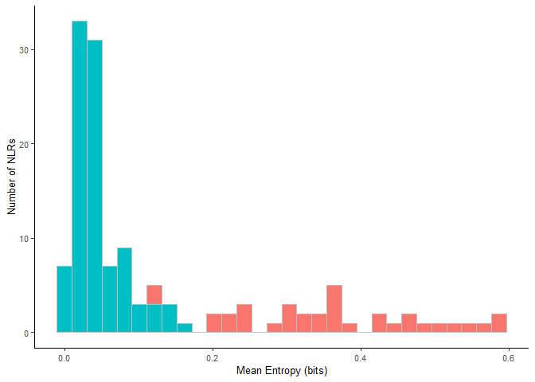
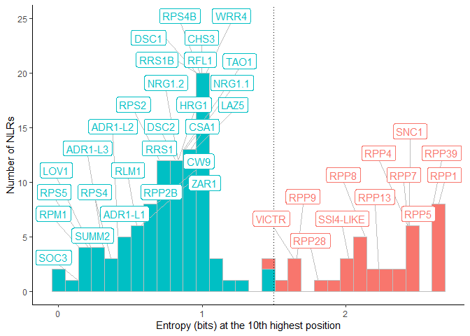

hv_plot
================
Chandler Sutherland
2023-09-11

Copyright (c) Chandler Sutherland Email:
<chandlersutherland@berkeley.edu>

Purpose: generate a named entropy plot to demonstrate hv and non-hvNLRs

Intermediate processing steps are shown here, with all input files
available in Zenodo. Figures can be recreated using just the numerical
source data provided in `Source Data/Figure 1` and `/EV Figure 1`.

``` r
library(tidyverse)
```

    ## ── Attaching core tidyverse packages ──────────────────────── tidyverse 2.0.0 ──
    ## ✔ dplyr     1.1.3     ✔ readr     2.1.4
    ## ✔ forcats   1.0.0     ✔ stringr   1.5.0
    ## ✔ ggplot2   3.4.3     ✔ tibble    3.2.1
    ## ✔ lubridate 1.9.2     ✔ tidyr     1.3.0
    ## ✔ purrr     1.0.2     
    ## ── Conflicts ────────────────────────────────────────── tidyverse_conflicts() ──
    ## ✖ dplyr::filter() masks stats::filter()
    ## ✖ dplyr::lag()    masks stats::lag()
    ## ℹ Use the conflicted package (<http://conflicted.r-lib.org/>) to force all conflicts to become errors

``` r
library(ggplot2)
library(stringr)
library(ggrepel)
```

``` r
#load in Daniil's entropy by position table 
Atha_Ent <- read_delim("C:\\Users\\chand\\Box Sync\\Krasileva_Lab\\Research\\chandler\\Krasileva Lab\\E14\\Zenodo V2\\Athaliana_NLR_Entropy.tsv")
```

    ## Rows: 8082075 Columns: 4
    ## ── Column specification ────────────────────────────────────────────────────────
    ## Delimiter: "\t"
    ## chr (2): Name, Clade
    ## dbl (2): Ent, Pos
    ## 
    ## ℹ Use `spec()` to retrieve the full column specification for this data.
    ## ℹ Specify the column types or set `show_col_types = FALSE` to quiet this message.

``` r
#load in the gene table, which provides HV information by clade 
Gene_table <- read_delim("C:\\Users\\chand\\Box Sync\\Krasileva_Lab\\Research\\chandler\\Krasileva Lab\\E14\\Zenodo V2\\Atha_NLRome_GeneTable.txt",delim = "\t")
```

    ## Rows: 7679 Columns: 10
    ## ── Column specification ────────────────────────────────────────────────────────
    ## Delimiter: "\t"
    ## chr (8): Gene, Clade_0, Clade_1, Clade_2, Clade_3, Clade, Ecotype, File
    ## dbl (2): Allele, HV
    ## 
    ## ℹ Use `spec()` to retrieve the full column specification for this data.
    ## ℹ Specify the column types or set `show_col_types = FALSE` to quiet this message.

``` r
#filter to just Col-0 
Col_Ent <- Atha_Ent %>% filter(str_detect(Name, 'ATHALIANA')) %>% separate(Name, c(NA, 'Gene'))
Col_table <- Gene_table %>% 
  filter(Ecotype=='ATHALIANA') %>% 
  separate(Gene, c(NA, 'Gene')) %>% 
  subset(select=c('Gene', 'Clade', 'HV')) %>% 
  distinct()

#read in common names 
names <- read_csv("C:\\Users\\chand\\Box Sync\\Krasileva_Lab\\Research\\chandler\\Krasileva Lab\\E14\\Zenodo V2\\Atha_NLR_common_names.csv") 
```

    ## New names:
    ## Rows: 132 Columns: 3
    ## ── Column specification
    ## ──────────────────────────────────────────────────────── Delimiter: "," chr
    ## (2): Gene, name dbl (1): ...1
    ## ℹ Use `spec()` to retrieve the full column specification for this data. ℹ
    ## Specify the column types or set `show_col_types = FALSE` to quiet this message.
    ## • `` -> `...1`

``` r
#tack common names onto the subset gene table 
Col_meta <- Col_table %>% merge(names)

#add back on to the entropy table 
named_ent <- left_join(Col_Ent, Col_meta, by=c('Gene', 'Clade')) %>% drop_na(HV)
```

Fig 1: mean entropy per NLR

``` r
#create a df with the mean entropy
fig1_source <- named_ent %>% 
  group_by(Gene, HV, name) %>% 
  summarise(mean_ent = mean(Ent))
```

    ## `summarise()` has grouped output by 'Gene', 'HV'. You can override using the
    ## `.groups` argument.

``` r
#save source data 
write.csv(fig1_source, file="./Source Data/Figure 1/Col0_mean_entropy.csv")
#read in source data 
#fig1_source <- read.csv("./Source Data/Figure 1/Col0_mean_entropy.csv")

#create a histogram
mean_entropy <- ggplot() + 
  geom_histogram(fig1_source, mapping=aes(x=mean_ent, fill=as.factor(-HV)), col=I('grey'))+
  xlab("Mean Entropy (bits)")+
  ylab("Number of NLRs")+
  theme_classic() +
  theme(text = element_text(size=10), 
        legend.position='none')+
  scale_fill_discrete(name ="", labels = c("hvNLR", "non-hvNLR"))

mean_entropy
```

    ## `stat_bin()` using `bins = 30`. Pick better value with `binwidth`.

<!-- -->

``` r
ggsave(filename='C:\\Users\\chand\\Box Sync\\Krasileva_Lab\\Research\\chandler\\Krasileva Lab\\Outputs\\NLR Features Paper\\EMBO Submission\\Figure Panels\\fig_1a.svg', plot=mean_entropy, dpi=1000, width=87, height=55, units='mm')
```

    ## `stat_bin()` using `bins = 30`. Pick better value with `binwidth`.

EV fig 1: count vs entropy at the tenth highest entropy position

``` r
#create a df with the tenth highest entropy position 
col_r10 <- named_ent %>% group_by(Gene) %>% slice_max(Ent,n=10) %>% slice_min(Ent,n=1,with_ties = FALSE) %>% 
  ungroup

#create a labelled histogram 
hist <- ggplot() + 
  geom_histogram(col_r10, mapping=aes(x=Ent, fill=as.factor(-HV)), col=I('grey'), bins=30)

#create a column, bins2, that allows for plotting of label and create label_df 
layer_data(hist)
```

    ##       fill  y count          x        xmin       xmax   density ncount ndensity
    ## 1  #F8766D  2     0 0.00000000 -0.04565371 0.04565371 0.0000000  0.000    0.000
    ## 2  #F8766D  1     0 0.09130742  0.04565371 0.13696113 0.0000000  0.000    0.000
    ## 3  #F8766D  4     0 0.18261484  0.13696113 0.22826855 0.0000000  0.000    0.000
    ## 4  #F8766D  4     0 0.27392226  0.22826855 0.31957597 0.0000000  0.000    0.000
    ## 5  #F8766D  3     0 0.36522968  0.31957597 0.41088339 0.0000000  0.000    0.000
    ## 6  #F8766D  5     0 0.45653710  0.41088339 0.50219081 0.0000000  0.000    0.000
    ## 7  #F8766D  6     0 0.54784452  0.50219081 0.59349823 0.0000000  0.000    0.000
    ## 8  #F8766D  8     0 0.63915194  0.59349823 0.68480565 0.0000000  0.000    0.000
    ## 9  #F8766D 12     0 0.73045936  0.68480565 0.77611307 0.0000000  0.000    0.000
    ## 10 #F8766D 12     0 0.82176678  0.77611307 0.86742049 0.0000000  0.000    0.000
    ## 11 #F8766D 13     0 0.91307420  0.86742049 0.95872791 0.0000000  0.000    0.000
    ## 12 #F8766D 20     0 1.00438162  0.95872791 1.05003533 0.0000000  0.000    0.000
    ## 13 #F8766D  3     0 1.09568904  1.05003533 1.14134275 0.0000000  0.000    0.000
    ## 14 #F8766D  1     0 1.18699646  1.14134275 1.23265017 0.0000000  0.000    0.000
    ## 15 #F8766D  1     0 1.27830388  1.23265017 1.32395759 0.0000000  0.000    0.000
    ## 16 #F8766D  0     0 1.36961130  1.32395759 1.41526501 0.0000000  0.000    0.000
    ## 17 #F8766D  3     1 1.46091872  1.41526501 1.50657242 0.3129146  0.125    0.125
    ## 18 #F8766D  1     1 1.55222613  1.50657242 1.59787984 0.3129146  0.125    0.125
    ## 19 #F8766D  3     3 1.64353355  1.59787984 1.68918726 0.9387439  0.375    0.375
    ## 20 #F8766D  0     0 1.73484097  1.68918726 1.78049468 0.0000000  0.000    0.000
    ## 21 #F8766D  1     1 1.82614839  1.78049468 1.87180210 0.3129146  0.125    0.125
    ## 22 #F8766D  1     1 1.91745581  1.87180210 1.96310952 0.3129146  0.125    0.125
    ## 23 #F8766D  3     3 2.00876323  1.96310952 2.05441694 0.9387439  0.375    0.375
    ## 24 #F8766D  5     5 2.10007065  2.05441694 2.14572436 1.5645732  0.625    0.625
    ## 25 #F8766D  2     2 2.19137807  2.14572436 2.23703178 0.6258293  0.250    0.250
    ## 26 #F8766D  2     2 2.28268549  2.23703178 2.32833920 0.6258293  0.250    0.250
    ## 27 #F8766D  2     2 2.37399291  2.32833920 2.41964662 0.6258293  0.250    0.250
    ## 28 #F8766D  6     6 2.46530033  2.41964662 2.51095404 1.8774879  0.750    0.750
    ## 29 #F8766D  0     0 2.55660775  2.51095404 2.60226146 0.0000000  0.000    0.000
    ## 30 #F8766D  8     8 2.64791517  2.60226146 2.69356888 2.5033171  1.000    1.000
    ## 31 #00BFC4  2     2 0.00000000 -0.04565371 0.04565371 0.2258147  0.100    0.100
    ## 32 #00BFC4  1     1 0.09130742  0.04565371 0.13696113 0.1129073  0.050    0.050
    ## 33 #00BFC4  4     4 0.18261484  0.13696113 0.22826855 0.4516294  0.200    0.200
    ## 34 #00BFC4  4     4 0.27392226  0.22826855 0.31957597 0.4516294  0.200    0.200
    ## 35 #00BFC4  3     3 0.36522968  0.31957597 0.41088339 0.3387220  0.150    0.150
    ## 36 #00BFC4  5     5 0.45653710  0.41088339 0.50219081 0.5645367  0.250    0.250
    ## 37 #00BFC4  6     6 0.54784452  0.50219081 0.59349823 0.6774441  0.300    0.300
    ## 38 #00BFC4  8     8 0.63915194  0.59349823 0.68480565 0.9032588  0.400    0.400
    ## 39 #00BFC4 12    12 0.73045936  0.68480565 0.77611307 1.3548881  0.600    0.600
    ## 40 #00BFC4 12    12 0.82176678  0.77611307 0.86742049 1.3548881  0.600    0.600
    ## 41 #00BFC4 13    13 0.91307420  0.86742049 0.95872791 1.4677955  0.650    0.650
    ## 42 #00BFC4 20    20 1.00438162  0.95872791 1.05003533 2.2581469  1.000    1.000
    ## 43 #00BFC4  3     3 1.09568904  1.05003533 1.14134275 0.3387220  0.150    0.150
    ## 44 #00BFC4  1     1 1.18699646  1.14134275 1.23265017 0.1129073  0.050    0.050
    ## 45 #00BFC4  1     1 1.27830388  1.23265017 1.32395759 0.1129073  0.050    0.050
    ## 46 #00BFC4  0     0 1.36961130  1.32395759 1.41526501 0.0000000  0.000    0.000
    ## 47 #00BFC4  2     2 1.46091872  1.41526501 1.50657242 0.2258147  0.100    0.100
    ## 48 #00BFC4  0     0 1.55222613  1.50657242 1.59787984 0.0000000  0.000    0.000
    ## 49 #00BFC4  0     0 1.64353355  1.59787984 1.68918726 0.0000000  0.000    0.000
    ## 50 #00BFC4  0     0 1.73484097  1.68918726 1.78049468 0.0000000  0.000    0.000
    ## 51 #00BFC4  0     0 1.82614839  1.78049468 1.87180210 0.0000000  0.000    0.000
    ## 52 #00BFC4  0     0 1.91745581  1.87180210 1.96310952 0.0000000  0.000    0.000
    ## 53 #00BFC4  0     0 2.00876323  1.96310952 2.05441694 0.0000000  0.000    0.000
    ## 54 #00BFC4  0     0 2.10007065  2.05441694 2.14572436 0.0000000  0.000    0.000
    ## 55 #00BFC4  0     0 2.19137807  2.14572436 2.23703178 0.0000000  0.000    0.000
    ## 56 #00BFC4  0     0 2.28268549  2.23703178 2.32833920 0.0000000  0.000    0.000
    ## 57 #00BFC4  0     0 2.37399291  2.32833920 2.41964662 0.0000000  0.000    0.000
    ## 58 #00BFC4  0     0 2.46530033  2.41964662 2.51095404 0.0000000  0.000    0.000
    ## 59 #00BFC4  0     0 2.55660775  2.51095404 2.60226146 0.0000000  0.000    0.000
    ## 60 #00BFC4  0     0 2.64791517  2.60226146 2.69356888 0.0000000  0.000    0.000
    ##    flipped_aes PANEL group ymin ymax colour linewidth linetype alpha
    ## 1        FALSE     1     1    2    2   grey       0.5        1    NA
    ## 2        FALSE     1     1    1    1   grey       0.5        1    NA
    ## 3        FALSE     1     1    4    4   grey       0.5        1    NA
    ## 4        FALSE     1     1    4    4   grey       0.5        1    NA
    ## 5        FALSE     1     1    3    3   grey       0.5        1    NA
    ## 6        FALSE     1     1    5    5   grey       0.5        1    NA
    ## 7        FALSE     1     1    6    6   grey       0.5        1    NA
    ## 8        FALSE     1     1    8    8   grey       0.5        1    NA
    ## 9        FALSE     1     1   12   12   grey       0.5        1    NA
    ## 10       FALSE     1     1   12   12   grey       0.5        1    NA
    ## 11       FALSE     1     1   13   13   grey       0.5        1    NA
    ## 12       FALSE     1     1   20   20   grey       0.5        1    NA
    ## 13       FALSE     1     1    3    3   grey       0.5        1    NA
    ## 14       FALSE     1     1    1    1   grey       0.5        1    NA
    ## 15       FALSE     1     1    1    1   grey       0.5        1    NA
    ## 16       FALSE     1     1    0    0   grey       0.5        1    NA
    ## 17       FALSE     1     1    2    3   grey       0.5        1    NA
    ## 18       FALSE     1     1    0    1   grey       0.5        1    NA
    ## 19       FALSE     1     1    0    3   grey       0.5        1    NA
    ## 20       FALSE     1     1    0    0   grey       0.5        1    NA
    ## 21       FALSE     1     1    0    1   grey       0.5        1    NA
    ## 22       FALSE     1     1    0    1   grey       0.5        1    NA
    ## 23       FALSE     1     1    0    3   grey       0.5        1    NA
    ## 24       FALSE     1     1    0    5   grey       0.5        1    NA
    ## 25       FALSE     1     1    0    2   grey       0.5        1    NA
    ## 26       FALSE     1     1    0    2   grey       0.5        1    NA
    ## 27       FALSE     1     1    0    2   grey       0.5        1    NA
    ## 28       FALSE     1     1    0    6   grey       0.5        1    NA
    ## 29       FALSE     1     1    0    0   grey       0.5        1    NA
    ## 30       FALSE     1     1    0    8   grey       0.5        1    NA
    ## 31       FALSE     1     2    0    2   grey       0.5        1    NA
    ## 32       FALSE     1     2    0    1   grey       0.5        1    NA
    ## 33       FALSE     1     2    0    4   grey       0.5        1    NA
    ## 34       FALSE     1     2    0    4   grey       0.5        1    NA
    ## 35       FALSE     1     2    0    3   grey       0.5        1    NA
    ## 36       FALSE     1     2    0    5   grey       0.5        1    NA
    ## 37       FALSE     1     2    0    6   grey       0.5        1    NA
    ## 38       FALSE     1     2    0    8   grey       0.5        1    NA
    ## 39       FALSE     1     2    0   12   grey       0.5        1    NA
    ## 40       FALSE     1     2    0   12   grey       0.5        1    NA
    ## 41       FALSE     1     2    0   13   grey       0.5        1    NA
    ## 42       FALSE     1     2    0   20   grey       0.5        1    NA
    ## 43       FALSE     1     2    0    3   grey       0.5        1    NA
    ## 44       FALSE     1     2    0    1   grey       0.5        1    NA
    ## 45       FALSE     1     2    0    1   grey       0.5        1    NA
    ## 46       FALSE     1     2    0    0   grey       0.5        1    NA
    ## 47       FALSE     1     2    0    2   grey       0.5        1    NA
    ## 48       FALSE     1     2    0    0   grey       0.5        1    NA
    ## 49       FALSE     1     2    0    0   grey       0.5        1    NA
    ## 50       FALSE     1     2    0    0   grey       0.5        1    NA
    ## 51       FALSE     1     2    0    0   grey       0.5        1    NA
    ## 52       FALSE     1     2    0    0   grey       0.5        1    NA
    ## 53       FALSE     1     2    0    0   grey       0.5        1    NA
    ## 54       FALSE     1     2    0    0   grey       0.5        1    NA
    ## 55       FALSE     1     2    0    0   grey       0.5        1    NA
    ## 56       FALSE     1     2    0    0   grey       0.5        1    NA
    ## 57       FALSE     1     2    0    0   grey       0.5        1    NA
    ## 58       FALSE     1     2    0    0   grey       0.5        1    NA
    ## 59       FALSE     1     2    0    0   grey       0.5        1    NA
    ## 60       FALSE     1     2    0    0   grey       0.5        1    NA

``` r
real_bin <- ggplot_build(hist)$data[[1]] %>% subset(select=c(y, xmin, xmax))
breaks <- real_bin$xmin %>% unique()
plot_df <- col_r10 %>% mutate(bins2=as.factor(as.numeric(cut(Ent, breaks=breaks))))%>% arrange(Ent)

#save source data 
ev_fig1_source <- plot_df %>% subset(select=c('Gene', 'HV', 'name', 'Ent', 'bins2'))
write.csv(ev_fig1_source, file='./Source Data/Figure 1/Col0_mean_entropy.csv')
#ev_fig1_source <- read.csv(file='./Source Data/Figure 1/Col0_mean_entropy.csv')

#create label_df
counts <- ev_fig1_source %>% group_by(bins2) %>% count
label_df <- ev_fig1_source %>% filter(!is.na(name)) %>% left_join(counts, by='bins2')

#plot 
r10 <- ggplot() + 
  geom_histogram(ev_fig1_source, mapping=aes(x=Ent, fill=as.factor(-HV)), col=I('grey'), bins=30)+
  geom_vline(xintercept = 1.5,linetype="dotted")+
  geom_label_repel(label_df, 
                   mapping=aes(label=name, x=Ent, y=n, color=as.factor(-HV)), 
                   nudge_y=5, show.legend = FALSE, segment.color='grey')+
  xlab("Entropy (bits) at the 10th highest position")+
  ylab("Number of NLRs")+
  theme_classic() +
  theme(legend.position = 'none')+
  scale_fill_discrete(name ="", labels = c("HV", "non-HV"))

r10
```

<!-- -->

``` r
ggsave(filename='C:\\Users\\chand\\Box Sync\\Krasileva_Lab\\Research\\chandler\\Krasileva Lab\\Outputs\\NLR Features Paper\\EMBO Submission\\Figure Panels\\EVfig_1.svg', plot=r10, dpi=1000, width=180, height=87, units='mm')
```
