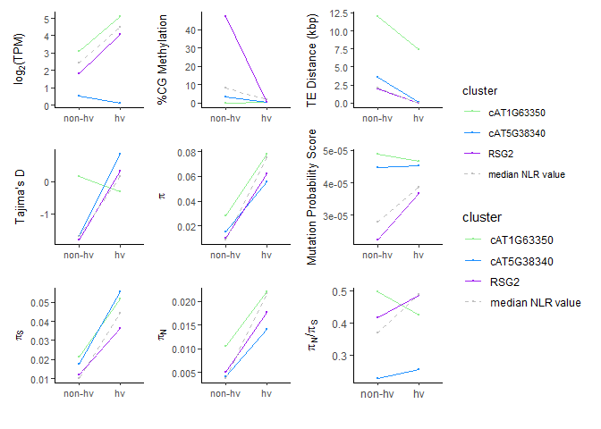

mixed_cluster
================
Chandler Sutherland
2024-01-10

Copyright (c) Chandler Sutherland Email:
<chandlersutherland@berkeley.edu>

Purpose: investigate mixed clusters, containing both hv and non-hvNLRs.

Intermediate processing steps are shown here, and figures can be
recreated using just the numerical source data provided in
`Source Data/EV Figure 4`.

``` r
library(tidyverse)
```

    ## Warning: package 'ggplot2' was built under R version 4.3.1

    ## Warning: package 'purrr' was built under R version 4.3.1

    ## Warning: package 'dplyr' was built under R version 4.3.1

    ## ── Attaching core tidyverse packages ──────────────────────── tidyverse 2.0.0 ──
    ## ✔ dplyr     1.1.3     ✔ readr     2.1.4
    ## ✔ forcats   1.0.0     ✔ stringr   1.5.0
    ## ✔ ggplot2   3.4.3     ✔ tibble    3.2.1
    ## ✔ lubridate 1.9.2     ✔ tidyr     1.3.0
    ## ✔ purrr     1.0.2     
    ## ── Conflicts ────────────────────────────────────────── tidyverse_conflicts() ──
    ## ✖ dplyr::filter() masks stats::filter()
    ## ✖ dplyr::lag()    masks stats::lag()
    ## ℹ Use the conflicted package (<http://conflicted.r-lib.org/>) to force all conflicts to become errors

``` r
library(ggplot2)
library(ggsignif)
library(ggpubr)
library(patchwork)
```

    ## Warning: package 'patchwork' was built under R version 4.3.1

Load NLR gene table

``` r
#Change to your path to the zenodo download to repeat 
zenodo_path <- "C:\\Users\\chand\\Box Sync\\Krasileva_Lab\\Research\\chandler\\Krasileva Lab\\E14\\Zenodo V2\\"

#load in all gene data, filter to NLRs 
NLR_table <- read.csv(paste(zenodo_path, 'NLR_gene_table.csv')) %>% subset(select=-c(X, `...1`)) %>%
  dplyr::rename('common_name'='name')
```

Investigate the number of mixed clusters (hv and non-hvNLRs in the same
cluster)

``` r
alt <- NLR_table %>%
  filter(Nterm %in% c('C', 'T')) %>% #remove RNL and XNLs
  mutate(domain=case_match(Nterm, 'C' ~ 'CNL', 
                           'T' ~ 'TNL'))
mixed_tbl <- alt %>% filter(clustered=='clustered') %>% 
  group_by(cluster, HV) %>% 
  summarize(n=n()) %>% 
  pivot_wider(names_from=HV, values_from=n) %>% 
  replace_na(list(`non-hv`=0, hv=0)) %>% 
  mutate(proportion_hv=hv/(`non-hv`+hv))
```

    ## `summarise()` has grouped output by 'cluster'. You can override using the
    ## `.groups` argument.

``` r
mix_hv <- mixed_tbl %>% 
  filter(proportion_hv > 0 & proportion_hv < 1) %>% 
  pull(hv) %>% 
  sum()

hv_only <- mixed_tbl %>%
  filter(proportion_hv == 1) %>% 
  pull(hv) %>% 
  sum()

print(paste('There are', mix_hv, 'hv in clusters with non-hv and', hv_only, 'in clusters with only other hvs.'))
```

    ## [1] "There are 14 hv in clusters with non-hv and 8 in clusters with only other hvs."

``` r
mixed_clust_n <- mixed_tbl %>% mutate(mixed=case_when(proportion_hv==0 ~ 'single', 
                                     proportion_hv==1 ~ 'single', 
                                     .default='mixed')) %>% 
  filter(mixed=='mixed') %>% 
  nrow()

print(paste('There are', mixed_clust_n, 'mixed clusters'))
```

    ## [1] "There are 6 mixed clusters"

``` r
#hv/non-hvNLR mixed clusters
hv_prop_df <- alt %>% 
  filter(cluster_type != 'singleton') %>% 
  filter(whyCluster=='distance') %>%
  group_by(cluster) %>% 
  mutate(HV=case_match(HV, 
                       'hv' ~ 1, 
                       'non-hv' ~ 0))%>%
  summarize(hv_prop = sum(HV)/n()) 

mixed_clust <- hv_prop_df %>% filter(hv_prop == 0.5) %>% pull(cluster)

mixed_df <- NLR_table %>% filter(cluster %in% mixed_clust) 
```

``` r
#write source data 
write.csv(mixed_df, file="./Source Data/EV Figure 4/mixed_cluster.csv")
#read source data 
#mixed_df <- read_csv("./Source Data/EV Figure 4/mixed_cluster.csv")
```

``` r
#calculate median hvNLR and median non-hvNLR value for each feature and popen statistic 
nlr_avg <- alt %>% 
  subset(select=c('Gene', 'HV', 'log2_TPM', 'meth_percentage', 'te_dist', 'Pi', 'D', 'PiN', 'PiS', 'Mutation.Probability.Score', 'PiNPiS'))  %>% 
  group_by(HV) %>% 
  summarize(log2_TPM=median(log2_TPM, na.rm=T), 
            meth_percentage=median(meth_percentage, na.rm=T), 
            te_dist=median(te_dist, na.rm=T),
            Pi=median(Pi, na.rm=T),
            D=median(D, na.rm=T), 
            PiN=median(PiN, na.rm=T), 
            PiS=median(PiS, na.rm=T), 
            Mutation.Probability.Score=median(`Mutation.Probability.Score`, na.rm=T), 
            PiNPiS=median(PiNPiS, na.rm=T)) %>% 
  mutate(Gene='median NLR value') %>%
  mutate(cluster='median NLR value')

mixed_df <- mixed_df %>% subset(select=c('Gene', 'HV', 'cluster','log2_TPM', 'meth_percentage', 'te_dist', 'Pi', 'D', 'PiN', 'PiS', 'Mutation.Probability.Score', 'PiNPiS')) %>% rbind(nlr_avg)

mixed_df$cluster <- factor(mixed_df$cluster, levels = c('cAT1G63350', 'cAT5G38340', 'RSG2', 'median NLR value'))
```

# EV Figure 4

``` r
expr <- mixed_df %>% 
  ggplot(aes(x=HV, y=log2_TPM)) +
  geom_point(aes(color=cluster), size=0.5)+
  geom_line(aes(group=cluster, color=cluster, linetype=cluster), linewidth=0.3)+
  theme_classic()+
  scale_color_manual(values=c('median NLR value'='grey', 
                              'cAT1G63350'='lightgreen', 
                              'cAT5G38340'='dodgerblue', 
                              'RSG2'='purple'))+
  scale_linetype_manual(values=c('median NLR value'=2, 
                              'cAT1G63350'=1, 
                              'cAT5G38340'=1, 
                              'RSG2'=1))+
  labs(x = '', y='log2TPM')
meth_percentage <- mixed_df %>% 
  ggplot(aes(x=HV, y=meth_percentage)) +
  geom_point(aes(color=cluster), size=0.5)+
  geom_line(aes(group=cluster, color=cluster, linetype=cluster), linewidth=0.3)+
  theme_classic()+
  scale_color_manual(values=c('median NLR value'='grey', 
                              'cAT1G63350'='lightgreen', 
                              'cAT5G38340'='dodgerblue', 
                              'RSG2'='purple'))+
  scale_linetype_manual(values=c('median NLR value'=2, 
                              'cAT1G63350'=1, 
                              'cAT5G38340'=1, 
                              'RSG2'=1))+
  labs(x = '', y='%CG Methylation')

d <- mixed_df %>% 
  ggplot(aes(x=HV, y=D)) +
  geom_point(aes(color=cluster), size=0.5)+
  geom_line(aes(group=cluster, color=cluster, linetype=cluster), linewidth=0.3)+
  theme_classic()+
  scale_color_manual(values=c('median NLR value'='grey', 
                              'cAT1G63350'='lightgreen', 
                              'cAT5G38340'='dodgerblue', 
                              'RSG2'='purple'))+
  scale_linetype_manual(values=c('median NLR value'=2, 
                              'cAT1G63350'=1, 
                              'cAT5G38340'=1, 
                              'RSG2'=1))+
  labs(x = '', y='D')
pi <- mixed_df %>% 
  ggplot(aes(x=HV, y=Pi)) +
  geom_point(aes(color=cluster), size=0.5)+
  geom_line(aes(group=cluster, color=cluster, linetype=cluster), linewidth=0.3)+
  theme_classic()+
  scale_color_manual(values=c('median NLR value'='grey', 
                              'cAT1G63350'='lightgreen', 
                              'cAT5G38340'='dodgerblue', 
                              'RSG2'='purple'))+
  scale_linetype_manual(values=c('median NLR value'=2, 
                              'cAT1G63350'=1, 
                              'cAT5G38340'=1, 
                              'RSG2'=1))+
  labs(x = '', y='Pi')
te_dist <- mixed_df %>% 
  ggplot(aes(x=HV, y=te_dist)) +
  geom_point(aes(color=cluster), size=0.5)+
  geom_line(aes(group=cluster, color=cluster, linetype=cluster), linewidth=0.3)+
  theme_classic()+
  scale_color_manual(values=c('median NLR value'='grey', 
                              'cAT1G63350'='lightgreen', 
                              'cAT5G38340'='dodgerblue', 
                              'RSG2'='purple'))+
  scale_linetype_manual(values=c('median NLR value'=2, 
                              'cAT1G63350'=1, 
                              'cAT5G38340'=1, 
                              'RSG2'=1))+
  labs(x = '', y='TE Distance')
PiN <- mixed_df %>% 
  ggplot(aes(x=HV, y=PiN)) +
  geom_point(aes(color=cluster), size=0.5)+
  geom_line(aes(group=cluster, color=cluster, linetype=cluster), linewidth=0.3)+
  theme_classic()+
  scale_color_manual(values=c('median NLR value'='grey', 
                              'cAT1G63350'='lightgreen', 
                              'cAT5G38340'='dodgerblue', 
                              'RSG2'='purple'))+
  scale_linetype_manual(values=c('median NLR value'=2, 
                              'cAT1G63350'=1, 
                              'cAT5G38340'=1, 
                              'RSG2'=1))+
  labs(x = '', y='PiN')
PiS <- mixed_df %>% 
  ggplot(aes(x=HV, y=PiS)) +
  geom_point(aes(color=cluster), size=0.5)+
  geom_line(aes(group=cluster, color=cluster, linetype=cluster), linewidth=0.3)+
  theme_classic()+
  scale_color_manual(values=c('median NLR value'='grey', 
                              'cAT1G63350'='lightgreen', 
                              'cAT5G38340'='dodgerblue', 
                              'RSG2'='purple'))+
  scale_linetype_manual(values=c('median NLR value'=2, 
                              'cAT1G63350'=1, 
                              'cAT5G38340'=1, 
                              'RSG2'=1))+
  labs(x = '', y='PiS')
PiNPiS <- mixed_df %>% 
  ggplot(aes(x=HV, y=PiN/PiS)) +
  geom_point(aes(color=cluster), size=0.5)+
  geom_line(aes(group=cluster, color=cluster, linetype=cluster), linewidth=0.3)+
  theme_classic()+
  scale_color_manual(values=c('median NLR value'='grey', 
                              'cAT1G63350'='lightgreen', 
                              'cAT5G38340'='dodgerblue', 
                              'RSG2'='purple'))+
  scale_linetype_manual(values=c('median NLR value'=2, 
                              'cAT1G63350'=1, 
                              'cAT5G38340'=1, 
                              'RSG2'=1))+
  labs(x = '', y='PiNPiS')
mut_prob <- mixed_df %>% 
  ggplot(aes(x=HV, y=Mutation.Probability.Score)) +
  geom_point(aes(color=cluster), size=0.5)+
  geom_line(aes(group=cluster, color=cluster, linetype=cluster), linewidth=0.3)+
  theme_classic()+
  scale_color_manual(values=c('median NLR value'='grey', 
                              'cAT1G63350'='lightgreen', 
                              'cAT5G38340'='dodgerblue', 
                              'RSG2'='purple'))+
  scale_linetype_manual(values=c('median NLR value'=2, 
                              'cAT1G63350'=1, 
                              'cAT5G38340'=1, 
                              'RSG2'=1))+
  labs(x = '', y='Mutation Probability Score')
p <- expr+meth_percentage+te_dist+d+pi+mut_prob+PiS+PiN+PiNPiS+plot_layout(guides='collect', nrow=3)
p
```

<!-- -->

``` r
ggsave(filename='C:\\Users\\chand\\Box Sync\\Krasileva_Lab\\Research\\chandler\\Krasileva Lab\\Outputs\\NLR Features Paper\\EMBO Submission\\Figure Panels\\EV_fig4.svg', plot=p, dpi=1000, width=180, height=120, units = 'mm')
```
