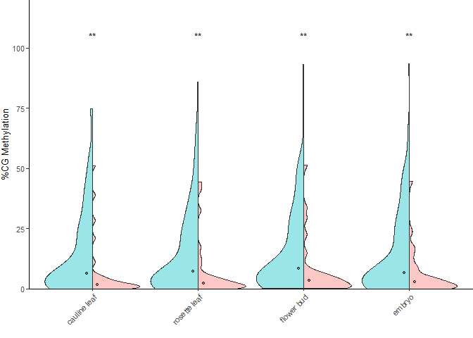

tissue_specific_expr
================
Chandler Sutherland
2023-11-28

Copyright (c) Chandler Sutherland Email:
<chandlersutherland@berkeley.edu>

Purpose: compare hv and non-hvNLR expression and methylation across
multiple tissue samples

Intermediate processing steps are shown here, with all input files
available for download from Zenodo. Figures can be recreated using just
the numerical source data provided in `Source Data/Figure 4`.

``` r
library(tidyverse)
```

    ## ── Attaching core tidyverse packages ──────────────────────── tidyverse 2.0.0 ──
    ## ✔ dplyr     1.1.3     ✔ readr     2.1.4
    ## ✔ forcats   1.0.0     ✔ stringr   1.5.0
    ## ✔ ggplot2   3.4.3     ✔ tibble    3.2.1
    ## ✔ lubridate 1.9.2     ✔ tidyr     1.3.0
    ## ✔ purrr     1.0.2     
    ## ── Conflicts ────────────────────────────────────────── tidyverse_conflicts() ──
    ## ✖ dplyr::filter() masks stats::filter()
    ## ✖ dplyr::lag()    masks stats::lag()
    ## ℹ Use the conflicted package (<http://conflicted.r-lib.org/>) to force all conflicts to become errors

``` r
library(ggplot2)
library(openxlsx)
library(ggsignif)
library(ggpubr)
library(patchwork)
library(ggbeeswarm)
library(introdataviz)
library(pheatmap)
library(viridis)
```

    ## Loading required package: viridisLite

## Expression

Explore tissue specific expression using TPM data from Mergner 2020.

``` r
#Download and shape data 
#Change to your path to the zenodo download to repeat 
zenodo_path <- "C://Users//chand//Box Sync//Krasileva_Lab//Research//chandler//Krasileva Lab//E14//Zenodo V2//"
all_gene <- read.csv(paste(zenodo_path, 'all_gene_table.csv')) %>% subset(select=-c(X))

#load TPM table from Mergner 2020
TPM_table <- read_csv("//wsl.localhost//Ubuntu//home//chandlersutherland//scratch//RNAseq.TPM.csv")
```

    ## New names:
    ## Rows: 27563 Columns: 64
    ## ── Column specification
    ## ──────────────────────────────────────────────────────── Delimiter: "," chr
    ## (4): AGI, Chrom, strand, gene dbl (60): ...1, AP-1, AP-2, AP-3, AP-4, AP-7,
    ## AP-8, AP-9, AP-10, AP-11, AP-1...
    ## ℹ Use `spec()` to retrieve the full column specification for this data. ℹ
    ## Specify the column types or set `show_col_types = FALSE` to quiet this message.
    ## • `` -> `...1`

``` r
everything <- merge(all_gene, TPM_table, by.x='Gene', by.y='gene')

#fitler and shape column names
names <- everything %>% colnames()
rel <- everything %>% subset(select=append(names[1:2], names[10:65]))

#pivot longer; calculate log2TPM in the same manner as other tissues 
rel_long <- rel %>% pivot_longer(cols=names[10:65], names_to=c('tissue'), values_to='TPM')

rel_long <- rel_long %>% 
  mutate(log2_TPM_tissue=log2(TPM+1))
rel_long <- rel_long %>% dplyr::rename('sample'='tissue') 
```

``` r
#convert sample IDs to tissue IDs 
sample_id <- read_tsv("//wsl.localhost//Ubuntu//home//chandlersutherland//scratch//E-MTAB-7978.sdrf.txt") %>% subset(select=c('Scan Name', 'Characteristics[developmental stage]', 'Characteristics[organism part]', 'Characteristics[sampling site]', 'Description'))
```

    ## New names:
    ## Rows: 112 Columns: 56
    ## ── Column specification
    ## ──────────────────────────────────────────────────────── Delimiter: "\t" chr
    ## (54): Source Name, Comment[ENA_SAMPLE], Comment[BioSD_SAMPLE], Character... dbl
    ## (2): Comment[NOMINAL_LENGTH], Comment[NOMINAL_SDEV]
    ## ℹ Use `spec()` to retrieve the full column specification for this data. ℹ
    ## Specify the column types or set `show_col_types = FALSE` to quiet this message.
    ## • `Protocol REF` -> `Protocol REF...16`
    ## • `Performer` -> `Performer...17`
    ## • `Protocol REF` -> `Protocol REF...18`
    ## • `Performer` -> `Performer...19`
    ## • `Protocol REF` -> `Protocol REF...20`
    ## • `Performer` -> `Performer...21`
    ## • `Protocol REF` -> `Protocol REF...22`
    ## • `Performer` -> `Performer...23`
    ## • `Protocol REF` -> `Protocol REF...33`
    ## • `Performer` -> `Performer...34`
    ## • `Protocol REF` -> `Protocol REF...42`
    ## • `Derived Array Data File` -> `Derived Array Data File...43`
    ## • `Comment [Derived ArrayExpress FTP file]` -> `Comment [Derived ArrayExpress
    ##   FTP file]...44`
    ## • `Protocol REF` -> `Protocol REF...45`
    ## • `Derived Array Data File` -> `Derived Array Data File...46`
    ## • `Comment [Derived ArrayExpress FTP file]` -> `Comment [Derived ArrayExpress
    ##   FTP file]...47`
    ## • `Protocol REF` -> `Protocol REF...48`
    ## • `Derived Array Data File` -> `Derived Array Data File...49`
    ## • `Comment [Derived ArrayExpress FTP file]` -> `Comment [Derived ArrayExpress
    ##   FTP file]...50`
    ## • `Protocol REF` -> `Protocol REF...51`
    ## • `Derived Array Data File` -> `Derived Array Data File...52`
    ## • `Comment [Derived ArrayExpress FTP file]` -> `Comment [Derived ArrayExpress
    ##   FTP file]...53`

``` r
conversion <- sample_id %>% 
  mutate(sample = str_remove(`Scan Name`, '_R1.fastq.gz')) %>% 
  mutate(sample = str_remove(sample, '_R2.fastq.gz')) %>%
  mutate(tissue=paste(`Characteristics[developmental stage]`, `Characteristics[organism part]`, `Characteristics[sampling site]`, sep=', ')) %>% subset(select=c('sample', 'tissue')) %>%
  distinct()

rel_long <- merge(rel_long, conversion, by='sample')

#write to zenodo 
write.csv(rel_long, paste(zenodo_path, 'all_gene_multi_tissue_tpm.csv'))
```

Filter to NLRs and repeat pairwise comparison between tissues

``` r
#NLR only 
hv_rel <- rel_long %>% filter(HV != 'all_genes') %>%
  filter(tissue != 'callus, plant callus, not applicable' & 
           tissue != 'cell culture, root, not applicable') #remove synthetic tissue 
hv_rel$HV <- factor(hv_rel$HV, levels=c('non-hv', 'hv'))

#calculate p values, Benjamini-Hochberg correction for multiple testing
sig_table <- compare_means(log2_TPM_tissue~HV, hv_rel,  method='wilcox.test', paired=FALSE, group.by='tissue', p.adjust.method='BH')

p_order <- sig_table %>% arrange(p.adj) %>% pull(tissue)
p_mat <- sig_table %>% subset(select=c(tissue, p.adj)) %>% column_to_rownames('tissue')%>% arrange(p.adj)

median_expr <- hv_rel %>% group_by(tissue) %>% summarize(med_val = median(log2_TPM_tissue, na.rm=T)) %>% arrange(-med_val)
expr_order <- median_expr %>% pull(tissue)

hv_rel$tissue <- factor(hv_rel$tissue, levels=expr_order)
```

Now, rename tissues to be a little clearer and shorter for plotting, and
define subgroups

``` r
#extensive renaming of tissue 
hv_rel <- hv_rel %>% 
  mutate(clean_tissue=case_match(tissue, 
                      'adult, adult vascular leaf, not applicable' ~ 'adult vascular leaf', 
                      'adult, cauline leaf, not applicable' ~ 'cauline leaf', 
                      'adult, cotyledon, not applicable' ~ 'adult cotyledon', 
                      'adult, fruit septum, not applicable' ~ 'fruit septum', 
                      'adult, fruit valve, not applicable' ~ 'fruit valve', 
                      'adult, petiole, rosette leaf 7 petiole' ~ 'rosette leaf 7; petiole', 
                      'adult, root, not applicable' ~ 'adult root', 
                      'adult, rosette leaf, rosette leaf 1' ~ 'rosette leaf 1', 
                      'adult, rosette leaf, rosette leaf 10' ~ 'rosette leaf 10', 
                      'adult, rosette leaf, rosette leaf 11' ~ 'rosette leaf 11', 
                      'adult, rosette leaf, rosette leaf 12' ~ 'rosette leaf 12', 
                      'adult, rosette leaf, rosette leaf 2' ~ 'rosette leaf 2', 
                      'adult, rosette leaf, rosette leaf 3' ~ 'rosette leaf 3', 
                      'adult, rosette leaf, rosette leaf 4' ~ 'rosette leaf 4', 
                      'adult, rosette leaf, rosette leaf 5' ~ 'rosette leaf 5', 
                      'adult, rosette leaf, rosette leaf 6' ~ 'rosette leaf 6', 
                      'adult, rosette leaf, rosette leaf 7' ~ 'rosette leaf 7', 
                      'adult, rosette leaf, rosette leaf 7 distal part' ~ 'rosette leaf 7; distal', 
                      'adult, rosette leaf, rosette leaf 7 proximal part' ~ 'rosette leaf 7; proximal', 
                      'adult, rosette leaf, rosette leaf 8' ~ 'rosette leaf 8', 
                      'adult, rosette leaf, rosette leaf 9' ~ 'rosette leaf 9', 
                      'adult, stem internode, second internode' ~ 'stem internode 2', 
                      'adult, stem node, first node' ~ 'stem node 1', 
                      'dry seed stage, seed, not applicable' ~ 'dry seed', 
                      'embryo stage 10, seed, not applicable' ~ 'stage 10', 
                      'embryo stage 6, seed, not applicable' ~ 'stage 6', 
                      'embryo stage 7, seed, not applicable' ~ 'stage 7', 
                      'embryo stage 8, seed, not applicable' ~ 'stage 8', 
                      'embryo stage 9, seed, not applicable' ~ 'stage 9',
                      'flower stage 10, flower, not applicable' ~ 'stage 10', 
                      'flower stage 11, flower, not applicable' ~ 'stage 11', 
                      'flower stage 12, flower, not applicable' ~ 'stage 12', 
                      'flower stage 13, flower, not applicable' ~ 'stage 13', 
                      'flower stage 15, carpel, not applicable' ~ 'carpel', 
                      'flower stage 15, flower pedicel, not applicable' ~ 'pedicel', 
                      'flower stage 15, flower, not applicable' ~ 'stage 15', 
                      'flower stage 15, petal, not applicable' ~ 'petal', 
                      'flower stage 15, pollen, not applicable' ~ 'pollen', 
                      'flower stage 15, sepal, not applicable' ~ 'sepal', 
                      'flower stage 15, stamen, not applicable' ~ 'stamen', 
                      'flower stage 9, flower, not applicable' ~ 'stage 9', 
                      'seed imbibition stage, seed, not applicable' ~ 'imbibed seed', 
                      'seedling, cotyledon, not applicable' ~ 'seedling cotyledon', 
                      'seedling, hypocotyl, not applicable' ~ 'hypocotyl', 
                      'seedling, mixed shoot apical meristem, cotyledon and first leaves, not applicable' ~ 'shoot apical meristem', 
                      'seedling, root tip, not applicable' ~ 'seedling root tip', 
                      'seedling, root tip, upper zone' ~ 'seedling root upper zone', 
                      'silique stage 1, silique, not applicable' ~ 'stage 1', 
                      'silique stage 2, silique, not applicable' ~ 'stage 2', 
                      'silique stage 3, silique, not applicable' ~ 'stage 3', 
                      'silique stage 4, silique, not applicable' ~ 'stage 4', 
                      'silique stage 5, silique, not applicable' ~ 'stage 5') 
                  ) %>% 
  mutate(tissue_group_1 = case_match(tissue, 
                      'adult, adult vascular leaf, not applicable' ~ 'vegetative', 
                      'adult, cauline leaf, not applicable' ~ 'vegetative', 
                      'adult, cotyledon, not applicable' ~ 'vegetative', 
                      'adult, fruit septum, not applicable' ~ 'reproductive', 
                      'adult, fruit valve, not applicable' ~ 'reproductive', 
                      'adult, petiole, rosette leaf 7 petiole' ~ 'vegetative', 
                      'adult, root, not applicable' ~ 'vegetative', 
                      'adult, rosette leaf, rosette leaf 1' ~ 'vegetative', 
                      'adult, rosette leaf, rosette leaf 10' ~ 'vegetative', 
                      'adult, rosette leaf, rosette leaf 11' ~ 'vegetative', 
                      'adult, rosette leaf, rosette leaf 12' ~ 'vegetative', 
                      'adult, rosette leaf, rosette leaf 2' ~ 'vegetative', 
                      'adult, rosette leaf, rosette leaf 3' ~ 'vegetative', 
                      'adult, rosette leaf, rosette leaf 4' ~ 'vegetative', 
                      'adult, rosette leaf, rosette leaf 5' ~ 'vegetative', 
                      'adult, rosette leaf, rosette leaf 6' ~ 'vegetative', 
                      'adult, rosette leaf, rosette leaf 7' ~ 'vegetative', 
                      'adult, rosette leaf, rosette leaf 7 distal part' ~ 'vegetative', 
                      'adult, rosette leaf, rosette leaf 7 proximal part' ~ 'vegetative', 
                      'adult, rosette leaf, rosette leaf 8' ~ 'vegetative', 
                      'adult, rosette leaf, rosette leaf 9' ~ 'vegetative', 
                      'adult, stem internode, second internode' ~ 'vegetative', 
                      'adult, stem node, first node' ~ 'vegetative', 
                      'dry seed stage, seed, not applicable' ~ 'reproductive', 
                      'embryo stage 10, seed, not applicable' ~ 'reproductive', 
                      'embryo stage 6, seed, not applicable' ~ 'reproductive', 
                      'embryo stage 7, seed, not applicable' ~ 'reproductive', 
                      'embryo stage 8, seed, not applicable' ~ 'reproductive', 
                      'embryo stage 9, seed, not applicable' ~ 'reproductive',
                      'flower stage 10, flower, not applicable' ~ 'reproductive', 
                      'flower stage 11, flower, not applicable' ~ 'reproductive', 
                      'flower stage 12, flower, not applicable' ~ 'reproductive', 
                      'flower stage 13, flower, not applicable' ~ 'reproductive', 
                      'flower stage 15, carpel, not applicable' ~ 'reproductive', 
                      'flower stage 15, flower pedicel, not applicable' ~ 'reproductive', 
                      'flower stage 15, flower, not applicable' ~ 'reproductive', 
                      'flower stage 15, petal, not applicable' ~ 'reproductive', 
                      'flower stage 15, pollen, not applicable' ~ 'reproductive', 
                      'flower stage 15, sepal, not applicable' ~ 'reproductive', 
                      'flower stage 15, stamen, not applicable' ~ 'reproductive', 
                      'flower stage 9, flower, not applicable' ~ 'reproductive', 
                      'seed imbibition stage, seed, not applicable' ~ 'reproductive', 
                      'seedling, cotyledon, not applicable' ~ 'vegetative', 
                      'seedling, hypocotyl, not applicable' ~ 'vegetative', 
                      'seedling, mixed shoot apical meristem, cotyledon and first leaves, not applicable' ~ 'vegetative', 
                      'seedling, root tip, not applicable' ~ 'vegetative', 
                      'seedling, root tip, upper zone' ~ 'vegetative', 
                      'silique stage 1, silique, not applicable' ~ 'reproductive', 
                      'silique stage 2, silique, not applicable' ~ 'reproductive', 
                      'silique stage 3, silique, not applicable' ~ 'reproductive', 
                      'silique stage 4, silique, not applicable' ~ 'reproductive', 
                      'silique stage 5, silique, not applicable' ~ 'reproductive'))%>% 
  mutate(tissue_group_2 = case_match(tissue, 
                      'adult, adult vascular leaf, not applicable' ~ 'shoot', 
                      'adult, cauline leaf, not applicable' ~ 'shoot', 
                      'adult, cotyledon, not applicable' ~ 'shoot', 
                      'adult, fruit septum, not applicable' ~ 'fruit', 
                      'adult, fruit valve, not applicable' ~ 'fruit', 
                      'adult, petiole, rosette leaf 7 petiole' ~ 'shoot', 
                      'adult, root, not applicable' ~ 'root', 
                      'adult, rosette leaf, rosette leaf 1' ~ 'shoot', 
                      'adult, rosette leaf, rosette leaf 10' ~ 'shoot', 
                      'adult, rosette leaf, rosette leaf 11' ~ 'shoot', 
                      'adult, rosette leaf, rosette leaf 12' ~ 'shoot', 
                      'adult, rosette leaf, rosette leaf 2' ~ 'shoot', 
                      'adult, rosette leaf, rosette leaf 3' ~ 'shoot', 
                      'adult, rosette leaf, rosette leaf 4' ~ 'shoot', 
                      'adult, rosette leaf, rosette leaf 5' ~ 'shoot', 
                      'adult, rosette leaf, rosette leaf 6' ~ 'shoot', 
                      'adult, rosette leaf, rosette leaf 7' ~ 'shoot', 
                      'adult, rosette leaf, rosette leaf 7 distal part' ~ 'shoot', 
                      'adult, rosette leaf, rosette leaf 7 proximal part' ~ 'shoot', 
                      'adult, rosette leaf, rosette leaf 8' ~ 'shoot', 
                      'adult, rosette leaf, rosette leaf 9' ~ 'shoot', 
                      'adult, stem internode, second internode' ~ 'shoot', 
                      'adult, stem node, first node' ~ 'shoot', 
                      'dry seed stage, seed, not applicable' ~ 'seed', 
                      'embryo stage 10, seed, not applicable' ~ 'embryo', 
                      'embryo stage 6, seed, not applicable' ~ 'embryo', 
                      'embryo stage 7, seed, not applicable' ~ 'embryo', 
                      'embryo stage 8, seed, not applicable' ~ 'embryo', 
                      'embryo stage 9, seed, not applicable' ~ 'embryo',
                      'flower stage 10, flower, not applicable' ~ 'flower', 
                      'flower stage 11, flower, not applicable' ~ 'flower', 
                      'flower stage 12, flower, not applicable' ~ 'flower', 
                      'flower stage 13, flower, not applicable' ~ 'flower', 
                      'flower stage 15, carpel, not applicable' ~ 'flower', 
                      'flower stage 15, flower pedicel, not applicable' ~ 'flower', 
                      'flower stage 15, flower, not applicable' ~ 'flower', 
                      'flower stage 15, petal, not applicable' ~ 'flower', 
                      'flower stage 15, pollen, not applicable' ~ 'flower', 
                      'flower stage 15, sepal, not applicable' ~ 'flower', 
                      'flower stage 15, stamen, not applicable' ~ 'flower', 
                      'flower stage 9, flower, not applicable' ~ 'flower', 
                      'seed imbibition stage, seed, not applicable' ~ 'seed', 
                      'seedling, cotyledon, not applicable' ~ 'shoot', 
                      'seedling, hypocotyl, not applicable' ~ 'shoot', 
                      'seedling, mixed shoot apical meristem, cotyledon and first leaves, not applicable' ~ 'shoot', 
                      'seedling, root tip, not applicable' ~ 'root', 
                      'seedling, root tip, upper zone' ~ 'root', 
                      'silique stage 1, silique, not applicable' ~ 'silique', 
                      'silique stage 2, silique, not applicable' ~ 'silique', 
                      'silique stage 3, silique, not applicable' ~ 'silique', 
                      'silique stage 4, silique, not applicable' ~ 'silique', 
                      'silique stage 5, silique, not applicable' ~ 'silique')) %>%
   mutate(dev_order = case_match(tissue, 
                      'adult, adult vascular leaf, not applicable' ~ 23, 
                      'adult, cauline leaf, not applicable' ~ 21, 
                      'adult, cotyledon, not applicable' ~ 4, 
                      'adult, fruit septum, not applicable' ~ 1, 
                      'adult, fruit valve, not applicable' ~ 2, 
                      'adult, petiole, rosette leaf 7 petiole' ~ 11, 
                      'adult, root, not applicable' ~ 3, 
                      'adult, rosette leaf, rosette leaf 1' ~ 5, 
                      'adult, rosette leaf, rosette leaf 10' ~ 17, 
                      'adult, rosette leaf, rosette leaf 11' ~ 18, 
                      'adult, rosette leaf, rosette leaf 12' ~ 19, 
                      'adult, rosette leaf, rosette leaf 2' ~ 6, 
                      'adult, rosette leaf, rosette leaf 3' ~ 7, 
                      'adult, rosette leaf, rosette leaf 4' ~ 8, 
                      'adult, rosette leaf, rosette leaf 5' ~ 9, 
                      'adult, rosette leaf, rosette leaf 6' ~ 10, 
                      'adult, rosette leaf, rosette leaf 7' ~ 14, 
                      'adult, rosette leaf, rosette leaf 7 distal part' ~ 13, 
                      'adult, rosette leaf, rosette leaf 7 proximal part' ~ 12, 
                      'adult, rosette leaf, rosette leaf 8' ~ 15, 
                      'adult, rosette leaf, rosette leaf 9' ~ 16, 
                      'adult, stem internode, second internode' ~ 22, 
                      'adult, stem node, first node' ~ 20, 
                      'dry seed stage, seed, not applicable' ~ 1, 
                      'embryo stage 10, seed, not applicable' ~ 5, 
                      'embryo stage 6, seed, not applicable' ~ 1, 
                      'embryo stage 7, seed, not applicable' ~ 2, 
                      'embryo stage 8, seed, not applicable' ~ 3, 
                      'embryo stage 9, seed, not applicable' ~ 4,
                      'flower stage 10, flower, not applicable' ~ 2, 
                      'flower stage 11, flower, not applicable' ~ 3, 
                      'flower stage 12, flower, not applicable' ~ 4, 
                      'flower stage 13, flower, not applicable' ~ 5, 
                      'flower stage 15, carpel, not applicable' ~ 11, 
                      'flower stage 15, flower pedicel, not applicable' ~ 7, 
                      'flower stage 15, flower, not applicable' ~ 6, 
                      'flower stage 15, petal, not applicable' ~ 9, 
                      'flower stage 15, pollen, not applicable' ~ 12, 
                      'flower stage 15, sepal, not applicable' ~ 8, 
                      'flower stage 15, stamen, not applicable' ~ 10, 
                      'flower stage 9, flower, not applicable' ~ 1, 
                      'seed imbibition stage, seed, not applicable' ~ 2, 
                      'seedling, cotyledon, not applicable' ~ 3, 
                      'seedling, hypocotyl, not applicable' ~ 2, 
                      'seedling, mixed shoot apical meristem, cotyledon and first leaves, not applicable' ~ 1, 
                      'seedling, root tip, not applicable' ~ 2, 
                      'seedling, root tip, upper zone' ~ 1, 
                      'silique stage 1, silique, not applicable' ~ 1, 
                      'silique stage 2, silique, not applicable' ~ 2, 
                      'silique stage 3, silique, not applicable' ~ 3, 
                      'silique stage 4, silique, not applicable' ~ 4, 
                      'silique stage 5, silique, not applicable' ~ 5))
```

``` r
#write/read source code 
write.csv(hv_rel, file="./Source Data/Figure 4/4A-B/NLR_multi_tissue_expr.csv")

#To reproduce these plots, un-comment the following lines and start code from there  
#hv_rel <- read.csv("./Source Data/Figure 4/4A/NLR_multi_tissue_expr.csv")
```

``` r
#order by development order 
order <- merge(sig_table, hv_rel, by='tissue') %>% arrange(dev_order)
order$clean_tissue <- factor(order$clean_tissue, levels=c(order %>% pull(clean_tissue) %>% unique()))
```

### Fig 4A: Split Violin Plots

Write a function to create an annotation dataframe, with stars, x and y
values

``` r
#build vegetative annotation df 
vegetative <- order %>% filter(tissue_group_1=='vegetative')
vegetative$tissue_group_2 <- factor(vegetative$tissue_group_2, levels=c('shoot', 'root'))
group_n <- vegetative %>% pull(clean_tissue) %>% unique() %>% length()
p_val <- vegetative %>% subset(select=c(tissue_group_2, clean_tissue, p.adj)) %>% arrange(tissue_group_2, p.adj) %>% unique() 

tissue_groups=levels(factor(p_val$tissue_group_2))
i=0
veg_annotation_df = ''
for (tissue in tissue_groups){
  print(tissue)
  
  df <- p_val %>% filter(tissue_group_2==tissue) 
  group_n <- nrow(df)
  annot_df <- df %>% 
    mutate(x=seq(from=1, to=group_n)) %>%
    mutate(y=9.5) %>% 
    mutate(stars=case_when(p.adj < .001 ~'***', 
                         p.adj >= .001 & p.adj < .01 ~ '**', 
                         p.adj >= .01 & p.adj < .05 ~ '*', 
                         p.adj > .05 ~ 'ns'
                         ))
  
  if (i == 0){
    veg_annotation_df = annot_df
    } else {
    veg_annotation_df = rbind(veg_annotation_df, annot_df)
    }
  i=+1
}
```

    ## [1] "shoot"
    ## [1] "root"

Plot for vegetative tissue

``` r
y_label <- expression('log'[2]*'(TPM)')

vegetative_plot <- ggplot(vegetative) +
  introdataviz::geom_split_violin(aes(x =clean_tissue, y = log2_TPM_tissue, fill = HV), 
                                  alpha=0.4, trim = TRUE, scale="width", 
                                  lwd=0.30)+
  stat_summary(mapping=aes(x = clean_tissue, y = log2_TPM_tissue, fill=HV),
               fun = median, geom = "point", show.legend = F, shape=21, color='black',
               position = position_dodge(.225), size=1) +
  scale_fill_manual(values=c('#00BFC4',  '#F8766D'))+
  scale_color_manual(values=c('#00BFC4',  '#F8766D'))+
  scale_y_continuous(limits = c(0,10.75), expand = c(0, 0)) +
  theme_classic(base_size = 10)+
  ylab(y_label)+
  xlab('')+
  ggtitle('Vegetative Tissue') +
  facet_grid(~tissue_group_2, scales='free', space='free')+
  theme(legend.position='none', 
        text = element_text(size=10), 
        axis.text.y=element_text(size=10), 
        axis.text.x = element_text(angle = 45, vjust = 1, hjust=1,))+
  geom_text(data=veg_annotation_df, 
            mapping=aes(x=x, y=y, label=stars),
            size = 10/.pt,
            show.legend=FALSE)+
  theme(text = element_text(family = "sans")) 

vegetative_plot 
```

<!-- -->

``` r
ggsave('C:\\Users\\chand\\Box Sync\\Krasileva_Lab\\Research\\chandler\\Krasileva Lab\\Outputs\\NLR Features Paper\\EMBO Submission\\Figure Panels\\EV_fig3a.svg', vegetative_plot, dpi=1000, height=77, width=180, units='mm')
```

And repeat for reproductive tissue

``` r
#build reproductive annotation df  
reproductive <- order %>% filter(tissue_group_1=='reproductive')%>% 
  arrange(tissue_group_2, dev_order)
reproductive$tissue <- factor(reproductive$tissue, levels=reproductive %>% 
                                subset(select=c(tissue_group_2, tissue, clean_tissue, dev_order)) %>% 
                                distinct() %>%
                                pull(tissue))

group_n <- reproductive %>% pull(clean_tissue) %>% unique() %>% length()
p_val <- reproductive %>% subset(select=c(tissue_group_2, clean_tissue, dev_order, p.adj)) %>% 
  arrange(tissue_group_2, dev_order) %>% unique() 

reproductive$tissue_group_2 <- factor(reproductive$tissue_group_2, levels=c('flower',  'silique', 'fruit', 'embryo', 'seed'))
tissue_groups=levels(factor(reproductive$tissue_group_2))
i=0
annotation_df = ''
for (tissue in tissue_groups){
  print(tissue)
  
  df <- p_val %>% filter(tissue_group_2==tissue) 
  group_n <- nrow(df)
  annot_df <- df %>% 
    mutate(x=seq(from=1, to=group_n)) %>%
    mutate(y=9.5) %>% 
    mutate(stars=case_when(p.adj < .001 ~'***', 
                         p.adj >= .001 & p.adj < .01 ~ '**', 
                         p.adj >= .01 & p.adj < .05 ~ '*', 
                         p.adj >= .05 ~ 'ns'
                         ))
  
  if (i == 0){
    annotation_df = annot_df
    } else {
    annotation_df = rbind(annotation_df, annot_df)
    }
  i=+1
}
```

    ## [1] "flower"
    ## [1] "silique"
    ## [1] "fruit"
    ## [1] "embryo"
    ## [1] "seed"

``` r
annotation_df$tissue_group_2 <- factor(annotation_df$tissue_group_2, levels=c('flower',  'silique', 'fruit', 'embryo','seed'))
order$clean_tissue <- factor(order$clean_tissue, levels=c(order %>% pull(clean_tissue) %>% unique()))

names <- reproductive %>% subset(select=c(tissue, clean_tissue)) %>% distinct()
```

``` r
repro_plot <- ggplot(reproductive) +
  introdataviz::geom_split_violin(aes(x = tissue, y = log2_TPM_tissue, fill = HV), #split violin
                                  alpha=0.4, trim = TRUE, scale="width",
                                  lwd=0.3)+
  stat_summary(mapping=aes(x = tissue, y = log2_TPM_tissue, fill=HV), #show median as a point
               fun = median, geom = "point", show.legend = F, shape=21, color='black',
               position = position_dodge(.225), size=1) +
  scale_fill_manual(values=c('#00BFC4',  '#F8766D'))+
  scale_color_manual(values=c('#00BFC4',  '#F8766D'))+
  scale_y_continuous(limits = c(0,10.75), expand = c(0, 0)) +
  facet_grid(~tissue_group_2, scales='free', space='free')+
  geom_text(data=annotation_df, 
            mapping=aes(x=x, y=y, label=stars), 
            size=10/ .pt, 
            show.legend=F)+
  theme_classic(base_size = 10)+
  ylab(y_label)+
  xlab('')+
  ggtitle('Reproductive Tissue') +
  theme(legend.position='none', 
        axis.text.y=element_text(size=10), 
        axis.text.x = element_text(angle = 45, vjust = 1, hjust=1))+
  theme(text = element_text(family = "sans")) +
  scale_x_discrete(breaks=names[[1]],
        labels=names[[2]])

repro_plot 
```

<!-- -->

``` r
ggsave('C:\\Users\\chand\\Box Sync\\Krasileva_Lab\\Research\\chandler\\Krasileva Lab\\Outputs\\NLR Features Paper\\EMBO Submission\\Figure Panels\\EV_fig3b.svg', repro_plot, height=70, width=180, units='mm', dpi=1000)
```

### Fig 4B: Heatmap

Create the heatmap First, create annotation dataframes

``` r
names <- read_csv(paste(zenodo_path, "Atha_NLR_common_names.csv", sep="")) 
```

    ## New names:
    ## Rows: 132 Columns: 3
    ## ── Column specification
    ## ──────────────────────────────────────────────────────── Delimiter: "," chr
    ## (2): Gene, name dbl (1): ...1
    ## ℹ Use `spec()` to retrieve the full column specification for this data. ℹ
    ## Specify the column types or set `show_col_types = FALSE` to quiet this message.
    ## • `` -> `...1`

``` r
#create matrices for hv and non-hvNLR expression, and all NLRs 
nlr_expr_mat <- hv_rel %>% 
  subset(select=c('Gene', 'log2_TPM_tissue', 'tissue')) %>%   
  pivot_wider(id_cols='Gene', names_from='tissue',  values_from = 'log2_TPM_tissue') %>%
  column_to_rownames('Gene')

hv_expr_mat <- hv_rel %>% 
  filter(HV=='hv')%>%
  subset(select=c('Gene', 'log2_TPM_tissue', 'tissue')) %>% 
  pivot_wider(id_cols='Gene', names_from='tissue',  values_from = 'log2_TPM_tissue') %>%
  column_to_rownames('Gene')

nhv_expr_mat <- hv_rel %>%  
  filter(HV=='non-hv')%>%
  subset(select=c('Gene', 'log2_TPM_tissue', 'tissue')) %>% 
  pivot_wider(id_cols='Gene', names_from='tissue',  values_from = 'log2_TPM_tissue') %>%
  column_to_rownames('Gene')

row_annotation <- hv_rel %>% subset(select=c('Gene', 'HV'))%>%
  distinct() %>%
  column_to_rownames('Gene')

annotation_df <- order %>% 
  subset(select=c(tissue, sample, clean_tissue, tissue_group_2, tissue_group_1, p.adj, dev_order)) %>% 
  distinct()

#column annotation: p value color, tissue group color 
col_annotation <- annotation_df  %>%
  subset(select=c('tissue', 'tissue_group_1', 'tissue_group_2', 'p.adj'))  %>%
  subset(select=c('tissue',  
                  'tissue_group_2'))%>%
  distinct() %>%
  column_to_rownames('tissue')

#manually enforce colors 
my_col = list(
  tissue_group_2=c('shoot'="#4DAF4A",
                   'root'="#A65628",
                   'flower'="#984EA3",
                   'embryo'="#FF456F",
                   'silique'="#FD7116",
                   'fruit'="#FFFF33",
                   'seed'="#377EB8"), 
  HV=c('hv'='#F8766D', 
       'non-hv'='#00BFC4'))


#use clustering of all NLRs to order the labels 
hclust_obj <- hclust(dist(t(nlr_expr_mat)))
hv_hclust_obj <- hclust(dist(hv_expr_mat))
hv_names <- names %>% filter(Gene %in% hv_hclust_obj$labels)
hv_label <- hv_names[match(hv_hclust_obj$labels, hv_names$Gene),] %>% 
  mutate(name=replace_na(name,'')) %>% pull(name)

nhv_hclust_obj <- hclust(dist(nhv_expr_mat))
nhv_names <- names %>% filter(Gene %in% nhv_hclust_obj$labels)
nhv_label <- nhv_names[match(nhv_hclust_obj$labels, nhv_names$Gene),] %>% 
  mutate(name=replace_na(name,'')) %>% pull(name)

hv_order <- hv_expr_mat %>% relocate(hclust_obj$labels)
nhv_order <- nhv_expr_mat %>% relocate(hclust_obj$labels)
```

``` r
#set the breaks in the phylogeny 
mat_breaks <- seq(min(nlr_expr_mat, na.rm=TRUE), max(nlr_expr_mat, na.rm=TRUE), length.out = 100)

#and plot! 
pheatmap(hv_order, 
         show_colnames = F, 
         show_rownames=F,  
         annotation_row=row_annotation, 
         annotation_col=col_annotation, 
         annotation_colors = my_col, 
         cluster_rows=T, 
         color=inferno(100), 
         cluster_cols=hclust_obj, 
        treeheight_row=15, 
        treeheight_col=15,
         cellheight = 1.5, 
         cellwidth=2, 
         border_color=NA,
         cutree_cols=2, 
         fontsize=8, 
        legend=F,
        annotation_names_row=F,
        annotation_names_col=F,
         filename='C:\\Users\\chand\\Box Sync\\Krasileva_Lab\\Research\\chandler\\Krasileva Lab\\Outputs\\NLR Features Paper\\EMBO Submission\\Figure Panels\\Fig4B_1.pdf'
        )

pheatmap(nhv_order, 
         show_colnames = F, 
         show_rownames=F,  
         annotation_row=row_annotation, 
        labels_row=nhv_label,
         annotation_colors = my_col, 
         cluster_rows=T, 
      cutree_cols=2,
         color=inferno(100), 
         breaks=mat_breaks,
         cluster_cols=hclust_obj, 
        treeheight_row=15, 
        treeheight_col=0,
        cellheight = 1.5, 
      legend=F,
         cellwidth=2, 
      border_color=NA,
    fontsize = 8,
    annotation_names_row=F,
        annotation_names_col=F,
      filename='C:\\Users\\chand\\Box Sync\\Krasileva_Lab\\Research\\chandler\\Krasileva Lab\\Outputs\\NLR Features Paper\\EMBO Submission\\Figure Panels\\Fig4B_2.pdf'
     )
```

## Methylation

Make a multi-tissue methylation table, plot. Begin with data import from
Williams 2022 somatic methylation, processed as described for other
methylation tissues.

    ## Rows: 30762 Columns: 4
    ## ── Column specification ────────────────────────────────────────────────────────
    ## Delimiter: "\t"
    ## chr (2): Chrom, Gene
    ## dbl (2): mean_meth_percentage, count
    ## 
    ## ℹ Use `spec()` to retrieve the full column specification for this data.
    ## ℹ Specify the column types or set `show_col_types = FALSE` to quiet this message.
    ## Rows: 30957 Columns: 4
    ## ── Column specification ────────────────────────────────────────────────────────
    ## Delimiter: "\t"
    ## chr (2): Chrom, Gene
    ## dbl (2): mean_meth_percentage, count
    ## 
    ## ℹ Use `spec()` to retrieve the full column specification for this data.
    ## ℹ Specify the column types or set `show_col_types = FALSE` to quiet this message.
    ## Rows: 30889 Columns: 4
    ## ── Column specification ────────────────────────────────────────────────────────
    ## Delimiter: "\t"
    ## chr (2): Chrom, Gene
    ## dbl (2): mean_meth_percentage, count
    ## 
    ## ℹ Use `spec()` to retrieve the full column specification for this data.
    ## ℹ Specify the column types or set `show_col_types = FALSE` to quiet this message.
    ## Rows: 30752 Columns: 4
    ## ── Column specification ────────────────────────────────────────────────────────
    ## Delimiter: "\t"
    ## chr (2): Chrom, Gene
    ## dbl (2): mean_meth_percentage, count
    ## 
    ## ℹ Use `spec()` to retrieve the full column specification for this data.
    ## ℹ Specify the column types or set `show_col_types = FALSE` to quiet this message.
    ## Rows: 30716 Columns: 4
    ## ── Column specification ────────────────────────────────────────────────────────
    ## Delimiter: "\t"
    ## chr (2): Chrom, Gene
    ## dbl (2): mean_meth_percentage, count
    ## 
    ## ℹ Use `spec()` to retrieve the full column specification for this data.
    ## ℹ Specify the column types or set `show_col_types = FALSE` to quiet this message.
    ## Rows: 30700 Columns: 4
    ## ── Column specification ────────────────────────────────────────────────────────
    ## Delimiter: "\t"
    ## chr (2): Chrom, Gene
    ## dbl (2): mean_meth_percentage, count
    ## 
    ## ℹ Use `spec()` to retrieve the full column specification for this data.
    ## ℹ Specify the column types or set `show_col_types = FALSE` to quiet this message.
    ## Rows: 30808 Columns: 4
    ## ── Column specification ────────────────────────────────────────────────────────
    ## Delimiter: "\t"
    ## chr (2): Chrom, Gene
    ## dbl (2): mean_meth_percentage, count
    ## 
    ## ℹ Use `spec()` to retrieve the full column specification for this data.
    ## ℹ Specify the column types or set `show_col_types = FALSE` to quiet this message.
    ## Rows: 30988 Columns: 4
    ## ── Column specification ────────────────────────────────────────────────────────
    ## Delimiter: "\t"
    ## chr (2): Chrom, Gene
    ## dbl (2): mean_meth_percentage, count
    ## 
    ## ℹ Use `spec()` to retrieve the full column specification for this data.
    ## ℹ Specify the column types or set `show_col_types = FALSE` to quiet this message.
    ## Rows: 31067 Columns: 4
    ## ── Column specification ────────────────────────────────────────────────────────
    ## Delimiter: "\t"
    ## chr (2): Chrom, Gene
    ## dbl (2): mean_meth_percentage, count
    ## 
    ## ℹ Use `spec()` to retrieve the full column specification for this data.
    ## ℹ Specify the column types or set `show_col_types = FALSE` to quiet this message.
    ## Rows: 31227 Columns: 4
    ## ── Column specification ────────────────────────────────────────────────────────
    ## Delimiter: "\t"
    ## chr (2): Chrom, Gene
    ## dbl (2): mean_meth_percentage, count
    ## 
    ## ℹ Use `spec()` to retrieve the full column specification for this data.
    ## ℹ Specify the column types or set `show_col_types = FALSE` to quiet this message.
    ## Rows: 31178 Columns: 4
    ## ── Column specification ────────────────────────────────────────────────────────
    ## Delimiter: "\t"
    ## chr (2): Chrom, Gene
    ## dbl (2): mean_meth_percentage, count
    ## 
    ## ℹ Use `spec()` to retrieve the full column specification for this data.
    ## ℹ Specify the column types or set `show_col_types = FALSE` to quiet this message.
    ## Rows: 31074 Columns: 4
    ## ── Column specification ────────────────────────────────────────────────────────
    ## Delimiter: "\t"
    ## chr (2): Chrom, Gene
    ## dbl (2): mean_meth_percentage, count
    ## 
    ## ℹ Use `spec()` to retrieve the full column specification for this data.
    ## ℹ Specify the column types or set `show_col_types = FALSE` to quiet this message.
    ## Rows: 31044 Columns: 4
    ## ── Column specification ────────────────────────────────────────────────────────
    ## Delimiter: "\t"
    ## chr (2): Chrom, Gene
    ## dbl (2): mean_meth_percentage, count
    ## 
    ## ℹ Use `spec()` to retrieve the full column specification for this data.
    ## ℹ Specify the column types or set `show_col_types = FALSE` to quiet this message.
    ## Rows: 31025 Columns: 4
    ## ── Column specification ────────────────────────────────────────────────────────
    ## Delimiter: "\t"
    ## chr (2): Chrom, Gene
    ## dbl (2): mean_meth_percentage, count
    ## 
    ## ℹ Use `spec()` to retrieve the full column specification for this data.
    ## ℹ Specify the column types or set `show_col_types = FALSE` to quiet this message.
    ## Rows: 31104 Columns: 4
    ## ── Column specification ────────────────────────────────────────────────────────
    ## Delimiter: "\t"
    ## chr (2): Chrom, Gene
    ## dbl (2): mean_meth_percentage, count
    ## 
    ## ℹ Use `spec()` to retrieve the full column specification for this data.
    ## ℹ Specify the column types or set `show_col_types = FALSE` to quiet this message.
    ## Rows: 27138 Columns: 4
    ## ── Column specification ────────────────────────────────────────────────────────
    ## Delimiter: "\t"
    ## chr (2): Chrom, Gene
    ## dbl (2): mean_meth_percentage, count
    ## 
    ## ℹ Use `spec()` to retrieve the full column specification for this data.
    ## ℹ Specify the column types or set `show_col_types = FALSE` to quiet this message.
    ## Rows: 27912 Columns: 4
    ## ── Column specification ────────────────────────────────────────────────────────
    ## Delimiter: "\t"
    ## chr (2): Chrom, Gene
    ## dbl (2): mean_meth_percentage, count
    ## 
    ## ℹ Use `spec()` to retrieve the full column specification for this data.
    ## ℹ Specify the column types or set `show_col_types = FALSE` to quiet this message.
    ## Rows: 28869 Columns: 4
    ## ── Column specification ────────────────────────────────────────────────────────
    ## Delimiter: "\t"
    ## chr (2): Chrom, Gene
    ## dbl (2): mean_meth_percentage, count
    ## 
    ## ℹ Use `spec()` to retrieve the full column specification for this data.
    ## ℹ Specify the column types or set `show_col_types = FALSE` to quiet this message.
    ## Rows: 28394 Columns: 4
    ## ── Column specification ────────────────────────────────────────────────────────
    ## Delimiter: "\t"
    ## chr (2): Chrom, Gene
    ## dbl (2): mean_meth_percentage, count
    ## 
    ## ℹ Use `spec()` to retrieve the full column specification for this data.
    ## ℹ Specify the column types or set `show_col_types = FALSE` to quiet this message.
    ## Rows: 27960 Columns: 4
    ## ── Column specification ────────────────────────────────────────────────────────
    ## Delimiter: "\t"
    ## chr (2): Chrom, Gene
    ## dbl (2): mean_meth_percentage, count
    ## 
    ## ℹ Use `spec()` to retrieve the full column specification for this data.
    ## ℹ Specify the column types or set `show_col_types = FALSE` to quiet this message.
    ## Rows: 27719 Columns: 4
    ## ── Column specification ────────────────────────────────────────────────────────
    ## Delimiter: "\t"
    ## chr (2): Chrom, Gene
    ## dbl (2): mean_meth_percentage, count
    ## 
    ## ℹ Use `spec()` to retrieve the full column specification for this data.
    ## ℹ Specify the column types or set `show_col_types = FALSE` to quiet this message.
    ## Rows: 27751 Columns: 4
    ## ── Column specification ────────────────────────────────────────────────────────
    ## Delimiter: "\t"
    ## chr (2): Chrom, Gene
    ## dbl (2): mean_meth_percentage, count
    ## 
    ## ℹ Use `spec()` to retrieve the full column specification for this data.
    ## ℹ Specify the column types or set `show_col_types = FALSE` to quiet this message.
    ## Rows: 27796 Columns: 4
    ## ── Column specification ────────────────────────────────────────────────────────
    ## Delimiter: "\t"
    ## chr (2): Chrom, Gene
    ## dbl (2): mean_meth_percentage, count
    ## 
    ## ℹ Use `spec()` to retrieve the full column specification for this data.
    ## ℹ Specify the column types or set `show_col_types = FALSE` to quiet this message.
    ## Rows: 8 Columns: 29
    ## ── Column specification ────────────────────────────────────────────────────────
    ## Delimiter: ","
    ## chr  (23): Run, Assay Type, BioProject, BioSample, Center Name, Consent, DAT...
    ## dbl   (4): AvgSpotLen, Bases, Bytes, version
    ## dttm  (2): ReleaseDate, create_date
    ## 
    ## ℹ Use `spec()` to retrieve the full column specification for this data.
    ## ℹ Specify the column types or set `show_col_types = FALSE` to quiet this message.
    ## `summarise()` has grouped output by 'Chrom', 'Gene', 'meth_context', 'source_name'. You can override using the `.groups` argument.

## Figure 4C: split violin

Perform and plot the pairwise comparison

``` r
#compare hv and non-hv CpG Methylation 
CG <- CG %>% mutate(source_name=case_match(source_name, 
                                     'Cauline leaf' ~ 'cauline leaf', 
                                     'Closed flower buds' ~ 'flower bud', 
                                     'Embryos' ~ 'embryo', 
                                     'Rosette leaf' ~ 'rosette leaf'))

CG$HV <- factor(CG$HV, levels=c('non-hv', 'hv'))
CG$source_name <- factor(CG$source_name, levels=c('cauline leaf', 'rosette leaf', 'flower bud', 'embryo'))
p_val <- compare_means(mean_meth_percentage~HV, CG,  method='wilcox.test', paired=FALSE, group.by='source_name', p.adjust.method='BH')

group_n <- nrow(p_val)
annot_df <- p_val %>% 
  mutate(x=seq(from=1, to=group_n)) %>%
  mutate(y=105) %>% 
  mutate(stars=case_when(p.adj < .001 ~'***', 
                         p.adj >= .001 & p.adj < .01 ~ '**', 
                         p.adj >= .01 & p.adj < .05 ~ '*', 
                         p.adj >= .05 ~ 'NS'
                         ))


methylation_plot <- ggplot(CG) +
  introdataviz::geom_split_violin(aes(x = source_name, y = mean_meth_percentage, fill = HV), 
                                  alpha=0.4, trim = TRUE, scale="width", 
                                  lwd=0.3)+
  stat_summary(mapping=aes(x = source_name, y = mean_meth_percentage, fill=HV),
               fun = median, geom = "point", show.legend = F, shape=21, color='black',
               position = position_dodge(.2), size=1) +
  scale_fill_manual(values=c('#00BFC4',  '#F8766D'))+
  scale_color_manual(values=c('#00BFC4',  '#F8766D'))+
  scale_y_continuous(limits = c(0,120), expand = c(0, 0), breaks=c(0, 25, 50, 75, 100)) +
  theme_classic(base_size = 10)+
  ylab('%CG Methylation')+
  xlab('') +
  geom_text(data=annot_df, 
            mapping=aes(x=x, y=y, label=stars),
            size=10/ .pt,
            show.legend=FALSE)+
  theme(axis.text.x = element_text(angle = 45, vjust = 1, hjust=1),
        legend.position='none',
        text = element_text(family = "sans"), 
        plot.margin=margin(b=0)) 

methylation_plot
```

<!-- -->

``` r
ggsave('C:\\Users\\chand\\Box Sync\\Krasileva_Lab\\Research\\chandler\\Krasileva Lab\\Outputs\\NLR Features Paper\\EMBO Submission\\Figure Panels\\fig4b.svg', methylation_plot, height=60, width=65, units='mm', dpi=1000)
```
