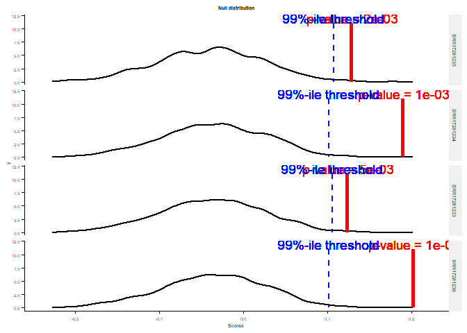
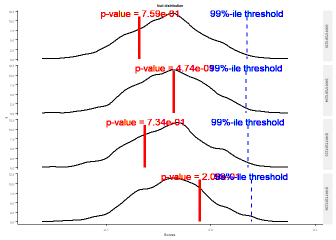

Enrichment Tests
================

Author: Chandler Sutherland Copyright (c) Chandler Sutherland Email:
<chandlersutherland@berkeley.edu>

Goal: assign significance to the enrichment plots, using the singscore
gene set enrichment for expression, and permutation tests for
methylation and TE distance.

``` r
library(data.table)
library(ggplot2)
library(tidyverse)
library(openxlsx)
library(ggsignif)
library(ggpubr)
library(singscore)
library(GSEABase)
library(patchwork)
```

Read in the gene table

``` r
zenodo_path <- "C:\\Users\\chand\\Box Sync\\Krasileva_Lab\\Research\\chandler\\Krasileva Lab\\E14\\Zenodo V2\\"
table <-  read.csv(paste(zenodo_path, 'all_gene_table.csv')) 

#set number of replicates throughout document
replicates <- 1000 #used 10,000 for p value reported in manuscript (see permutations.R), but reduced to 1000 here for rendering speed 
```

# Singscore for Expression Enrichment

An out of the box package exists to test significance of gene sets for
expression: singscore. (Fourtran 2018)

``` r
#generate gene sets
#remove unmappable genes 
HV <- table %>% filter(HV == 'hv') %>% filter(!(Gene %in% c('AT1G58807','AT1G58848','AT1G59124','AT1G59218')))
hv_names <- HV$Gene
hv_geneset <- GeneSet(hv_names, geneIdType=SymbolIdentifier())

NONHV <- table %>% filter(HV == 'non-hv')
nonhv_names <- NONHV$Gene %>% unique()
nonhv_geneset <- GeneSet(nonhv_names, geneIdType=SymbolIdentifier())
```

This packages does analysis by sample, not on averaged biological
replicates. Loading a raw TPM matrix. Then, create the ranked gene
object, ranked, and score the hv gene set and the nonhv gene set. From
here, generate a null distribution and plot our p values.

hvNLR enrichment:

``` r
TPM <- read.table("C:\\Users\\chand\\Box Sync\\Krasileva_Lab\\Research\\chandler\\Krasileva Lab\\E14\\tpm_matrix.csv", header=TRUE, sep=",", row.names=2) %>% subset(select=c(-X))

ranked <- rankGenes(TPM)

hv_sing <- simpleScore(ranked, upSet=hv_geneset)
nonhv_sing <- simpleScore(ranked, nonhv_geneset)

hv_null <- generateNull(rankData=ranked, upSet=hv_geneset)
hv_p <- getPvals(hv_null, hv_sing)
print(hv_p)
```

    ## SRR17281235 SRR17281234 SRR17281233 SRR17281236 
    ##       0.002       0.001       0.005       0.001

``` r
plotNull(hv_null, hv_sing, hv_p, sampleNames = names(hv_p)[1:4], textSize=0.5)
```

    ## Using  as id variables

<!-- -->

non-hvNLR enrichment:

``` r
nonhv_null <- generateNull(rankData=ranked, upSet=nonhv_geneset)
nonhv_p <- getPvals(nonhv_null, nonhv_sing)
print(nonhv_p)
```

    ## SRR17281235 SRR17281234 SRR17281233 SRR17281236 
    ##       0.759       0.474       0.734       0.208

``` r
plotNull(nonhv_null, nonhv_sing, nonhv_p, sampleNames = names(nonhv_p)[1:4], textSize=0.5)
```

    ## Using  as id variables

<!-- -->

Therefore, hvNLRs are significantly enriched (largest p value=0.003),
non-hvNLRs are not (largest p value=0.790).

# TE distance

For TE distance, write a function to calculate a p value for enrichment
tests by using a permutation test

``` r
# write a general permutation test function that can be used across features 
# first, calculate the observed value
observe <- function(df, col_index, hv_status){
  observed <- mean(df%>%filter(HV==hv_status)%>% pull(col_index)%>%na.omit()) - 
    mean(df %>% filter(HV=='all_genes')%>%pull(col_index)%>%na.omit())
  observed
}

permute <- function(df, col_index, hv_status) {
  # build null distribution
  permutation = replicate(replicates, { 
    df <- df %>% drop_na(col_index)
    sample_small <- df[sample(nrow(df), nrow(df[df$HV == hv_status,]) , replace = FALSE), ] # sample the size of hvNLRs
    sample_large <- df[! rownames(df) %in% rownames(sample_small), ] # sample the rest
    mean(sample_small %>% pull(col_index))-mean(sample_large %>% pull(col_index)) # get expected mean
})
  permutation
}


p_calc <- function(df, col_index){
  o <- observe(df, col_index, 'hv')
  p <- permute(df, col_index, 'hv')
  pval <- mean(o > p)
  
  o2 <- observe(df, col_index, 'non-hv')
  p2 <- permute(df, col_index, 'non-hv')
  pval2 <- mean(o2 > p2)
  
  print(paste(colnames(df)[col_index]))
  print(paste('hv_p: ', pval, ' nonhv_p:', pval2))
}
```

TE distance permutation test difference in means:

``` r
#apply to TE distance
p_calc(table, 6)
```

    ## [1] "te_dist"
    ## [1] "hv_p:  0  nonhv_p: 0.103"

For TE distance, also check the median:

``` r
observe_med <- function(df, col_index, hv_status){
  observed <- median(df%>%filter(HV==hv_status)%>%pull(col_index)%>%na.omit()) - 
    median(df %>% filter(HV=='all_genes')%>%pull(col_index)%>%na.omit())
  observed
}

permute_med <- function(df, col_index, hv_status) {
  # build null distribution
  permutation = replicate(replicates, { 
    df <- df %>% drop_na(col_index)
    sample_small <- df[sample(nrow(df), nrow(df[df$HV == hv_status,]) , replace = FALSE), ] # sample the size of hvNLRs
    sample_large <- df[! rownames(df) %in% rownames(sample_small), ] # sample the rest
    median(sample_small %>% pull(col_index))-median(sample_large %>% pull(col_index)) # get expected mean
})
  permutation
}

p_calc_med <- function(df, col_index){
  o <- observe_med(df, col_index, 'hv')
  p <- permute_med(df, col_index, 'hv')
  pval <- mean(o > p)
  
  o2 <- observe_med(df, col_index, 'non-hv')
  p2 <- permute_med(df, col_index, 'non-hv')
  pval2 <- mean(o2 > p2)
  
  print(paste(colnames(df)[col_index], ' median'))
  print(paste('hv_p: ', pval, ' nonhv_p:', pval2))
}
```

Permutation test difference in medians:

``` r
p_calc_med(table, 6)
```

    ## [1] "te_dist  median"
    ## [1] "hv_p:  0  nonhv_p: 0.569"

# Methylation

Begin with basic difference in means calculation

``` r
p_calc(table, 5)
```

    ## [1] "meth_percentage"
    ## [1] "hv_p:  0.002  nonhv_p: 0.783"

A potential bias for CG methylation is the number of high coverage CGs
per gene. This is on a per-sample basis. First, test the per sample
significance, then weight based on CGs per gene.

``` r
#load the per sample methylation files 
SRR17281085 <- readxl::read_xlsx(path="C://Users//chand//Box Sync//Krasileva_Lab//Research//chandler//Krasileva Lab//E14//e14_R//SRR17281085_per_gene_meth_count.xlsx", skip=2, col_names = c('Index', 'Chrom', 'Gene', 'mean_percent_methylation', 'count'))
SRR17281086 <- readxl::read_xlsx(path="C://Users//chand//Box Sync//Krasileva_Lab//Research//chandler//Krasileva Lab//E14//e14_R//SRR17281086_per_gene_meth_count.xlsx", skip=2, col_names = c('Index', 'Chrom', 'Gene', 'mean_percent_methylation', 'count'))
SRR17281087 <- readxl::read_xlsx(path="C://Users//chand//Box Sync//Krasileva_Lab//Research//chandler//Krasileva Lab//E14//e14_R//SRR17281087_per_gene_meth_count.xlsx", skip=2, col_names = c('Index', 'Chrom', 'Gene', 'mean_percent_methylation', 'count'))
SRR17281088 <- readxl::read_xlsx(path="C://Users//chand//Box Sync//Krasileva_Lab//Research//chandler//Krasileva Lab//E14//e14_R//SRR17281088_per_gene_meth_count.xlsx", skip=2, col_names = c('Index', 'Chrom', 'Gene', 'mean_percent_methylation', 'count'))

#clean up 
samples <- list(SRR17281085, SRR17281086, SRR17281087, SRR17281088)
names(samples) <- c('SRR17281085', 'SRR17281086', 'SRR17281087', 'SRR17281088')

clean <- function(df) {
  df2 <- df %>% merge(table, by='Gene', all=TRUE)
  df2$HV <- factor(df2$HV , levels=c("all_genes", "non-hv", "hv"))
  df3 <- df2 %>% subset(select=c('Gene', 'HV', 'mean_percent_methylation', 'count')) %>%
    filter(!is.na(mean_percent_methylation)) %>% 
    filter(Gene != 'AT4G16860') %>% #remove outlier hvNLRs with tricontext methylation 
    filter(Gene != 'AT1G58602')
  df3
}

clean_samples <- lapply(names(samples), function(x) clean(samples[[x]]))
names(clean_samples) <- c('SRR17281085', 'SRR17281086', 'SRR17281087', 'SRR17281088')
```

The kernel density estimation computes kernel density estimates. Often
shortened to KDE, it’s a technique that let’s you create a smooth curve
given a set of data. So here, it’s taking in my \# of mappable CG sites
per HV gene, and returning a density curve.

The approxfun function returns a list of points which linearly
interpolate given data points. Returns a function performing linear or
constant interpolation of the given data points. Linear interpolation is
a method of calculating intermediate data between known values by
conceptually drawing a straight line between two adjacent known values.

Repeat the CG count weighted permutation test on all four samples:

``` r
#create a sampled gene list weighted by counts 
density_sample <- function(df, hv_status){
  split_df <- df %>% filter(HV == hv_status)
  
  #calculate CG count density KDE function 
  d <- density(split_df$count)
  density_function <- approxfun(d)
  
  # write probabilities, and write NAs to zero as they are outliers in CG content (90+ per gene)
  probabilities <- density_function(df$count)
  probabilities[is.na(probabilities)] <- 0
  
  # sample genes, with weights according to their number of CGs, according to above function
  all_genes <- df$Gene
  sampled_genes <- data.frame(replicate(replicates, 
                                        sample(all_genes, 
                                               size = nrow(split_df), 
                                               replace = FALSE, 
                                               prob = probabilities)))
  
  return(sampled_genes)
  }


#write function that gets the difference in means between the permuted sample and the actual 
get_mean_difference <- function(gene_list, table) {
  permute_mean <- table %>% filter(Gene %in% gene_list) %>% pull(mean_percent_methylation) %>% mean()
  actual_mean <- table %>% filter(!Gene %in% gene_list)  %>% pull(mean_percent_methylation) %>% mean()
  return(actual_mean-permute_mean)
}

#calculate the pvalue 
pval <- function(sampled_df, table, hv_status, observed){
  differences <- list()
  for (x in 1:replicates) { 
    x <- get_mean_difference(sampled_df[[x]], table)
    differences <- append(differences, x)
    }
  
  p_val <- mean(differences < observed)
  
  return(p_val)
}
```

hvNLRs each sample:

``` r
hv_sampled_genes <- lapply(names(clean_samples), function(x) density_sample(clean_samples[[x]], 'hv'))
observed_hv <- lapply(names(clean_samples), function(x) observe(clean_samples[[x]], 3, 'hv'))

pval(hv_sampled_genes[[1]], clean_samples[[1]], 'hv', observed_hv[[1]])
```

    ## [1] 0.004

``` r
pval(hv_sampled_genes[[2]], clean_samples[[2]], 'hv', observed_hv[[2]])
```

    ## [1] 0.015

``` r
pval(hv_sampled_genes[[3]], clean_samples[[3]], 'hv', observed_hv[[3]])
```

    ## [1] 0.018

``` r
pval(hv_sampled_genes[[4]], clean_samples[[4]], 'hv', observed_hv[[4]])
```

    ## [1] 0.024

non-hvNLRs each sample:

``` r
nhv_sampled_genes <- lapply(names(clean_samples), function(x) density_sample(clean_samples[[x]], 'non-hv'))
observed_nhv <- lapply(names(clean_samples), function(x) observe(clean_samples[[x]], 3, 'non-hv'))

pval(nhv_sampled_genes[[1]], clean_samples[[1]], 'non-hv', observed_nhv[[1]])
```

    ## [1] 0.812

``` r
pval(nhv_sampled_genes[[2]], clean_samples[[2]], 'non-hv', observed_nhv[[2]])
```

    ## [1] 0.401

``` r
pval(nhv_sampled_genes[[3]], clean_samples[[3]], 'non-hv', observed_nhv[[3]])
```

    ## [1] 0.81

``` r
pval(nhv_sampled_genes[[4]], clean_samples[[4]], 'non-hv', observed_nhv[[4]])
```

    ## [1] 0.605
