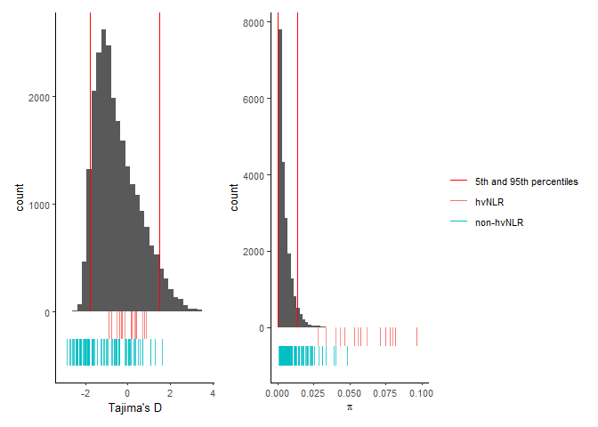

popgen_permutations
================
Chandler Sutherland
2024-01-11

Author: Chandler Sutherland Copyright (c) Chandler Sutherland Email:
<chandlersutherland@berkeley.edu>

Goal: Use permutation tests to determine number of NLRs expected by
chance in tails of empirical distribution.

``` r
library(data.table)
library(ggplot2)
```

    ## Warning: package 'ggplot2' was built under R version 4.3.1

``` r
library(tidyverse)
```

    ## Warning: package 'purrr' was built under R version 4.3.1

    ## Warning: package 'dplyr' was built under R version 4.3.1

    ## ── Attaching core tidyverse packages ──────────────────────── tidyverse 2.0.0 ──
    ## ✔ dplyr     1.1.3     ✔ readr     2.1.4
    ## ✔ forcats   1.0.0     ✔ stringr   1.5.0
    ## ✔ lubridate 1.9.2     ✔ tibble    3.2.1
    ## ✔ purrr     1.0.2     ✔ tidyr     1.3.0
    ## ── Conflicts ────────────────────────────────────────── tidyverse_conflicts() ──
    ## ✖ dplyr::between()     masks data.table::between()
    ## ✖ dplyr::filter()      masks stats::filter()
    ## ✖ dplyr::first()       masks data.table::first()
    ## ✖ lubridate::hour()    masks data.table::hour()
    ## ✖ lubridate::isoweek() masks data.table::isoweek()
    ## ✖ dplyr::lag()         masks stats::lag()
    ## ✖ dplyr::last()        masks data.table::last()
    ## ✖ lubridate::mday()    masks data.table::mday()
    ## ✖ lubridate::minute()  masks data.table::minute()
    ## ✖ lubridate::month()   masks data.table::month()
    ## ✖ lubridate::quarter() masks data.table::quarter()
    ## ✖ lubridate::second()  masks data.table::second()
    ## ✖ purrr::transpose()   masks data.table::transpose()
    ## ✖ lubridate::wday()    masks data.table::wday()
    ## ✖ lubridate::week()    masks data.table::week()
    ## ✖ lubridate::yday()    masks data.table::yday()
    ## ✖ lubridate::year()    masks data.table::year()
    ## ℹ Use the conflicted package (<http://conflicted.r-lib.org/>) to force all conflicts to become errors

``` r
library(ggsignif)
library(ggpubr)
library(patchwork)
```

    ## Warning: package 'patchwork' was built under R version 4.3.1

load data

``` r
#Change to your path to the zenodo download to repeat 
zenodo_path <- "C:\\Users\\chand\\Box Sync\\Krasileva_Lab\\Research\\chandler\\Krasileva Lab\\E14\\Zenodo V2\\"
#load in all gene data 
table <- read.csv(paste(zenodo_path, 'all_gene_table.csv'))
```

# D and Pi

We are interested in the probability of observing NLRs, hvNLRs, or
non-hvNLRs in the top 5% of an empirical distribution

``` r
#function that takes in table, column name as a string, and n replicates, and outputs probability of observing NLRs, hvNLRs, and non-hvNLRs in the top 5% of the distribution by chance 
on_top <- function(table, col_name, n){
  
  q <- quantile(table %>% pull(col_name), c(.05, .95), na.rm=TRUE)
  print(paste('calculating probability of ', col_name, '. The 95th percentile is: ', q[2]))
  
  observed_nlr <- table[table['HV'] != 'all_genes' & table[col_name]>q[2],] %>% nrow()
  
  permutation_nlr = replicate(n, {
  sample_small <- table[sample(nrow(table), nrow(table[table$HV != 'all_genes',]) , replace = FALSE), ] # sample the size of all NLRs
  sample_small[sample_small[col_name]>q[2],] %>% nrow()  # get expected above 95% 
  })
  
  print(paste('observed NLRs in top 5%:', observed_nlr))
  print(paste('expected NLRs in top 5% by chance:', mean(permutation_nlr)))
  print(paste('p value non-hv in top 5%:', mean(observed_nlr < permutation_nlr)))
  
  observed_hv <- table[table['HV'] == 'hv' & table[col_name]>q[2],] %>% nrow()
  permutation_hv = replicate(n, {
  sample_small <- table[sample(nrow(table), nrow(table[table$HV == 'hv',]) , replace = FALSE), ] 
  sample_small[sample_small[col_name]>q[2],] %>% nrow()  # get expected above 95% 
  })
  
  print(paste('observed hvNLRs in top 5%:', observed_hv))
  print(paste('expected hvNLRs in top 5% by chance:', mean(permutation_hv)))
  print(paste('p value hv in top 5%:', mean(observed_hv < permutation_hv)))
  
  observed_nhv <- table[table['HV'] == 'non-hv' & table[col_name]>q[2],] %>% nrow()
  
  permutation_nhv = replicate(n, {
  sample_small <- table[sample(nrow(table), nrow(table[table$HV == 'non-hv',]) , replace = FALSE), ] # sample the size of non-hvNLRs
  sample_small[sample_small[col_name]>q[2],] %>% nrow()  # get expected above 95% 
  })
  
  print(paste('observed hvNLRs in top 5%:', observed_nhv))
  print(paste('expected hvNLRs in top 5% by chance:', mean(permutation_nhv)))
  print(paste('p value hv in top 5%:', mean(observed_hv < permutation_nhv)))
  
}

on_top(table, 'Pi', 10000)
```

    ## [1] "calculating probability of  Pi . The 95th percentile is:  0.0140489927540266"
    ## [1] "observed NLRs in top 5%: 63"
    ## [1] "expected NLRs in top 5% by chance: 9.4444"
    ## [1] "p value non-hv in top 5%: 0"
    ## [1] "observed hvNLRs in top 5%: 35"
    ## [1] "expected hvNLRs in top 5% by chance: 2.5193"
    ## [1] "p value hv in top 5%: 0"
    ## [1] "observed hvNLRs in top 5%: 28"
    ## [1] "expected hvNLRs in top 5% by chance: 6.9743"
    ## [1] "p value hv in top 5%: 0"

``` r
on_top(table, 'D', 10000)
```

    ## [1] "calculating probability of  D . The 95th percentile is:  1.50881426721351"
    ## [1] "observed NLRs in top 5%: 1"
    ## [1] "expected NLRs in top 5% by chance: 12.0985"
    ## [1] "p value non-hv in top 5%: 0.9999"
    ## [1] "observed hvNLRs in top 5%: 0"
    ## [1] "expected hvNLRs in top 5% by chance: 3.2046"
    ## [1] "p value hv in top 5%: 0.9628"
    ## [1] "observed hvNLRs in top 5%: 1"
    ## [1] "expected hvNLRs in top 5% by chance: 8.8973"
    ## [1] "p value hv in top 5%: 1"

``` r
on_bottom <- function(table, x, n){
  
  q <- quantile(table %>% pull(x), c(.05, .95), na.rm=TRUE)
  print(paste('calculating probability of ', x, '. The 5th percentile is: ', q[1]))
  
  observed_nlr <- table[table['HV'] != 'all_genes' & table[x]<q[1],] %>% nrow()
  
  permutation_nlr = replicate(n, {
  sample_small <- table[sample(nrow(table), nrow(table[table$HV != 'all_genes',]) , replace = FALSE), ] # sample the size of all NLRs
  sample_small[sample_small[x]<q[1],] %>% nrow()  # get below 5% 
  })
  
  print(paste('observed NLRs in bottom 5%:', observed_nlr))
  print(paste('expected NLRs in bottom 5% by chance:', mean(permutation_nlr)))
  print(paste('p value non-hv in bottom 5%:', mean(observed_nlr < permutation_nlr)))
  
  observed_hv <- table[table['HV'] == 'hv' & table[x]<q[1],] %>% nrow()
  
  permutation_hv = replicate(n, {
  sample_small <- table[sample(nrow(table), nrow(table[table$HV == 'hv',]) , replace = FALSE), ] # sample the size of hvNLRs
  sample_small[sample_small[x]<q[1],] %>% nrow()  # get expected above 95% 
  })
  
  print(paste('observed hvNLRs in bottom 5%:', observed_hv))
  print(paste('expected hvNLRs in bottom 5% by chance:', mean(permutation_hv)))
  print(paste('p value hv in bottom 5%:', mean(observed_hv < permutation_hv)))
  
  observed_nhv <- table[table['HV'] == 'non-hv' & table[x]<q[1],] %>% nrow()
  
  permutation_nhv = replicate(n, {
  sample_small <- table[sample(nrow(table), nrow(table[table$HV == 'non-hv',]) , replace = FALSE), ] # sample the size of non-hvNLRs
  sample_small[sample_small[x]<q[1],] %>% nrow()  # get expected above 95% 
  })
  
  print(paste('observed hvNLRs in bottom 5%:', observed_nhv))
  print(paste('expected hvNLRs in bottom 5% by chance:', mean(permutation_nhv)))
  print(paste('p value hv in bottom 5%:', mean(observed_hv < permutation_nhv)))
  
}

on_bottom(table, 'Pi', 1000)
```

    ## [1] "calculating probability of  Pi . The 5th percentile is:  0.000316624887148824"
    ## [1] "observed NLRs in bottom 5%: 0"
    ## [1] "expected NLRs in bottom 5% by chance: 9.553"
    ## [1] "p value non-hv in bottom 5%: 1"
    ## [1] "observed hvNLRs in bottom 5%: 0"
    ## [1] "expected hvNLRs in bottom 5% by chance: 2.443"
    ## [1] "p value hv in bottom 5%: 0.923"
    ## [1] "observed hvNLRs in bottom 5%: 0"
    ## [1] "expected hvNLRs in bottom 5% by chance: 6.912"
    ## [1] "p value hv in bottom 5%: 1"

``` r
on_bottom(table, 'D', 1000)
```

    ## [1] "calculating probability of  D . The 5th percentile is:  -1.78922602865888"
    ## [1] "observed NLRs in bottom 5%: 46"
    ## [1] "expected NLRs in bottom 5% by chance: 12.146"
    ## [1] "p value non-hv in bottom 5%: 0"
    ## [1] "observed hvNLRs in bottom 5%: 0"
    ## [1] "expected hvNLRs in bottom 5% by chance: 3.188"
    ## [1] "p value hv in bottom 5%: 0.954"
    ## [1] "observed hvNLRs in bottom 5%: 46"
    ## [1] "expected hvNLRs in bottom 5% by chance: 8.927"
    ## [1] "p value hv in bottom 5%: 1"

Supplemental figure 3, which shows the distribution of D and Pi with the
percentiles

``` r
d_distro <- ggplot(data=table)+geom_histogram(aes(x=D))+
   geom_segment(x=1.50913785453558, xend=1.50913785453558, yend=0, y=20000, aes(color='5th and 95th percentiles'))+
  geom_segment(x=-1.7870429615165, xend=-1.7870429615165, yend=0, y=20000, aes(color='5th and 95th percentiles'))+
  geom_segment(data= table %>% filter(HV=='hv'), aes(
      x= D,
        y = 0,
        xend = D,
        yend = -250, color='hvNLR'), alpha = 0.75, linewidth=0.5) +
    labs(colour = c('hvNLR', 'nonhvNLR')) +
geom_segment(data= table %>% filter(HV=='non-hv'), aes(
      x= D,
        y = -250,
        xend = D,
        yend = -500, color='non-hvNLR'), alpha = 0.75, linewidth=0.5) +
    labs(colour = c('hvNLR', 'nonhvNLR')) +
  theme_classic() +
  theme(legend.position='right', text=element_text(size=10), legend.title=element_blank())+
 # labs(title='Empirical Distribution of D values')+
  xlab("Tajima's D")+
  ylab('count')+
  scale_color_manual(values=c('red', '#F8766D', '#00BFC4'))

pi_distro <- ggplot(data=table)+geom_histogram(aes(x=Pi), bins=50)+
  geom_segment(x=0.000316624887148824, xend=0.000316624887148824, yend=0, y=20000, aes(color='5th and 95th percentiles'))+
  geom_segment(x=0.0140259207477425, xend=0.0140259207477425, yend=0, y=20000, aes(color='5th and 95th percentiles'))+
  geom_segment(data= table %>% filter(HV=='hv'), aes(
      x= Pi,
        y = 0,
        xend = Pi,
        yend = -500, color='hvNLR'), alpha = 0.75, linewidth=0.5) +
    labs(colour = c('hvNLR', 'nonhvNLR')) +
geom_segment(data= table %>% filter(HV=='non-hv'), aes(
      x= Pi,
        y = -500,
        xend = Pi,
        yend = -1000, color='non-hvNLR'), alpha = 0.75, linewidth=0.5) +
    labs(colour = c('hvNLR', 'nonhvNLR')) +
  theme_classic() +
  xlim(0, 0.10)+
  theme(legend.position='right', text=element_text(size=10), legend.title=element_blank())+
  #labs(title='Empirical Distribution of Pi Values')+
  xlab(expression(pi))+
  ylab('count')+
  scale_color_manual(values=c('red', '#F8766D', '#00BFC4'))

both <- d_distro+pi_distro+plot_layout(guides = 'collect')
both
```

    ## `stat_bin()` using `bins = 30`. Pick better value with `binwidth`.

    ## Warning: Removed 1134 rows containing non-finite values (`stat_bin()`).

    ## Warning: Removed 590 rows containing non-finite values (`stat_bin()`).

    ## Warning: Removed 2 rows containing missing values (`geom_bar()`).

<!-- -->

``` r
ggsave(filename='C:\\Users\\chand\\Box Sync\\Krasileva_Lab\\Research\\chandler\\Krasileva Lab\\Outputs\\NLR Features Paper\\EMBO Submission\\Figure Panels\\EV_fig4a.png', plot=both, dpi=1000, width=180, height=70, unit='mm')
```

    ## `stat_bin()` using `bins = 30`. Pick better value with `binwidth`.

    ## Warning: Removed 1134 rows containing non-finite values (`stat_bin()`).

    ## Warning: Removed 590 rows containing non-finite values (`stat_bin()`).

    ## Warning: Removed 2 rows containing missing values (`geom_bar()`).

``` r
#write source data 
write.csv(table %>% subset(select=c('Gene', 'HV', 'Pi', 'D')), file="./Source Data/EV Figure 3/EV 3AB/pi_d_genome.csv")
```

Repeat for the density of both distributions

``` r
#double double toil and trouble, two distros! 
q_D <- quantile(table$D, c(.05, .95), na.rm = TRUE)
q_Pi <- quantile(table$Pi, c(.05, .95), na.rm=TRUE)

observed_nlr <- table %>% filter(HV != 'all_genes') %>% filter(D > q_D[2]) %>% filter(Pi > q_Pi[2]) %>% nrow()

permutation_nlr = replicate(10000, {
  sample_small <- table[sample(nrow(table), nrow(table[table$HV != 'all_genes',]) , replace = FALSE), ] # sample the size of non-hvNLRs
  #sample_large <- meth[! rownames(meth) %in% rownames(sample_small), ] # sample the rest
  sample_small%>% filter(D > q_D[2]) %>% filter(Pi > q_Pi[2]) %>% nrow()  # get expected above 95%
})

print(paste('observed NLRs in top 5% of both distros:', observed_nlr))
```

    ## [1] "observed NLRs in top 5% of both distros: 1"

``` r
print(paste('expected NLRs in top 5% of both distros by chance:', mean(permutation_nlr)))
```

    ## [1] "expected NLRs in top 5% of both distros by chance: 1.6874"

``` r
print(paste('p value NLRs in top of both distros:', mean(observed_nlr < permutation_nlr)))
```

    ## [1] "p value NLRs in top of both distros: 0.5053"
