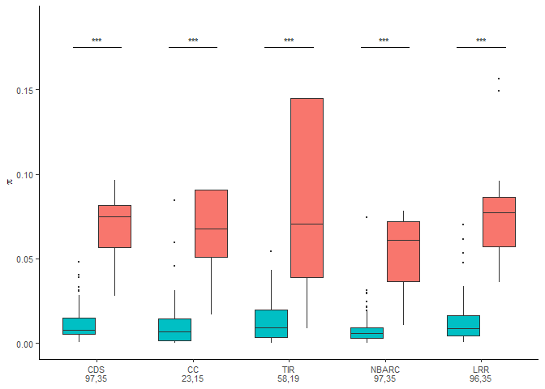
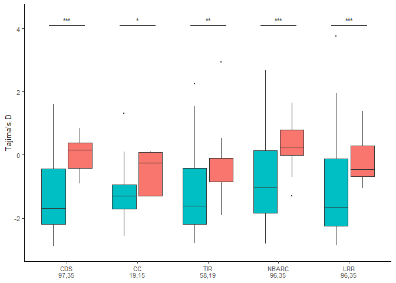
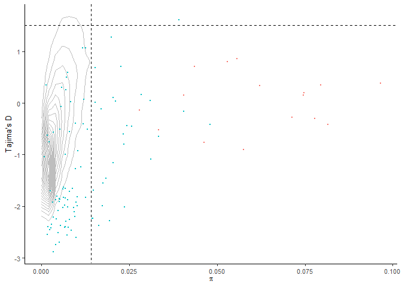
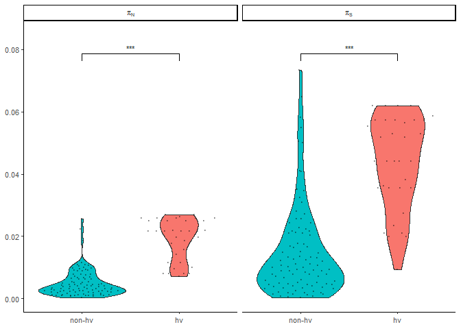
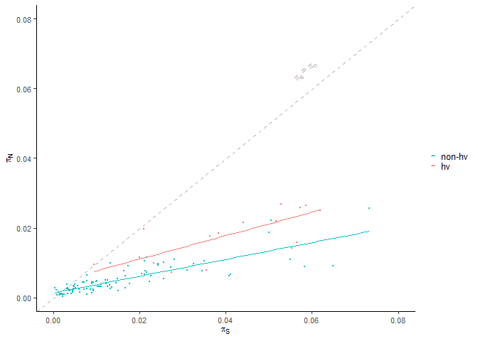
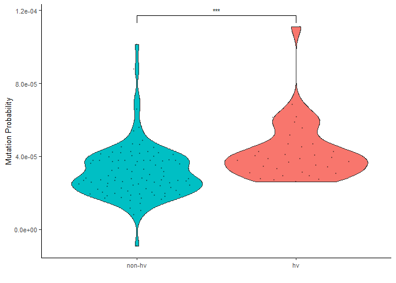
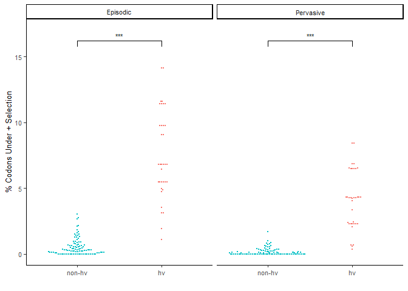
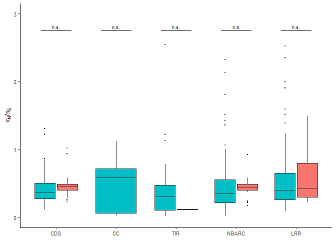
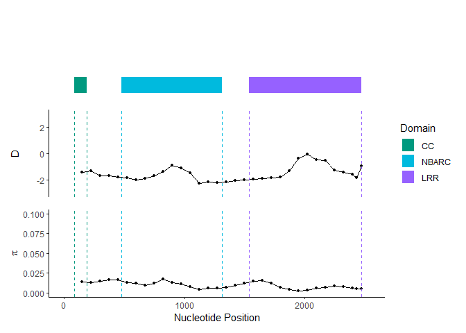
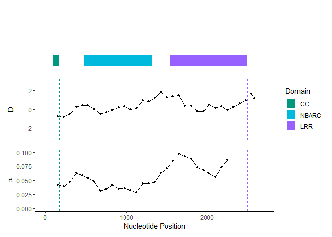

popgen_plots
================
Chandler Sutherland
2023-08-15

Copyright (c) Chandler Sutherland Email:
<chandlersutherland@berkeley.edu>

Purpose: Plot population genetics statistics of hv and non-hvNLRs

Intermediate processing steps are shown here, but figures can be
recreated using just the numerical source data provided in
`Source Data/Figure 5` and `Source Data/Figure 6`.

``` r
library(ggplot2)
library(ggsignif)
library(ggpubr)
library(ggbeeswarm)
require(tidyverse)
library(openxlsx)
library(patchwork)
```

Gather and clean the necessary datasets, write intermediate files to
zenodo

``` r
#zenodo path 
zenodo_path <- "C:\\Users\\chand\\Box Sync\\Krasileva_Lab\\Research\\chandler\\Krasileva Lab\\E14\\Zenodo V2\\"

#read in col0_popgen_stats, generated by the egglib_nlr.ipynb script 
col_popgen <- read_tsv("//wsl.localhost//Ubuntu//home//chandlersutherland//scratch//egglib_results.tsv") %>%
  mutate(Pi=Pi_raw/lseff)%>%
  mutate(PiNPiS = PiN/PiS) %>%
  mutate(domain=recode(domain, 'cc' = "CC", 'tir'="TIR", 'nbarc'='NBARC', 'lrr'='LRR', 'cds'='CDS'))

col_popgen$domain <- factor(col_popgen$domain, levels=c('CDS', 'CC', 'TIR', 'NBARC', 'LRR'))
col_popgen$HV <- factor(col_popgen$HV, levels=c('non-hv', 'hv'))

#add in gene names 
names <- read_csv(paste(zenodo_path, "Atha_NLR_common_names.csv", sep="")) 
col_popgen <- merge(col_popgen, names, all.x=TRUE)

popgen_per_domain <- col_popgen %>% subset(select=c('Gene', 'D', 'PiN', 'PiS', 'clade', 'dna_aln', 'domain', 'lseff', 'HV', 'Pi', 'PiNPiS', 'name'))

#write to zenodo
write.csv(popgen_per_domain, paste(zenodo_path, 'popgen_per_domain.csv', sep=""))

#write to source data 
write.csv(popgen_per_domain %>% subset(select=c('Gene', 'name', 'HV', 'domain', 'D', 'Pi', 'PiN', 'PiS', 'PiNPiS')), 
          'Source Data//Figure 5//popgen_per_domain.csv')
write.csv(popgen_per_domain %>% subset(select=c('Gene', 'name', 'HV', 'domain', 'D', 'Pi', 'PiN', 'PiS', 'PiNPiS')), 
          'Source Data//EV Figure 4//EV 4C//popgen_per_domain.csv')
```

For gene wide statistics, use just the CDS. Already in the
NLR_gene_table

``` r
#read in gene-wide data from NLR gene table 
#subset to relevant columns and add sample size label 
NLR_popgen <- read.csv(paste(zenodo_path, 'NLR_gene_table.csv')) %>% 
  subset(select=c('Gene', 'HV', 'name', 'D', 'Pi', 'PiN', 'PiS', 'PiNPiS', 'Mutation.Probability.Score'))%>%
  group_by(HV) %>%
  mutate(n=n()) %>%
  mutate(label = paste0(HV,"\n", "n=",n))

labels <- NLR_popgen$label %>% unique()
NLR_popgen$label <- factor(NLR_popgen$label, levels=c(labels[1], labels[2]))

write.csv(NLR_popgen, 'Source Data//Figure 6//6ABC//NLR_popgen.csv')
```

Read in the sliding window analysis

``` r
#read in sliding window analysis 
x <- col_popgen %>% 
  filter(domain=='CDS') %>% 
  subset(select=c('Gene', 'dna_aln')) %>% dplyr::rename('gene_length'='dna_aln')
vig_slider <- read_csv(paste(zenodo_path, "egglib_window_stats.csv", sep="")) %>% 
  mutate(Pi=Pi_raw/lseff) %>% 
  mutate(nuc_midpoint = (start*3+dna_aln/2)) 

col_slider <- merge(x, vig_slider, by='Gene', all.x=FALSE) %>% mutate(normal=nuc_midpoint/gene_length) 

#read in all gene data 
all_gene <- read.csv(paste(zenodo_path, 'all_gene_table.csv'))
```

Read in, combine, and clean positive selection results

``` r
#read in hyphy positive selection results 
fel_results<-read_csv("//wsl.localhost//Ubuntu//home//chandlersutherland//scratch//fel_results.csv")%>%
  dplyr::rename('Clade'='clade')

meme_results<-read_csv("//wsl.localhost//Ubuntu//home//chandlersutherland//scratch//meme_results.csv")%>%
  dplyr::rename('Clade'='clade')

clades <- read.table(file='C:\\Users\\chand\\Box Sync\\Krasileva_Lab\\Research\\chandler\\Krasileva Lab\\E14\\Atha_NLRome_GeneTable.txt', header=1) %>% 
  filter(Ecotype=='ATHALIANA') %>% 
  separate(Gene, c(NA, 'Gene'))%>%
  subset(select=c('Gene', 'Clade', 'HV')) %>% 
  distinct() %>% 
  mutate(HV=recode(HV, '0'='non-hv', '1'='hv'))

pos_sites <- merge(clades, fel_results %>% filter(direction == 'Pos.'), all.x=TRUE) %>% 
  merge(meme_results, by='Clade', all.x=TRUE) %>% 
  subset(select=c('Clade', 'Gene', 'HV', 'prop_fel_int_95', 'prop_meme_internal_95'))

pos_sites$HV <- factor(pos_sites$HV , levels=c("non-hv", "hv"))

sites_internal_long <- pos_sites %>% subset(select=c('Gene', 'HV', 'prop_fel_int_95', 'prop_meme_internal_95')) %>% pivot_longer(
    cols = c(prop_fel_int_95, prop_meme_internal_95), 
    names_to = "model",
    values_to = "value") %>%
  mutate(model=recode(model, 
                      'prop_fel_int_95' = "Pervasive", 
                      'prop_meme_internal_95' = 'Episodic'))
#write to zenodo
write.csv(sites_internal_long, paste(zenodo_path, 'positive_selection.csv', sep=""))

#write source data 
write.csv(sites_internal_long, 'Source Data//Figure 6//6D//positive_selection.csv')
```

# Figure 5:

Per domain plots

## A: Pi

Pi stats:

``` r
cds <- compare_means(Pi~HV, col_popgen %>% filter(domain=='CDS'), method='wilcox.test', paired=FALSE)$p
cc <- compare_means(Pi~HV, col_popgen %>% filter(domain=='CC'), method='wilcox.test', paired=FALSE)$p
tir <- compare_means(Pi~HV, col_popgen %>% filter(domain=='TIR'), method='wilcox.test', paired=FALSE)$p
nbarc <- compare_means(Pi~HV, col_popgen %>% filter(domain=='NBARC'), method='wilcox.test', paired=FALSE)$p
lrr <- compare_means(Pi~HV, col_popgen %>% filter(domain=='LRR'), method='wilcox.test', paired=FALSE)$p

pvalues <- c(cds, cc, tir, nbarc, lrr)
pvalues_adjust <- p.adjust(pvalues, method = 'BH', n = length(pvalues))
print(pvalues_adjust)
```

    ## [1] 1.898108e-17 8.195799e-06 7.266158e-09 2.631707e-16 2.733286e-17

``` r
compare_means(Pi~domain, col_popgen %>% filter(HV=='hv'), method='wilcox.test', paired=FALSE)
```

    ## # A tibble: 10 × 8
    ##    .y.   group1 group2        p  p.adj p.format p.signif method  
    ##    <chr> <chr>  <chr>     <dbl>  <dbl> <chr>    <chr>    <chr>   
    ##  1 Pi    CDS    CC     0.511    1      0.51052  ns       Wilcoxon
    ##  2 Pi    CDS    TIR    0.828    1      0.82752  ns       Wilcoxon
    ##  3 Pi    CDS    NBARC  0.00132  0.012  0.00132  **       Wilcoxon
    ##  4 Pi    CDS    LRR    0.404    1      0.40365  ns       Wilcoxon
    ##  5 Pi    CC     TIR    0.185    1      0.18483  ns       Wilcoxon
    ##  6 Pi    CC     NBARC  0.289    1      0.28853  ns       Wilcoxon
    ##  7 Pi    CC     LRR    0.361    1      0.36137  ns       Wilcoxon
    ##  8 Pi    TIR    NBARC  0.114    0.91   0.11419  ns       Wilcoxon
    ##  9 Pi    TIR    LRR    0.885    1      0.88451  ns       Wilcoxon
    ## 10 Pi    NBARC  LRR    0.000418 0.0042 0.00042  ***      Wilcoxon

``` r
compare_means(Pi~domain, col_popgen %>% filter(HV=='non-hv'), method='wilcox.test', paired=FALSE)
```

    ## # A tibble: 10 × 8
    ##    .y.   group1 group2        p  p.adj p.format p.signif method  
    ##    <chr> <chr>  <chr>     <dbl>  <dbl> <chr>    <chr>    <chr>   
    ##  1 Pi    CDS    CC     0.246    1      0.24631  ns       Wilcoxon
    ##  2 Pi    CDS    TIR    0.829    1      0.82926  ns       Wilcoxon
    ##  3 Pi    CDS    NBARC  0.000458 0.0046 0.00046  ***      Wilcoxon
    ##  4 Pi    CDS    LRR    0.848    1      0.84805  ns       Wilcoxon
    ##  5 Pi    CC     TIR    0.439    1      0.43882  ns       Wilcoxon
    ##  6 Pi    CC     NBARC  0.840    1      0.84032  ns       Wilcoxon
    ##  7 Pi    CC     LRR    0.314    1      0.31404  ns       Wilcoxon
    ##  8 Pi    TIR    NBARC  0.0148   0.12   0.01480  *        Wilcoxon
    ##  9 Pi    TIR    LRR    0.991    1      0.99125  ns       Wilcoxon
    ## 10 Pi    NBARC  LRR    0.00510  0.046  0.00510  **       Wilcoxon

Plot:

``` r
pi_exp <- expression(pi)

#create a sample size df for x label 
sample_size <- col_popgen %>% group_by(domain, HV) %>% summarize(D=sum(!is.na(D)), Pi=sum(!is.na(Pi)))
label_df <- sample_size %>% 
  pivot_wider(names_from=HV, values_from=c(D, Pi)) %>%
  mutate(pi_label=paste(domain, '\n', `Pi_non-hv`, ',', Pi_hv, sep=""), 
         d_label=paste(domain, '\n', `D_non-hv`, ',', D_hv, sep=""))
```

``` r
p7 <- ggplot(col_popgen)+
  geom_boxplot(aes(x=domain, y=Pi, fill=HV), lwd=0.25, outlier.size=0.1)+
    scale_fill_manual(values=c('#00BFC4', '#F8766D'))+
  theme_classic()+
  ylab(pi_exp)+
  ylim(0, 0.19)+
  scale_x_discrete(breaks=label_df$domain,
        labels=label_df$pi_label)+
  geom_signif(stat='identity', 
                      data=data.frame(x = c(0.75, 1.75, 2.75, 3.75, 4.75),
                      xend=c(1.25, 2.25, 3.25, 4.25, 5.25),
                      y = c(0.175, 0.175, 0.175, 0.175, 0.175),
                      annotation2 = c('***',  ' *** ', '  ***  ', '   ***    ', '    ***    ')), 
              aes(x=x, xend=xend, y=y, yend=y, annotation=annotation2, textsize=2.5))+
    theme(legend.position='none', text=element_text(size=10), axis.title.x = element_blank())
  
p7 
```

<!-- -->

## A: Tajima’s D

Stats:

``` r
cds <- compare_means(D~HV, col_popgen %>% filter(domain=='CDS'), method='wilcox.test', paired=FALSE)$p
cc <- compare_means(D~HV, col_popgen %>% filter(domain=='CC'), method='wilcox.test', paired=FALSE)$p
tir <- compare_means(D~HV, col_popgen %>% filter(domain=='TIR'), method='wilcox.test', paired=FALSE)$p
nbarc <- compare_means(D~HV, col_popgen %>% filter(domain=='NBARC'), method='wilcox.test', paired=FALSE)$p
lrr <- compare_means(D~HV, col_popgen %>% filter(domain=='LRR'), method='wilcox.test', paired=FALSE)$p

pvalues <- c(cds, cc, tir, nbarc, lrr)
p.adjust(pvalues, method = 'BH', n = length(pvalues))
```

    ## [1] 6.940697e-08 1.114327e-02 3.731634e-03 3.983814e-05 8.448988e-05

``` r
compare_means(D~domain, col_popgen, method='wilcox.test')
```

    ## # A tibble: 10 × 8
    ##    .y.   group1 group2        p  p.adj p.format p.signif method  
    ##    <chr> <chr>  <chr>     <dbl>  <dbl> <chr>    <chr>    <chr>   
    ##  1 D     CDS    CC     0.856    1      0.85649  ns       Wilcoxon
    ##  2 D     CDS    TIR    0.284    1      0.28415  ns       Wilcoxon
    ##  3 D     CDS    NBARC  0.00392  0.035  0.00392  **       Wilcoxon
    ##  4 D     CDS    LRR    0.987    1      0.98657  ns       Wilcoxon
    ##  5 D     CC     TIR    0.259    1      0.25859  ns       Wilcoxon
    ##  6 D     CC     NBARC  0.0511   0.36   0.05108  ns       Wilcoxon
    ##  7 D     CC     LRR    0.995    1      0.99521  ns       Wilcoxon
    ##  8 D     TIR    NBARC  0.000793 0.0079 0.00079  ***      Wilcoxon
    ##  9 D     TIR    LRR    0.356    1      0.35626  ns       Wilcoxon
    ## 10 D     NBARC  LRR    0.0108   0.087  0.01083  *        Wilcoxon

``` r
compare_means(D~domain, col_popgen %>% filter(HV=='hv'), method='wilcox.test')
```

    ## # A tibble: 10 × 8
    ##    .y.   group1 group2       p p.adj p.format p.signif method  
    ##    <chr> <chr>  <chr>    <dbl> <dbl> <chr>    <chr>    <chr>   
    ##  1 D     CDS    CC     0.0109  0.087 0.0109   *        Wilcoxon
    ##  2 D     CDS    TIR    0.0948  0.57  0.0948   ns       Wilcoxon
    ##  3 D     CDS    NBARC  0.129   0.57  0.1292   ns       Wilcoxon
    ##  4 D     CDS    LRR    0.138   0.57  0.1383   ns       Wilcoxon
    ##  5 D     CC     TIR    0.972   0.97  0.9722   ns       Wilcoxon
    ##  6 D     CC     NBARC  0.00508 0.046 0.0051   **       Wilcoxon
    ##  7 D     CC     LRR    0.0978  0.57  0.0978   ns       Wilcoxon
    ##  8 D     TIR    NBARC  0.00389 0.039 0.0039   **       Wilcoxon
    ##  9 D     TIR    LRR    0.336   0.67  0.3359   ns       Wilcoxon
    ## 10 D     NBARC  LRR    0.0254  0.18  0.0254   *        Wilcoxon

``` r
compare_means(D~domain, col_popgen %>% filter(HV=='non-hv'), method='wilcox.test')
```

    ## # A tibble: 10 × 8
    ##    .y.   group1 group2       p p.adj p.format p.signif method  
    ##    <chr> <chr>  <chr>    <dbl> <dbl> <chr>    <chr>    <chr>   
    ##  1 D     CDS    CC     0.537   1     0.5372   ns       Wilcoxon
    ##  2 D     CDS    TIR    0.705   1     0.7049   ns       Wilcoxon
    ##  3 D     CDS    NBARC  0.00359 0.036 0.0036   **       Wilcoxon
    ##  4 D     CDS    LRR    0.908   1     0.9081   ns       Wilcoxon
    ##  5 D     CC     TIR    0.553   1     0.5527   ns       Wilcoxon
    ##  6 D     CC     NBARC  0.123   0.86  0.1225   ns       Wilcoxon
    ##  7 D     CC     LRR    0.617   1     0.6172   ns       Wilcoxon
    ##  8 D     TIR    NBARC  0.00747 0.067 0.0075   **       Wilcoxon
    ##  9 D     TIR    LRR    0.674   1     0.6743   ns       Wilcoxon
    ## 10 D     NBARC  LRR    0.0153  0.12  0.0153   *        Wilcoxon

``` r
kruskal.test(D ~ domain, data = col_popgen)
```

    ## 
    ##  Kruskal-Wallis rank sum test
    ## 
    ## data:  D by domain
    ## Kruskal-Wallis chi-squared = 14.665, df = 4, p-value = 0.005449

``` r
kruskal.test(D ~ domain, data = col_popgen%>%filter(HV=='hv'))
```

    ## 
    ##  Kruskal-Wallis rank sum test
    ## 
    ## data:  D by domain
    ## Kruskal-Wallis chi-squared = 15.548, df = 4, p-value = 0.00369

``` r
kruskal.test(D ~ domain, data = col_popgen%>%filter(HV=='non-hv'))
```

    ## 
    ##  Kruskal-Wallis rank sum test
    ## 
    ## data:  D by domain
    ## Kruskal-Wallis chi-squared = 11.69, df = 4, p-value = 0.01981

Plot:

``` r
p10 <- ggplot(col_popgen,
       aes(x=domain, y=D))+
   geom_boxplot(lwd=0.25, aes(fill=HV), outlier.size = 0.1)+
    scale_fill_manual(values=c('#00BFC4', '#F8766D'))+
  theme_classic()+
  ylab("Tajima's D")+
  ylim(-3, 4.4)+
  scale_x_discrete(breaks=label_df$domain,
        labels=label_df$d_label)+
  geom_signif(stat='identity', 
                      data=data.frame(x = c(0.75, 1.75, 2.75, 3.75, 4.75),
                      xend=c(1.25, 2.25, 3.25, 4.25, 5.25),
                      y = c(4.1, 4.1, 4.1, 4.1, 4.1),
                      annotation2 = c('***', '*', '**', ' *** ', '  ***  ')), 
              aes(x=x, xend=xend, y=y, yend=y, annotation=annotation2, textsize=2.5))+
    theme(legend.position='none', text=element_text(size=10), axis.title.x = element_blank())

  
p10 
```

<!-- -->

``` r
fig_5a <- p10+p7+plot_layout(ncol=1)
ggsave(filename='C:\\Users\\chand\\Box Sync\\Krasileva_Lab\\Research\\chandler\\Krasileva Lab\\Outputs\\NLR Features Paper\\EMBO Submission\\Figure Panels\\fig_5a.svg', plot=fig_5a, dpi=1000, width=75, height=80, units = 'mm')
```

## B: Pi vs Tajima’s D plot

``` r
#calculate top 5% threshold for Pi and Tajima's D 
top_pi <- all_gene %>% pull(Pi) %>% quantile(c(.95), na.rm=TRUE)
top_D <- all_gene %>% pull(D) %>% quantile(c(.95), na.rm=TRUE)
all_gene %>% filter(HV != 'all_genes') %>% filter(Pi > top_pi & D > top_D)
```

    ##       X      Gene     HV log2_TPM meth_percentage te_dist         Pi        D
    ## 1 25226 AT5G47260 non-hv        0            77.5       0 0.03909852 1.605438

``` r
p <-ggplot()+
  geom_density2d(all_gene, mapping=aes(x=Pi, y=D, linetype='Genome Distribution'), bins=20, color='grey',  lwd=0.5)+
  geom_segment(x=top_pi, 
               xend=top_pi, 
               y=max(all_gene$D, na.rm=TRUE), 
               yend=-3.1, color='black', 
               aes(linetype='95th Percentile'), lwd=0.35)+
  geom_segment(x=-1, 
               xend=max(all_gene$Pi, na.rm=TRUE), 
               y=top_D, 
               yend=top_D, color='black', 
               aes(linetype='95th Percentile'), lwd=0.35)+
  geom_point(data=NLR_popgen, aes(x=Pi, y=D, color=HV), size=0.5)+
  scale_linetype_manual(values=c('Genome Distribution' = 1,  '95th Percentile'=2))+
  scale_color_manual(values = c("hv" = "#F8766D",
                                "non-hv" = '#00BFC4'))+
  guides(linetype=guide_legend(override.aes = list(linetype = c(2, 1),
                                                   shape=c(NA, NA), 
                                                   color=c('black', 'grey')), 
                               order=1),
         color=guide_legend(override.aes = list(linetype = c(0, 0), 
                                                shape=c(16, 16)), 
                            order=2), 
        fill = guide_legend(byrow = TRUE))+
  xlab(expression(pi))+
  ylab("Tajima's D")+
  theme_classic()+
  theme(legend.position='none', 
        text=element_text(size=10))

p
```

<!-- -->

``` r
ggsave(filename='C:\\Users\\chand\\Box Sync\\Krasileva_Lab\\Research\\chandler\\Krasileva Lab\\Outputs\\NLR Features Paper\\EMBO Submission\\Figure Panels\\fig_5b.svg', plot=p, dpi=1000, width=105,  height=80, units='mm')
```

# Figure 6:

## A: PiN and PiS plots

``` r
pi_long <- NLR_popgen %>% subset(select=c('Gene', 'PiS', 'PiN', 'HV')) %>% pivot_longer(
    cols = c(PiS, PiN), 
    names_to = "pi_type",
    values_to = "value") %>%
  mutate(pi_type=recode(pi_type, 
                        "PiS" = "{pi[S]}", 
                        "PiN" = "{pi[N]}"))

pis <- compare_means(value~HV, pi_long %>% filter(pi_type=="{pi[S]}"), method="wilcox.test")$p
pin <- compare_means(value~HV, pi_long %>% filter(pi_type=="{pi[N]}"), method="wilcox.test")$p

p.adjust(c(pis, pin), method='BH', 2)
```

    ## [1] 1.171513e-12 3.288645e-15

``` r
pi_long$HV <- factor(pi_long$HV, levels=c('non-hv', 'hv'))

p13 <- pi_long %>%
  ggplot(aes(x=HV, y=value, fill=HV))+
  geom_violin(lwd=0.25)+
    geom_quasirandom(alpha=0.3, size=0.5)+
   geom_signif(comparisons=list(c('hv', 'non-hv')), 
               map_signif_level = TRUE, test=wilcox.test, textsize=2, size=0.25, y=c(0.08))+
  ylim(0,0.085)+
    scale_fill_manual(values=c('#00BFC4', '#F8766D'))+
  theme_classic()+
    theme(legend.position='none', text=element_text(size=10), axis.title=element_blank())+
  facet_grid(~pi_type, labeller=label_parsed)

p13
```

<!-- -->

## B: PiN/PiS plot

``` r
pis=expression(pi['S'])
pin=expression(pi['N'])
pis_equals_pin=expression(pi['s']~'='~pi['n'])

pis_piN <- NLR_popgen %>% 
  ggplot(aes(x=PiS, y=PiN, fill=HV, color=HV))+
    geom_point(aes(color=HV), size=0.5)+
  geom_abline(slope=1, intercept=0, color='darkgrey', linetype='dashed')+
  geom_smooth(method='lm', se=FALSE, lwd=0.5)+
  ylim(0,0.08)+
  xlim(0,0.08)+
  scale_color_manual(values = c('#00BFC4',"#F8766D"))+
  xlab(pis)+
  ylab(pin)+
  theme_classic()+
  theme(text=element_text(size=10), 
        legend.text=element_text(size=10), 
        legend.title = element_blank(), 
        legend.key.size = unit(.2, 'cm'), 
        legend.key.height=unit(.2, 'cm'),
        legend.key.width = unit(.2, 'cm'))+
  annotate(geom="text", label=pis_equals_pin, x=0.06, y=0.0625, angle=40, vjust=-1, color='darkgrey', size=3.5)

pis_piN 
```

<!-- -->

Fig 6B Statistics:

``` r
NLR_popgen %>% group_by(HV) %>% summarize(mean=mean(PiNPiS, na.rm=TRUE), median=median(PiNPiS, na.rm=TRUE))
```

    ## # A tibble: 2 × 3
    ##   HV      mean median
    ##   <chr>  <dbl>  <dbl>
    ## 1 hv     0.464  0.450
    ## 2 non-hv 0.583  0.374

``` r
compare_means(PiNPiS~HV, col_popgen%>%filter(domain=='CDS'), method='wilcox.test', paired=FALSE)
```

    ## # A tibble: 1 × 8
    ##   .y.    group1 group2     p p.adj p.format p.signif method  
    ##   <chr>  <chr>  <chr>  <dbl> <dbl> <chr>    <chr>    <chr>   
    ## 1 PiNPiS non-hv hv     0.173  0.17 0.17     ns       Wilcoxon

``` r
lm(PiN ~ PiS, data=NLR_popgen %>% filter(HV=='hv'))
```

    ## 
    ## Call:
    ## lm(formula = PiN ~ PiS, data = NLR_popgen %>% filter(HV == "hv"))
    ## 
    ## Coefficients:
    ## (Intercept)          PiS  
    ##    0.004356     0.336025

``` r
lm(PiN ~ PiS, data=NLR_popgen %>% filter(HV=='non-hv'))
```

    ## 
    ## Call:
    ## lm(formula = PiN ~ PiS, data = NLR_popgen %>% filter(HV == "non-hv"))
    ## 
    ## Coefficients:
    ## (Intercept)          PiS  
    ##    0.001352     0.241057

``` r
compare_means(PiNPiS~HV, col_popgen %>% filter(domain=='LRR'), method='wilcox.test', paired=FALSE)
```

    ## # A tibble: 1 × 8
    ##   .y.    group1 group2     p p.adj p.format p.signif method  
    ##   <chr>  <chr>  <chr>  <dbl> <dbl> <chr>    <chr>    <chr>   
    ## 1 PiNPiS non-hv hv     0.684  0.68 0.68     ns       Wilcoxon

``` r
col_popgen %>% filter(domain=='LRR') %>% group_by(HV) %>% summarize(mean=mean(PiNPiS, na.rm=TRUE), median=median(PiNPiS, na.rm=TRUE))
```

    ## # A tibble: 2 × 3
    ##   HV      mean median
    ##   <fct>  <dbl>  <dbl>
    ## 1 non-hv 0.736  0.402
    ## 2 hv     0.657  0.422

## C: Mutation plot

``` r
mut_prob_plot <- NLR_popgen %>%
  ggplot(aes(x=HV, y=Mutation.Probability.Score, fill=HV))+
  geom_violin(lwd=0.25)+
  geom_quasirandom(alpha=0.3, size=0.5)+
  scale_fill_manual(values=c('#00BFC4', '#F8766D'))+
  theme_classic()+
  geom_signif(comparisons=list(c('non-hv', 'hv')), 
               map_signif_level = TRUE, test=wilcox.test, textsize=2, size=0.25)+
  theme(legend.position='none', text=element_text(size=10))+
  ylim(0,1.2e-4)+
  scale_y_continuous(labels = scales::scientific)+
  ylab("Mutation Probability")+
  xlab('')

mut_prob_plot 
```

<!-- -->

Figure 6C statistics:

``` r
compare_means(Mutation.Probability.Score~HV, NLR_popgen, method="wilcox.test")$p
```

    ## [1] 2.473658e-05

``` r
summary <- NLR_popgen %>% group_by(HV) %>% summarize(mean=mean(Mutation.Probability.Score), median=median(Mutation.Probability.Score))
mean_percent_increase <- (summary[2,2]-summary[1,2])/summary[1,2]*100
med_percent_increase <- (summary[2,3]-summary[1,3])/summary[1,3]*100
print(mean_percent_increase[[1]])
```

    ## [1] -26.34908

``` r
print(med_percent_increase)
```

    ##      median
    ## 1 -27.64858

## D: Positive selection sites plot:

``` r
facet_sites_internal <- sites_internal_long %>%
  ggplot(aes(x=HV, y=value*100, fill=HV))+
   geom_beeswarm(size=0.5, aes(color=HV))+
   geom_signif(comparisons=list(c('hv', 'non-hv')), 
               map_signif_level = TRUE, test=wilcox.test, textsize=2, size=0.25, y=c(16))+
    scale_color_manual(values=c('#00BFC4','#F8766D'))+
  theme_classic()+
  theme(legend.position='none', text=element_text(size=10))+
  facet_grid(~model, labeller=label_parsed)+
  ylab('% Codons Under + Selection')+
  xlab('')+
  ylim(0, 17)

facet_sites_internal
```

<!-- -->

6D statistics:

``` r
p_pervasive <- compare_means(value~HV, sites_internal_long %>% filter(model=='Pervasive'), method='wilcox.test', paired=FALSE)$p
p_episodic <- compare_means(value~HV, sites_internal_long %>% filter(model=='Episodic'), method='wilcox.test', paired=FALSE)$p
```

Finally save

``` r
fig6 <- p13+pis_piN+mut_prob_plot+facet_sites_internal

ggsave(filename='C:\\Users\\chand\\Box Sync\\Krasileva_Lab\\Research\\chandler\\Krasileva Lab\\Outputs\\NLR Features Paper\\EMBO Submission\\Figure Panels\\fig_6.svg', plot=fig6, dpi=1000, width=180,  height=120, units='mm')
```

# EV Figure 5C

``` r
cds <- compare_means(PiNPiS~HV, col_popgen %>% filter(domain=='CDS'), method='wilcox.test', paired=FALSE)$p
cc <- compare_means(PiNPiS~HV, col_popgen %>% filter(domain=='CC'), method='wilcox.test', paired=FALSE)$p
tir <- compare_means(PiNPiS~HV, col_popgen %>% filter(domain=='TIR'), method='wilcox.test', paired=FALSE)$p
nbarc <- compare_means(PiNPiS~HV, col_popgen %>% filter(domain=='NBARC'), method='wilcox.test', paired=FALSE)$p
lrr <- compare_means(PiNPiS~HV, col_popgen %>% filter(domain=='LRR'), method='wilcox.test', paired=FALSE)$p

pvalues <- c(cds, cc, tir, nbarc, lrr)
p.adjust(pvalues, method = 'BH', n = length(pvalues))
```

    ## [1] 0.4638078 0.4734848 0.4734848 0.4638078 0.6842724

``` r
PiNPiS_domain <- ggplot(col_popgen,
       aes(x=domain, y=PiNPiS))+
   geom_boxplot(lwd=0.25, aes(fill=HV), outlier.size = 0.1)+
    scale_fill_manual(values=c('#00BFC4', '#F8766D'))+
  theme_classic()+
  ylab(expression(paste(pi[N],'/',pi[S])))+
  ylim(0, 3)+
  geom_signif(stat='identity', 
                      data=data.frame(x = c(0.75, 1.75, 2.75, 3.75, 4.75),
                      xend=c(1.25, 2.25, 3.25, 4.25, 5.25),
                      y = c(2.75, 2.75, 2.75, 2.75, 2.75),
                      annotation2 = c('n.s.', ' n.s. ', '  n.s.  ', '    n.s.   ', '    n.s.    ')), 
              aes(x=x, xend=xend, y=y, yend=y, annotation=annotation2, textsize=2.5))+
    theme(legend.position='none', text=element_text(size=10), axis.title.x = element_blank())

PiNPiS_domain
```

<!-- -->

``` r
ggsave(filename='C:\\Users\\chand\\Box Sync\\Krasileva_Lab\\Research\\chandler\\Krasileva Lab\\Outputs\\NLR Features Paper\\EMBO Submission\\Figure Panels\\EV_fig5C.svg', plot=PiNPiS_domain, dpi=1000, width=70, height=70, units='mm')
```

# Figure 7:

Create sliding window plots with domain annotation for RSG2 cluster 1.
define functions to get annotation start and stop 2. calculate gene
length 3. plot Pi and D across CDS

``` r
#step 1: get AA coordinates of each domain from col_popgen, convert to nucleotide coordinates of coding sequence (multiply by 3)
annotation_creator <- function(gene_name){
  coords <- col_popgen %>% 
    filter(Gene==gene_name) %>% 
    filter(domain != 'CDS') %>%
    subset(select=c('Gene', 'domain', 'start', 'stop')) %>% 
    mutate(start=start*3)%>%
    mutate(stop=stop*3)
  
  return(coords)
}

gene_length_finder <- function(gene_name){
  gene_length <- col_popgen %>% 
    filter(Gene==gene_name) %>% 
    filter(domain == 'CDS') %>%
    pull(stop)
  
  return(gene_length*3)
}

#step 2: plot
tripartite_plot <- function(gene_name){
  coords <- annotation_creator(gene_name)
  gene_length <- gene_length_finder(gene_name)
  
  #plot domains as rectangles
  domains <- ggplot()+
  theme_classic()+
  geom_rect(data=coords, aes(xmin=start, xmax=stop,
                             ymin=0, ymax=.2,  fill=domain),size=5)+
  scale_fill_manual(values=c('CC'='#00997F', 
                               'TIR'='orange',
                               'NBARC'='#00BADE', 
                               'LRR'='#9661FF'))+
  xlim(0, gene_length)+
  ylim(0,1)+
  theme(legend.position='right',
        axis.title.x=element_blank(),
        axis.text.x=element_blank(),
        axis.ticks.x=element_blank(), 
        axis.line.x=element_blank(), 
        axis.line.y=element_blank(), 
        axis.text.y=element_blank(),
        axis.ticks.y=element_blank())+
  guides(fill=guide_legend(title="Domain"))
  
  D <- ggplot()+
  geom_point(data=col_slider %>% filter(Gene==gene_name) %>% filter(!is.na(D)), 
             aes(x=nuc_midpoint, y=D), size=1)+
  geom_line(data=col_slider %>% filter(Gene==gene_name) %>% filter(!is.na(D)), 
             aes(x=nuc_midpoint, y=D))+
  geom_vline(data=coords, linetype='dashed', aes(xintercept=start, color=domain))+
  geom_vline(data=coords, linetype='dashed', aes(xintercept=stop,  color=domain))+
   scale_color_manual(values=c('CC'='#00997F', 
                               'TIR'='orange',
                               'NBARC'='#00BADE', 
                               'LRR'='#9661FF'))+
  ylim(-3, 3)+
  xlim(0, gene_length)+
  ylab("D")+
  theme_classic()+
  theme(legend.position='none',
        axis.title.x=element_blank(),
        axis.text.x=element_blank(),
        axis.ticks.x=element_blank(), 
        axis.line.x=element_blank())
  
  Pi <- col_slider %>% filter(Gene==gene_name) %>% ggplot() + 
    geom_point(aes(x=nuc_midpoint, y=Pi), size=1)+
    geom_line(aes(x=nuc_midpoint, y=Pi))+
  geom_vline(data=coords, linetype='dashed', aes(xintercept=start, color=domain))+
  geom_vline(data=coords, linetype='dashed', aes(xintercept=stop,  color=domain))+
  scale_color_manual(values=c('CC'='#00997F', 
                               'TIR'='orange',
                               'NBARC'='#00BADE', 
                               'LRR'='#9661FF'))+
  ylim(0, 0.1)+
  xlab('Nucleotide Position')+
  ylab(pi_exp)+
  xlim(0, gene_length)+
  theme_classic()+
  theme(legend.position='none')
  
  return(domains+D+Pi+plot_layout(guides='collect', ncol = 1))
}
```

``` r
#save source data 
aa_annotation_rsg2 <- rbind(annotation_creator('AT5G43730'), annotation_creator('AT5G43740'))
sliding_window_RSG2 <- col_slider %>% subset(select=c(Gene, gene_length, HV, Pi, D, nuc_midpoint)) %>%
  filter(Gene %in% c('AT5G43730', 'AT5G43740'))

write.csv(aa_annotation_rsg2, 
          'Source Data//Figure 7//7BC//aa_annotation_rsg2.csv')
write.csv(sliding_window_RSG2, 
          'Source Data//Figure 7//7BC//sliding_window_RSG2.csv')
```

Plot!

``` r
AT5G43730 <- tripartite_plot('AT5G43730')
AT5G43740 <- tripartite_plot('AT5G43740')

AT5G43730
```

<!-- -->

``` r
AT5G43740
```

<!-- -->

``` r
ggsave(filename='C:\\Users\\chand\\Box Sync\\Krasileva_Lab\\Research\\chandler\\Krasileva Lab\\Outputs\\NLR Features Paper\\EMBO Submission\\Figure Panels\\fig_7B.svg', plot=AT5G43730, dpi=1000, width=120, height=80, unit='mm')

ggsave(filename='C:\\Users\\chand\\Box Sync\\Krasileva_Lab\\Research\\chandler\\Krasileva Lab\\Outputs\\NLR Features Paper\\EMBO Submission\\Figure Panels\\fig_7C.svg', plot=AT5G43740, dpi='retina', width=120, height=80, unit='mm')
```
