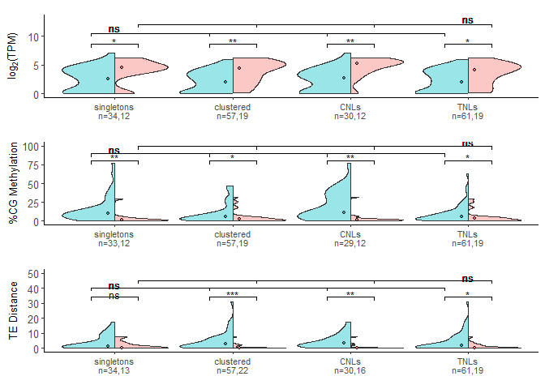

Confounding variable analysis by Stratification
================

Copyright (c) Chandler Sutherland Email:
<chandlersutherland@berkeley.edu>

Purpose: investigate potential confounding factors by using data
stratification and repeating pairwise comparisons.

Intermediate processing steps are shown here, and figures can be
recreated using just the numerical source data provided in
`Source Data/Figure 3/3A`.

``` r
library(tidyverse)
```

    ## ── Attaching core tidyverse packages ──────────────────────── tidyverse 2.0.0 ──
    ## ✔ dplyr     1.1.3     ✔ readr     2.1.4
    ## ✔ forcats   1.0.0     ✔ stringr   1.5.0
    ## ✔ ggplot2   3.4.3     ✔ tibble    3.2.1
    ## ✔ lubridate 1.9.2     ✔ tidyr     1.3.0
    ## ✔ purrr     1.0.2     
    ## ── Conflicts ────────────────────────────────────────── tidyverse_conflicts() ──
    ## ✖ dplyr::filter() masks stats::filter()
    ## ✖ dplyr::lag()    masks stats::lag()
    ## ℹ Use the conflicted package (<http://conflicted.r-lib.org/>) to force all conflicts to become errors

``` r
library(ggplot2)
library(openxlsx)
library(ggsignif)
library(ggpubr)
library(ggrepel)
library(patchwork)
```

``` r
#Change to your path to the zenodo download to repeat 
zenodo_path <- "C:\\Users\\chand\\Box Sync\\Krasileva_Lab\\Research\\chandler\\Krasileva Lab\\E14\\Zenodo V2\\"

#load in all gene data, filter to NLRs 
NLR_table <- read.csv(paste(zenodo_path, 'NLR_gene_table.csv')) %>% subset(select=-c(X, `...1`)) %>%
  dplyr::rename('common_name'='name')
```

Create a dataframe with the column subgroup, which has
clustered/singleton and CNL/TNL information

``` r
alt <- NLR_table %>%
  filter(Nterm %in% c('C', 'T')) %>% #remove RNL and XNLs
  mutate(domain=case_match(Nterm, 'C' ~ 'CNL', 
                           'T' ~ 'TNL'))
```

Fisher test of independence between HV status, cluster status, and
domain status

``` r
cont_table <- alt %>% 
  group_by(HV, clustered) %>% 
  summarize(n=n()) %>% 
  pivot_wider(names_from = c('clustered'), values_from='n') %>% 
  column_to_rownames('HV') %>% 
  as.matrix()
```

    ## `summarise()` has grouped output by 'HV'. You can override using the `.groups`
    ## argument.

``` r
fisher.test(cont_table)
```

    ## 
    ##  Fisher's Exact Test for Count Data
    ## 
    ## data:  cont_table
    ## p-value = 1
    ## alternative hypothesis: true odds ratio is not equal to 1
    ## 95 percent confidence interval:
    ##  0.421452 2.483664
    ## sample estimates:
    ## odds ratio 
    ##   1.009372

``` r
cont_table2 <- alt %>% 
  group_by(HV, domain) %>% 
  summarize(n=n()) %>% 
  pivot_wider(names_from = c('domain'), values_from='n') %>% 
  column_to_rownames('HV') %>% 
  as.matrix()
```

    ## `summarise()` has grouped output by 'HV'. You can override using the `.groups`
    ## argument.

``` r
fisher.test(cont_table2)
```

    ## 
    ##  Fisher's Exact Test for Count Data
    ## 
    ## data:  cont_table2
    ## p-value = 0.2172
    ## alternative hypothesis: true odds ratio is not equal to 1
    ## 95 percent confidence interval:
    ##  0.710913 4.075161
    ## sample estimates:
    ## odds ratio 
    ##    1.70477

HV status and cluster status are independent, and HV status and domain
are independent.

``` r
#write/read source Data 
write.csv(alt, file="./Source Data/Figure 3/3A/NLR_feature_by_strata.csv")
#read in source data 
#alt <- read.csv("./Source Data/Figure 3/3A/NLR_feature_by_strata.csv")
```

Statistics for within hv and within non-hv differences across strata

``` r
#pivot for easier stratification 
pivot_alt <- alt %>% 
  pivot_longer(cols=c('clustered', 'domain'), values_to='subgroup') 

pivot_alt$HV <- factor(pivot_alt$HV, levels=c('non-hv', 'hv'))
y_label <- expression('log'[2]*'(TPM)')

#are the distributions between hv and non-hv different across strata? 
kruskal.test(log2_TPM~subgroup, data=(pivot_alt %>% filter(HV=='non-hv')))
```

    ## 
    ##  Kruskal-Wallis rank sum test
    ## 
    ## data:  log2_TPM by subgroup
    ## Kruskal-Wallis chi-squared = 0.71155, df = 3, p-value = 0.8705

``` r
kruskal.test(log2_TPM~subgroup, data=(pivot_alt %>% filter(HV=='hv')))
```

    ## 
    ##  Kruskal-Wallis rank sum test
    ## 
    ## data:  log2_TPM by subgroup
    ## Kruskal-Wallis chi-squared = 3.3192, df = 3, p-value = 0.345

``` r
kruskal.test(meth_percentage~subgroup, data=(pivot_alt %>% filter(HV=='non-hv')))
```

    ## 
    ##  Kruskal-Wallis rank sum test
    ## 
    ## data:  meth_percentage by subgroup
    ## Kruskal-Wallis chi-squared = 9.0373, df = 3, p-value = 0.0288

``` r
kruskal.test(meth_percentage~subgroup, data=(pivot_alt %>% filter(HV=='hv')))
```

    ## 
    ##  Kruskal-Wallis rank sum test
    ## 
    ## data:  meth_percentage by subgroup
    ## Kruskal-Wallis chi-squared = 0.90022, df = 3, p-value = 0.8254

``` r
kruskal.test(te_dist~subgroup, data=(pivot_alt %>% filter(HV=='non-hv')))
```

    ## 
    ##  Kruskal-Wallis rank sum test
    ## 
    ## data:  te_dist by subgroup
    ## Kruskal-Wallis chi-squared = 2.0734, df = 3, p-value = 0.5573

``` r
kruskal.test(te_dist~subgroup, data=(pivot_alt %>% filter(HV=='hv')))
```

    ## 
    ##  Kruskal-Wallis rank sum test
    ## 
    ## data:  te_dist by subgroup
    ## Kruskal-Wallis chi-squared = 1.7814, df = 3, p-value = 0.619

``` r
nhv_res <- round(p.adjust(c(0.8705, 0.04255, 0.5573), method='BH'), digits=2)
hv_res <- round(p.adjust(c(0.345, 0.6333, 0.619), method='BH'), digits=2)

print('non-hv subset p values:')
```

    ## [1] "non-hv subset p values:"

``` r
print(nhv_res)
```

    ## [1] 0.87 0.13 0.84

``` r
print('hv subset p values:')
```

    ## [1] "hv subset p values:"

``` r
print(hv_res)
```

    ## [1] 0.63 0.63 0.63

Nope, subseting the hv and non-hv groups does not change distribution
across strata.

## Expression stratification

Apply Benjamini-Hochberg correction across strata to account for
multiple testing

``` r
#build annotation df 
group_n <- pivot_alt %>% pull(subgroup) %>% unique() %>% length()
pivot_alt$subgroup <- factor(pivot_alt$subgroup, levels=c('singleton', 'clustered', 'CNL', 'TNL'))
p_val <- pivot_alt %>% compare_means(log2_TPM~HV, ., group.by='subgroup', paired=F, method='wilcox.test', p.adjust.method = 'BH') %>%
  arrange(subgroup, p.adj) %>% 
  unique() %>%
  mutate(x=seq(from=1, to=group_n)) %>% 
  mutate(y=9) %>% 
  mutate(stars=case_when(p.adj < .001 ~'***', 
                         p.adj >= .001 & p.adj < .01 ~ '**', 
                         p.adj >= .01 & p.adj < .05 ~ '*', 
                         p.adj > .05 ~ 'ns'
                         ))
p_val 
```

    ## # A tibble: 4 × 12
    ##   subgroup  .y.      group1 group2       p  p.adj p.format p.signif method     x
    ##   <fct>     <chr>    <chr>  <chr>    <dbl>  <dbl> <chr>    <chr>    <chr>  <int>
    ## 1 singleton log2_TPM non-hv hv     0.0427  0.043  0.0427   *        Wilco…     1
    ## 2 clustered log2_TPM non-hv hv     0.00160 0.0063 0.0016   **       Wilco…     2
    ## 3 CNL       log2_TPM non-hv hv     0.00315 0.0063 0.0032   **       Wilco…     3
    ## 4 TNL       log2_TPM non-hv hv     0.00992 0.013  0.0099   **       Wilco…     4
    ## # ℹ 2 more variables: y <dbl>, stars <chr>

``` r
pivot_alt %>% filter(!is.na(log2_TPM)) %>% group_by(HV, subgroup) %>% summarize(n=n())
```

    ## `summarise()` has grouped output by 'HV'. You can override using the `.groups`
    ## argument.

    ## # A tibble: 8 × 3
    ## # Groups:   HV [2]
    ##   HV     subgroup      n
    ##   <fct>  <fct>     <int>
    ## 1 non-hv singleton    34
    ## 2 non-hv clustered    57
    ## 3 non-hv CNL          30
    ## 4 non-hv TNL          61
    ## 5 hv     singleton    12
    ## 6 hv     clustered    19
    ## 7 hv     CNL          12
    ## 8 hv     TNL          19

``` r
base_expr <- pivot_alt %>% arrange(subgroup, HV) %>%
  ggplot()+
  introdataviz::geom_split_violin(aes(x=subgroup, 
                                      y=log2_TPM, 
                                      fill=HV), 
                                  alpha=0.4, trim = T, scale="width", 
                                  lwd=0.30)+
  stat_summary(mapping=aes(x=subgroup, y=log2_TPM, fill=HV), fun = median, geom = "point", show.legend = F, shape=21, color='black',
               position = position_dodge(.225), size=1) +
  scale_fill_manual(values=c('#00BFC4',  '#F8766D'))+
  scale_color_manual(values=c('#00BFC4',  '#F8766D'))+
  theme_classic(base_size = 10)+
  ylab(y_label)+
  xlab('')+
  ylim(0, 13)+
  scale_x_discrete(breaks=c("singleton","clustered", "CNL", "TNL"),
        labels=c("singletons\nn=34,12", "clustered\nn=57,19", "CNLs\nn=30,12", "TNLs\nn=61,19"))+
  theme(legend.position='none', 
        text = element_text(size=10, family='sans'), 
        axis.text.y=element_text(size=10))

tick_length <- 0.6 
expr_p <- base_expr + 
  geom_text(data=p_val, 
            mapping=aes(x=x, y=y, label=stars),
            size = 9/.pt,
            show.legend=FALSE)+
  geom_segment( #horizontal line pairwise
    data=p_val, 
    mapping=aes(x=x-.2, y=y-.4, xend=x+.2, yend=y-.4), lwd=0.3
  )+
  geom_segment( #left tick pairwise 
    data=p_val, 
    mapping=aes(x=x-.2, xend=x-.2, y=y-.4, yend=y-.4-tick_length), lwd=0.3
  )+
  geom_segment( #right tick pairwise 
    data=p_val, 
    mapping=aes(x=x+.2, xend=x+.2, y=y-.4, yend=y-.4-tick_length), lwd=0.3
  )+
  geom_segment(x=0.8, xend=3.8, y=10.5, yend=10.5, lwd=0.3) +#horizontal line Kruskal wallis non-hvNLR
  geom_segment(data=p_val, mapping=aes(x=x-0.2, y=10.5, xend=x-0.2, yend=10.5-tick_length), lwd=0.3)+
  geom_text(x=1, y=11.5, label='ns', size = 9/.pt)+
  geom_segment(x=1.2, xend=4.2, y=12, yend=12, lwd=0.3) +#horizontal line Kruskal wallis non-hvNLR
  geom_segment(data=p_val, mapping=aes(x=x+0.2, y=12, xend=x+0.2, yend=12-tick_length), lwd=0.3)+
  geom_text(x=4, y=13, label='ns', size = 9/.pt)
```

## Methylation Stratification

``` r
p_val <- pivot_alt %>% 
  compare_means(meth_percentage~HV, ., group.by='subgroup', paired=F, method='wilcox.test', p.adjust.method = 'BH') %>%
  arrange(subgroup, p.adj) %>% 
  unique() %>%
  mutate(x=seq(from=1, to=group_n)) %>% 
  mutate(y=85) %>% 
  mutate(stars=case_when(p.adj < .001 ~'***', 
                         p.adj >= .001 & p.adj < .01 ~ '**', 
                         p.adj >= .01 & p.adj < .05 ~ '*', 
                         p.adj > .05 ~ 'ns'
                         ))
p_val 
```

    ## # A tibble: 4 × 12
    ##   subgroup  .y.      group1 group2       p  p.adj p.format p.signif method     x
    ##   <fct>     <chr>    <chr>  <chr>    <dbl>  <dbl> <chr>    <chr>    <chr>  <int>
    ## 1 singleton meth_pe… non-hv hv     4.49e-4 0.0018 0.00045  ***      Wilco…     1
    ## 2 clustered meth_pe… non-hv hv     2.99e-2 0.03   0.02991  *        Wilco…     2
    ## 3 CNL       meth_pe… non-hv hv     1.39e-3 0.0028 0.00139  **       Wilco…     3
    ## 4 TNL       meth_pe… non-hv hv     2.11e-2 0.028  0.02109  *        Wilco…     4
    ## # ℹ 2 more variables: y <dbl>, stars <chr>

``` r
#print sample sizes
pivot_alt %>% filter(!is.na(meth_percentage)) %>% group_by(HV, subgroup) %>% summarize(n=n())
```

    ## `summarise()` has grouped output by 'HV'. You can override using the `.groups`
    ## argument.

    ## # A tibble: 8 × 3
    ## # Groups:   HV [2]
    ##   HV     subgroup      n
    ##   <fct>  <fct>     <int>
    ## 1 non-hv singleton    33
    ## 2 non-hv clustered    57
    ## 3 non-hv CNL          29
    ## 4 non-hv TNL          61
    ## 5 hv     singleton    12
    ## 6 hv     clustered    19
    ## 7 hv     CNL          12
    ## 8 hv     TNL          19

``` r
base_meth <- pivot_alt %>% arrange(subgroup, HV) %>%
  ggplot()+
  introdataviz::geom_split_violin(aes(x=subgroup, y=meth_percentage, fill=HV), alpha=0.4, trim = TRUE, scale="width", 
                                  lwd=0.30)+
  stat_summary(mapping=aes(x=subgroup, y=meth_percentage, fill=HV), fun = median, geom = "point", show.legend = F, shape=21, color='black',
               position = position_dodge(.225), size=1) +
  scale_fill_manual(values=c('#00BFC4',  '#F8766D'))+
  scale_color_manual(values=c('#00BFC4',  '#F8766D'))+
  theme_classic(base_size = 10)+
  ylab('%CG Methylation')+
  #ylim(0,120)+
  xlab('')+
  scale_x_discrete(breaks=c("singleton","clustered", "CNL", "TNL"),
        labels=c("singletons\nn=33,12", "clustered\nn=57,19", "CNLs\nn=29,12", "TNLs\nn=61,19"))+
  scale_y_continuous(breaks=c(0, 25,50, 75, 100))+
  theme(legend.position='none', 
        text = element_text(size=10, family='sans'), 
        axis.text.y=element_text(size=10))

y_scale <- 0.83
tick_length_m <- 0.6*120/13
meth_p <- base_meth + 
  geom_text(data=p_val, 
            mapping=aes(x=x, y=y, label=stars),
            size = 9/.pt,
            show.legend=FALSE)+
  geom_segment( #horizontal line pairwise
    data=p_val, 
    mapping=aes(x=x-.2, y=80, xend=x+.2, yend=80), lwd=0.3
  )+
  geom_segment( #left tick pairwise 
    data=p_val, 
    mapping=aes(x=x-.2, xend=x-.2, y=80, yend=80-tick_length_m), lwd=0.3
  )+
  geom_segment( #right tick pairwise 
    data=p_val, 
    mapping=aes(x=x+.2, xend=x+.2, y=80, yend=80-tick_length_m), lwd=0.3
  )+
  geom_segment(x=0.8, xend=3.8, y=90, yend=90, lwd=0.3) +#horizontal line Kruskal wallis non-hvNLR
  geom_segment(data=p_val, mapping=aes(x=x-0.2, y=90, xend=x-0.2, yend=90-tick_length_m), lwd=0.3)+
  geom_text(x=1, y=95, label='ns', size = 9/.pt)+
  geom_segment(x=1.2, xend=4.2, y=100, yend=100, lwd=0.3) +#horizontal line Kruskal wallis hvNLR
  geom_segment(data=p_val, mapping=aes(x=x+0.2, y=100, xend=x+0.2, yend=100-tick_length_m), lwd=0.3)+
  geom_text(x=4, y=105, label='ns', size = 9/.pt)
```

## TE distance stratification

``` r
p_val <- pivot_alt %>% compare_means(te_dist~HV, ., group.by='subgroup', paired=F, method='wilcox.test', p.adjust.method = 'BH') %>%
  arrange(subgroup, p.adj) %>% 
  unique() %>%
  mutate(x=seq(from=1, to=group_n)) %>% 
  mutate(y=36) %>% 
  mutate(stars=case_when(p.adj < .001 ~'***', 
                         p.adj >= .001 & p.adj < .01 ~ '**', 
                         p.adj >= .01 & p.adj < .05 ~ '*', 
                         p.adj > .05 ~ 'ns'
                         ))

p_val
```

    ## # A tibble: 4 × 12
    ##   subgroup  .y.     group1 group2        p  p.adj p.format p.signif method     x
    ##   <fct>     <chr>   <chr>  <chr>     <dbl>  <dbl> <chr>    <chr>    <chr>  <int>
    ## 1 singleton te_dist non-hv hv      9.97e-2 1  e-1 0.09966  ns       Wilco…     1
    ## 2 clustered te_dist non-hv hv      6.57e-5 2.6e-4 6.6e-05  ****     Wilco…     2
    ## 3 CNL       te_dist non-hv hv      5.49e-4 1.1e-3 0.00055  ***      Wilco…     3
    ## 4 TNL       te_dist non-hv hv      1.22e-2 1.6e-2 0.01221  *        Wilco…     4
    ## # ℹ 2 more variables: y <dbl>, stars <chr>

``` r
pivot_alt %>% group_by(HV, subgroup) %>% summarize(n=n())
```

    ## `summarise()` has grouped output by 'HV'. You can override using the `.groups`
    ## argument.

    ## # A tibble: 8 × 3
    ## # Groups:   HV [2]
    ##   HV     subgroup      n
    ##   <fct>  <fct>     <int>
    ## 1 non-hv singleton    34
    ## 2 non-hv clustered    57
    ## 3 non-hv CNL          30
    ## 4 non-hv TNL          61
    ## 5 hv     singleton    13
    ## 6 hv     clustered    22
    ## 7 hv     CNL          16
    ## 8 hv     TNL          19

``` r
base_te <- pivot_alt %>% arrange(subgroup, HV) %>%
  ggplot()+
  introdataviz::geom_split_violin(aes(x=subgroup, y=te_dist, fill=HV), alpha=0.4, trim = TRUE, scale="width", 
                                  lwd=0.30)+
  stat_summary(mapping=aes(x=subgroup, y=te_dist, fill=HV), fun = median, geom = "point", show.legend = F, shape=21, color='black',
               position = position_dodge(.225), size=1) +
  scale_fill_manual(values=c('#00BFC4',  '#F8766D'))+
  scale_color_manual(values=c('#00BFC4',  '#F8766D'))+
  theme_classic(base_size = 10)+
  ylab('TE Distance')+
  xlab('')+
  ylim(0, 50)+
  theme(legend.position='none', 
        text = element_text(size=10, family='sans'), 
        axis.text.y=element_text(size=10))+
  scale_x_discrete(breaks=c("singleton","clustered", "CNL", "TNL"),
        labels=c("singletons\nn=34,13", "clustered\nn=57,22", "CNLs\nn=30,16", "TNLs\nn=61,19"))


y_scale <- 0.33
tick_te <- 0.6*50/13
te_p <- base_te + 
  geom_text(data=p_val, 
            mapping=aes(x=x, y=y, label=stars),
            size = 9/.pt,
            show.legend=FALSE)+
  geom_segment( #horizontal line pairwise
    data=p_val, 
    mapping=aes(x=x-.2, y=y-2, xend=x+.2, yend=y-2), lwd=0.3
  )+
  geom_segment( #left tick pairwise 
    data=p_val, 
    mapping=aes(x=x-.2, xend=x-.2, y=y-2, yend=y-2-tick_te), lwd=0.3
  )+
  geom_segment( #right tick pairwise 
    data=p_val, 
    mapping=aes(x=x+.2, xend=x+.2, y=y-2, yend=y-2-tick_te), lwd=0.3
  )+
  geom_segment(x=0.8, xend=3.8, y=40, yend=40, lwd=0.3) + #horizontal line Kruskal wallis non-hvNLR
  geom_segment(data=p_val, mapping=aes(x=x-0.2, y=40, xend=x-0.2, yend=40-tick_te), lwd=0.3)+
  geom_text(x=1, y=42, label='ns', size = 9/.pt)+
  geom_segment(x=1.2, xend=4.2, y=45, yend=45, lwd=0.3)+ #horizontal line Kruskal wallis hvNLR
  geom_segment(data=p_val, mapping=aes(x=x+0.2, y=45, xend=x+0.2, yend=45-tick_te), lwd=0.3)+
  geom_text(x=4, y=47, label='ns', size = 9/.pt)
```

# Figure 3A: split violin plots by strata

``` r
split_upset <- expr_p+meth_p+te_p + plot_layout(guides='collect', ncol=1) & theme(plot.margin= margin(t=0.25, b=0, l=0.1, r=0.1, 'cm'))
split_upset
```

<!-- -->

``` r
ggsave(filename='C:\\Users\\chand\\Box Sync\\Krasileva_Lab\\Research\\chandler\\Krasileva Lab\\Outputs\\NLR Features Paper\\EMBO Submission\\Figure Panels\\fig_3a.svg', plot=split_upset, dpi=1000, width=75, height=120, units = 'mm')
```
