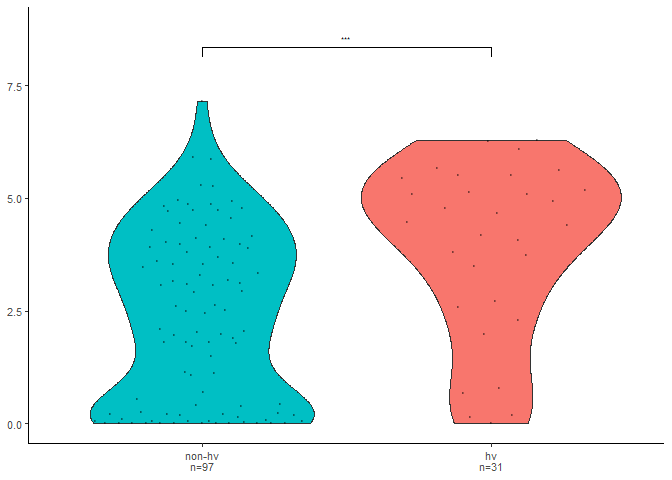
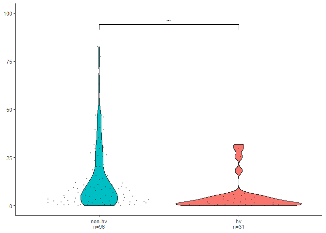
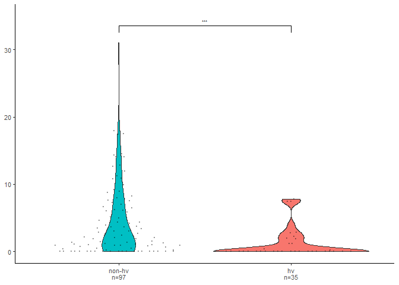

Violin plots
================
Chandler Sutherland

Copyright (c) Chandler Sutherland Email:
<chandlersutherland@berkeley.edu>

Purpose: generate hv vs non-hvNLR violin plots of expression,
methylation, and TE distance.

Intermediate processing steps are shown here, but figures can be
recreated using just the numerical source data provided in
`Source Data/Figure 2`.

``` r
library(tidyverse)
```

    ## ── Attaching core tidyverse packages ──────────────────────── tidyverse 2.0.0 ──
    ## ✔ dplyr     1.1.3     ✔ readr     2.1.4
    ## ✔ forcats   1.0.0     ✔ stringr   1.5.0
    ## ✔ ggplot2   3.4.3     ✔ tibble    3.2.1
    ## ✔ lubridate 1.9.2     ✔ tidyr     1.3.0
    ## ✔ purrr     1.0.2     
    ## ── Conflicts ────────────────────────────────────────── tidyverse_conflicts() ──
    ## ✖ dplyr::filter() masks stats::filter()
    ## ✖ dplyr::lag()    masks stats::lag()
    ## ℹ Use the conflicted package (<http://conflicted.r-lib.org/>) to force all conflicts to become errors

``` r
library(ggplot2)
library(ggsignif)
library(ggpubr)
library(ggbeeswarm)
library(patchwork)
```

``` r
#paste your path to the zenodo download to repeat 
zenodo_path <- "C:\\Users\\chand\\Box Sync\\Krasileva_Lab\\Research\\chandler\\Krasileva Lab\\E14\\Zenodo V2\\"

#input data 
table <- readxl::read_xlsx(path=paste(zenodo_path, "all_gene_table.xlsx", sep=''))

NLR_table <- table %>% filter(HV != 'all_genes')
NLR_table$HV <- factor(NLR_table$HV , levels=c("non-hv", "hv"))
fig2_source <- NLR_table %>% subset(select=c('Gene', 'HV', 'log2_TPM', 'meth_percentage', 'te_dist'))
```

``` r
#save source data. To reproduce these plots, un-comment reading in the fig2_source and start code from there  
write.csv(fig2_source, file="./Source Data/Figure 2/2A-C/per_NLR_features.csv")
#fig2_source <- read.csv("./Source Data/Figure 2/2A-C/per_NLR_features.csv")
```

Fig 2a: Expression in log2(TPM)

``` r
#create a sample size label
NLR_table2 <- fig2_source %>% 
  filter(!is.na(log2_TPM)) %>% 
  group_by(HV) %>% 
  mutate(n_exp = n()) %>% 
  mutate(exp_label = paste(HV, n_exp, sep="\nn="))
levels <- NLR_table2 %>% pull(exp_label) %>% unique()
NLR_table2$exp_label <- factor(NLR_table2$exp_label, levels=c(levels[1], levels[2]))

#plot 
p1 <- ggplot(NLR_table2,
       aes(x=exp_label, y=log2_TPM, fill=HV))+
    geom_violin(lwd=0.30)+
  geom_quasirandom(alpha=0.3, size=0.5)+
   ylim(0,8.8)+
   geom_signif(comparisons=list(c(levels[1], levels[2])), 
               map_signif_level = TRUE, y_position = c(8, 7), test=wilcox.test, textsize=2, size=0.25)+
    scale_fill_manual(values=c('#00BFC4',  '#F8766D'))+
  theme_classic()+
    theme(legend.position='none', text=element_text(size=10), 
          axis.title=element_blank())+
  scale_x_discrete(labels=c(levels[1], levels[2]))

p1
```

<!-- -->

``` r
#unpaired wilcox rank sum test 
compare_means(log2_TPM~HV, NLR_table, method = 'wilcox.test', paired = FALSE)
```

    ## # A tibble: 1 × 8
    ##   .y.      group1 group2         p    p.adj p.format p.signif method  
    ##   <chr>    <chr>  <chr>      <dbl>    <dbl> <chr>    <chr>    <chr>   
    ## 1 log2_TPM non-hv hv     0.0000789 0.000079 7.9e-05  ****     Wilcoxon

Fig 2B: %CG methylation

``` r
# sample size label
NLR_table3 <- fig2_source %>% filter(!is.na(meth_percentage)) %>% group_by(HV) %>% mutate(n_meth = n()) %>% mutate(meth_label = paste0(HV,"\n", "n=",n_meth))
levels_m <- NLR_table3 %>% pull(meth_label) %>% unique()
NLR_table3$meth_label <- factor(NLR_table3$meth_label, levels=c(levels_m[1], levels_m[2]))

#plot
p2 <- ggplot(NLR_table3,
       aes(x=meth_label, y=meth_percentage, fill=HV))+
    geom_violin(lwd=0.3)+
  geom_quasirandom(alpha=0.3, size=0.5)+
  ylim(0,100)+
   geom_signif(comparisons=list(c(levels_m[1], levels_m[2])), 
               map_signif_level = TRUE, y_position = c(90, 80), test=wilcox.test, textsize=2, size=0.25)+
    scale_fill_manual(values=c('#00BFC4',  '#F8766D'))+
  theme_classic()+
    theme(legend.position='none', text=element_text(size=10), axis.title=element_blank())

p2
```

<!-- -->

``` r
#stats 
compare_means(meth_percentage~HV, NLR_table, method = 'wilcox.test', paired = FALSE)
```

    ## # A tibble: 1 × 8
    ##   .y.             group1 group2        p   p.adj p.format p.signif method  
    ##   <chr>           <chr>  <chr>     <dbl>   <dbl> <chr>    <chr>    <chr>   
    ## 1 meth_percentage non-hv hv     0.000428 0.00043 0.00043  ***      Wilcoxon

Fig 2C: Distance to nearest TE

``` r
#sample size label
NLR_table3 <- fig2_source %>% 
  filter(!is.na(te_dist)) %>% 
  group_by(HV) %>% 
  mutate(n_te = n()) %>% 
  mutate(te_label = paste0(HV,"\n", "n=",n_te))
levels_t <- NLR_table3 %>% pull(te_label) %>% unique()
NLR_table3$te_label <- factor(NLR_table3$te_label, levels=c(levels_t[1], levels_t[2]))

#plot
p3 <- ggplot(NLR_table3,
       aes(x=te_label, y=te_dist, fill=HV))+
    geom_violin(lwd=0.3)+
   ylim(0,35)+
  geom_quasirandom(alpha=0.3, size=0.5)+
   geom_signif(comparisons=list(c('non-hv\nn=97', 'hv\nn=35')), 
               map_signif_level = TRUE, y_position = c(32, 32), test=wilcox.test, textsize=2, size=0.25)+
    scale_fill_manual(values=c('#00BFC4',  '#F8766D'))+
  theme_classic()+
    theme(legend.position='none', text=element_text(size=10), 
          axis.title=element_blank())

p3
```

<!-- -->

``` r
#unpaired wilcox rank sum test 
compare_means(te_dist~HV, NLR_table, method = 'wilcox.test', paired = FALSE)
```

    ## # A tibble: 1 × 8
    ##   .y.     group1 group2         p    p.adj p.format p.signif method  
    ##   <chr>   <chr>  <chr>      <dbl>    <dbl> <chr>    <chr>    <chr>   
    ## 1 te_dist non-hv hv     0.0000130 0.000013 1.3e-05  ****     Wilcoxon

``` r
#perform fisher's test on HV status vs internal TE
NLR_table3 <- NLR_table3 %>% mutate('int_te'=if_else(te_dist == 0, 'TRUE', 'FALSE'))
fisher.test(NLR_table3$HV, NLR_table3$int_te)
```

    ## 
    ##  Fisher's Exact Test for Count Data
    ## 
    ## data:  NLR_table3$HV and NLR_table3$int_te
    ## p-value = 3.636e-05
    ## alternative hypothesis: true odds ratio is not equal to 1
    ## 95 percent confidence interval:
    ##   2.346103 15.392180
    ## sample estimates:
    ## odds ratio 
    ##   5.909507

HV status is predictive of a TE within the genic sequence (p=3.63e-05)

``` r
#combine plots and save 
panel <- p1+p2+p3

ggsave(filename='C:\\Users\\chand\\Box Sync\\Krasileva_Lab\\Research\\chandler\\Krasileva Lab\\Outputs\\NLR Features Paper\\EMBO Submission\\Figure Panels\\fig_2a_c.svg', plot=panel, dpi=1000, width=180, height=50, unit='mm')
```
